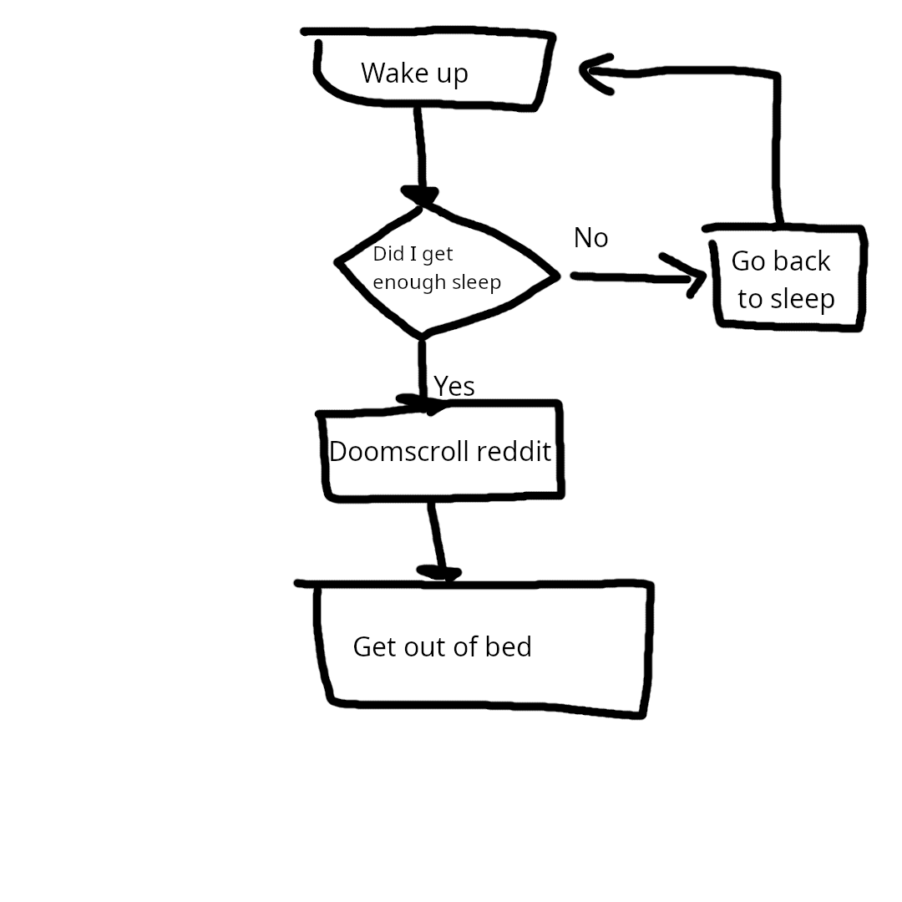

# COMP 202 - Foundations of Programming

```python
print("COMP 202 - Foundations of Programming")
```

This course is an introductory course to the world of programming. It goes over every core concept that needs to be understood to begin the ability of being able to use programming languages for future endeavors. This is intended for students with little to no programming experience.

This course has two sister courses: [COMP 204 - Computer Programming for Life Sciences](https://coursecatalogue.mcgill.ca/courses/comp-204/), and  [COMP 208 - Computer Programming for Physical Sciences and Engineering](https://coursecatalogue.mcgill.ca/courses/comp-208/). All these courses cover more or less the same content, but the two mentioned above are tailored towards Life Science students and Engineering Students respectively. This course targets a more general audience. 

This course uses the [Python programming language](https://www.python.org/), a high level general purpose programming language. However, the concepts gone over this course are applicable to all programming languages (Java, C, etc.)

Note that this course is skippable with sufficient programming knowledge.

---

### Table of Contents

- [__Unit 1:__ Programming and Computer Science](#unit-1-programming-and-computer-science)

What is an algorithm? What is programming? How does a computer read programs? 

- [__Unit 2__: Programming Basics](#unit-2-programming-basics)

Value types, variables and assignments, math, input and output

- [**Unit 3**: Control Flow and modules](#unit-3-control-flow-and-modules)

Conditional Statements, Loops, functions, modules, the `random` module.

- [**Unit 4**: Lists and Strings](#unit-4-lists-and-strings )

Lists operations, Object mutability, String methods, Nesting

- [__Unit 5__: Other concepts and objects](#unit-5-other-concepts-and-elements)

Dictionaries, Exceptions, File I/O, Debugging, Exception Handling

- [**Unit 6**: Object Oriented Programming](#unit-6-object-oriented-programming)

Object Oriented Programming concepts

- [**Unit 7**: Optional Content](#unit-7-optional-content)

External libraries


# Unit 1: Programming and Computer Science

### What is Computer Science?
> We like to talk about Computer Science a lot, but what does the word encompass?

**Computer Science** is _the study of computers and computing_ including, theoretical and algorithmic foundations, hardware and software, and their uses to process information. That's a pretty broad definition, but the important part is that it's not just coding. This course, however, will look pretty much exclusively at coding.

### How computers work and Binary
There are 4 essential parts to a computer. The **C**entral **P**rocessing **U**nit, Memory, an input and output. Everything in a computer works in binary, where everything is either 1 or 0, _True_ or _False_. 

We typically use the decimal number system (base 10) to match our number of fingers. In there, every digit is a power of ten. For example `247 = 2 * 10^2 + 4 * 10^1 + 7 * 10^0`.  Binary numbers on the other hand, work in powers of 2, where every digit is multiplied by different powers of two. For example, in binary, 7 would be written as 0111, since `7 = 1 * 2^2 + 1*2^1 + 1 * 2^0  = 4 + 2 + 1 = 7`. Note that we use a subscript $n_b$ to denote a number n in base b. Therefore, to define 0111 as being binary, we write $0111_2$ 

To convert from binary to decimal, we simply multiply each digit by their respective power of two. Look at how we did 7 above for an example

To convert from decimal to binary, we use a simple little set of instructions
1. Divide number by 2 and keep track of the remainder
2. Repeat until the number is zero
3. Take all the remainders from bottom to top

For example, to convert 42 to binary
```
42 / 2 = 21 remainder 0
21 / 2 = 10 remainder 1
10 / 2 = 5  remainder 0
5  / 2 = 2  remainder 1
2  / 2 = 1  remainder 0
1  / 2 = 0  remainder 1

Take the remainders from bottom to up, we get 101010
```

### Some other common terminology 
- A **bit** is a single binary digit (either 1 or 0). It is the most basic unit of information in a computer
- A **byte** is a combination of 8 bits and is what you'll commonly see in computer interfaces. They are commonly displayed with an SI prefix such as _kilobyte_, _megabyte_, _gigabyte_, or _terabyte_


## Programming 
What is programming? To answer that, we first need to answer what an algorithm is

An **algorithm** is a _step by step procedure for solving a problem or accomplishing some end_. The important thing to note here is that an algorithm is not limited to computer science. A delicious cake recipe is an algorithm, a set of instructions to assemble a furniture is an algorithm. 

To visualize an algorithm, we can use flow charts. For example, here's a flowchart that describes an algorithm for how I get out of bed in the morning



> Of course, this flowchart isn't perfect. I made it in 10 minutes on gimp. This flowchart is missing a start point and an end point, and it probably could've been more detailed.


A **program** is the "translation" of an algorithm using a programming language. It is the implementation of an algorithm into computer code.

A **programming language** is a formal language designed to communicate with a computer. There are two types of languages 
1. **Low Level languages**: They work closer to the actual hardware level (as a computer does everything in binary). The two common ones are typically machine code (binary), which is what the computer understands, and assembly code, which is one level of abstraction above machine code, but still difficult to use.
2. **High Level languages**: They use various forms of abstraction such as English and Math symbols to communicate instructions to the computer. 

However, since computers only understand binary, all that code has to be translated into machine code eventually. To do that there are two types of programs we use, compilers and interpreters. 

A compiler translate the code and generates an executable program in machine code. That executable program can be executed as many times as it wants without needing to be recompiled

An interpreter simulates a computer that understands high level language. It translates the code "as it goes" without creating an object or executable. To run it multiple times, you would have to run the interpreter again.

Most well known languages are high level languages. For examples, C++ is a high level language that primarily uses a compiler to generate executables. Python is a high level language that primarily uses an interpreter to run its codes. This course will focus on Python.

---
### Python

Python is a high level language and currently the most popular programming language among developers. It is beloved for its easy syntax, wide range of use cases and for being free and open source.

To write a program in Python, you can hypothetically use any text editor, such as Notepad, vim or Atom. (please don't use those, especially not Microsoft Word). However, the most popular approach is to use an **I**ntegrated **D**evelopment **E**nvironment. Popular options include PyCharm, IDLE, Visual Studio Code and Thonny. For beginners, I recommend using [Thonny](https://thonny.org/) as it comes prebuilt with a lot of useful features. However, if you plan on continuing in computer science later on, I recommend getting familiar with [Visual Studio Code](https://code.visualstudio.com/), as it's a more versatile IDE that can be used to write in pretty much any language seamlessly (except Java because Java is special or something). To setup your IDE search "How to set up \[insert IDE name\] for Python development" in your search engine and follow a guide there. Trust me, you will do a lot of searching up online while programming, so might as well start to get used to it.

After installing and setting up your IDE , we can write our first program in it. Open a new python file, and write the following

```python
print("Hello World!")
```

Now find the "Run program" button and you should see `Hello World!` being displayed in the output area. Congratulations, you have created your first Python program. 

[Back to Top ^](#table-of-contents)


# Unit 2: Programming Basics


## Basic programming terminology

So let's go back to our first ever Python masterpiece

```python
print("Hello World!")
```

We call this line a statement, or a "print statement" to be more exact. A **statement** is a line of code that does a basic operation. In this case, this line prints `Hello World!` onto your screen.

Let's look at `print()` itself. The brackets indicate that `print()` is a **function**. We will define them it in more detail later, but just know that `print()` is one of many built in functions in python.

Now watch what happens if we add an \# in front of the statement

```python
#print("Hello World!")
```

You'll notice the text turned grey, and if you run it, nothing happens. That's because we just turned this statement into a comment. A **comment** is an annotation we add to our program. They are ignored by the interpreter, meaning you can write pretty much whatever you want in them. In python, comments are started by a \#. These are useful to make our code more readable in the future, document who did changes when, preserve unused code for future use, or [just write the funniest nonsense about the despair and/or confusion you feel](https://community.appsmith.com/content/blog/52-funny-code-comments)


#### Errors and Bugs

Now watch what happens when we remove the brackets

```python
print "Hello World"
```

When we run this, we get the following output

```
File "<stdin>", line 1
    print "Hello World!"
    ^^^^^^^^^^^^^^^^^^^^
SyntaxError: Missing parentheses in call to 'print'. Did you mean print(...)?
```

This is called an **error** and happens if the interpreter runs into something wrong. In this case, it's a  syntax error. In programming, syntax, structure and punctuation is extremely important. Something that's readable to you does not mean it's readable to the interpreter (or even other programmers) as the interpreter needs the correct syntax to understand your code. As such, when the interpreter encounters something it can't read, it returns an error.

Whenever your program produces an incorrect or unexpected result, it's called a **bug**. The process of identifying and fixing bugs is called **debugging**. Debugging is one of the most important skills to have while programming, and comes with experience. There are many debugging techniques you can use to help you in the process. Here are some of them

- **Using the debugger**: Most IDEs and compilers offer a debugging tool that allows you to use your code line by line and seeing variable values. This is incredibly useful when tackling a hard to trace bug
- **Using print() statements**: This allows you to monitor where the code runs and where the code goes wrong, although it can get messy very quickly for large programs.
- **Rubber duck**: The process of yelling at a rubber duck until it fixes the bug for you. [Read this for more information](https://rubberduckdebugging.com/)


### Value types
Values are classified based on their types. For now, we will look at the following

- **Integer** type values (`int`) represent a whole number. These can be positive, negative or zero. Examples are `1`, `0`, `-2147483648` and `42`. 

- **Floating point**, or float values (`float`), represent numbers with decimal points. Similar to integers, they can be positive, negative or zero. Although they cover a wider range of values, they are less precise than integers (and typically slower). Hence, we tend to avoid using floats whenever possible. Examples include `1.5`, `-0.0524`, `3.1415926535897932384` and `0.0`.

- **Boolean** type values (`bool`) represent either `True` or `False`. 

- The **None** type (`NoneType`) is a special type. It represents nothing and does nothing.

- **String** type values (`str`) represent a series of characters. These are what we use whenever we want to represent text in a value. These are more complex than the previously mentioned values and will be explored more thoroughly later. However, here are some characteristic of strings.
  - In Python, you can write them in single quotes (' ') or double quotes (" "). Therefore `'Hello World!' == "Hello World!"` Note that this is not the case outside of Python
  - You can use the backslash `\` to represent special characters called escape sequences. The two common ones are `\n` to represent a new line and `\t` to represent a tab character. You can also use the backslash to use a character that would otherwise have a special function. For example, the string `"She said: \"I can't believe you did that\"\nAnd I was like: \"I did nothing! \t Did I?\""` would be printed out as

```
She said: "I can't believe you did that"
And I was like: "I did nothing! 	 Did I?"
```

You may use the built in`type()` function to check a value's type. Here are some examples

```python
>>> type(1)
<class 'int'>
>>> type(1.0)
<class 'float'>
>>> type("According to all known laws of aviation, there is no way a bee should be able to fly. Its wings are too small to get its fat little body off the ground. The bee, of course, flies anyway because bees don't care what humans think is impossible.")
<class 'str'>
>>> type(True)
<class 'bool'>
>>> type(None)
<class 'NoneType'>
```

You may also use the built-in casting functions to change a variable's type.  For example, if we have a string `"3018575"` and we want to change it into an int, we can use the `int()` function to do so

```python
int("3018575")
```

You may also use the `float()`, `bool()` and `str()` functions to do the same thing for their respective types.  Note that you may only make casting that "makes sense".  For example, if you try 

```python
int("Hello World!")
```

You will get the following

```
Traceback (most recent call last):
  File "<stdin>", line 1, in <module>
ValueError: invalid literal for int() with base 10: 'Hello World!'
```

> A ValueError is raised when a function recieves an inappropriate value.

### Variables 

A **variable** is a thing that has a _name_ and can hold a _value_ and represents a block in memory. To create a variable in python, we use the assignment statement (`=`). 

```python
a = 7
```

There, we just created a variable with name `a` and value `7` in memory. Now if we use print on the variable, we get the following

```python
>>> print(a)
7
```

Of course, `a` is not stuck with `7`. If something happens between the two later on and `a` does not want to be assigned to `7` anymore, we can always reassign it

``` python
>>> a = "Hello World!"
>>> print(a)
Hello World!
```

>As you can see, we can assign different types to the same variable, an ability that doesn't exist in other popular programming languages.

Python has a nice feature where you may assign multiple variables in a single line. For example

```python
# Assign a, b and c to different values
a, b, c = 1, 2, 3
# Assign foo, bar and bat to the same value
foo = bar = bat = 0
```

Some details about variable names
- Variable names are case-sensitive, meaning `FOO` and `foo` are two different variables
- Variable names can contain numbers, but shouldn't start with one. `COMP202` is a valid variable name but `123Cheese` is not.
- Variable names cannot contain special characters (e.g. `@`,`$`,`!`) or spaces. You may use underscores `_` for variables with long names. For example `this_var_has_an_unneccesarily_long_name`
- Variable names cannot correspond to a python keyword. You cannot name a variable `False` or `if`
- Although not required, it is generally good practice to have meaningful variable names. This helps readability for both you and future developers working on your code. Good examples include

```python
is_open = False
num_of_days = 15
bank_balance = 0.91
```

Bad examples can be

```python
y = False
gasyukdaaf = 15
thisvariablehasnounderscoresandishardtoread = 0.91
```

> An exception can be made for counter variables in loops, more on those later.

 >By convention, variables whose values change are written in lower case letters `(num_of_days)` while constants whose values don't change are written in capital letters `(NUM_OF_DAYS_IN_A_WEEK)`

With variables also come a new type of error. A `NameError` occurs when you try to use a variable that hasn't been declared. For example, if you type

```python
print(Hello)
```

The interpreter will attempt to locate a variable named "Hello", which it doesn't find. Therefore, it will return the following

```
Traceback (most recent call last):
  File "<stdin>", line 1, in <module>
NameError: name 'Hello' is not defined
```

### Math

The earliest computers to have been built were calculators, and although we may think computers today as giant smart devices, deep down, they're all just really efficient number handling machines.

Python has a number of math operators that can be used. There are `+`, `-`, `*` and `/` which, if you don't recognize them, you probably shouldn't be taking this course yet. Here are some other ones.

- `**` is used for exponentiation. `10**3 == 1000`
- `//` is used for integer division, where only the integer part of the number is kept and the remainder is ignored. For example, `5 // 2 == 2` and `13 // 3 == 4`
- `%` is called modulo and is used for modular arithmetic. Basically the opposite of integer division where only the remainder is kept. For example `5 % 2 == 1` and `12 % 3 == 0`

Python does math in BEDMAS order. Integer division and modulo are treated the same way as regular division.

> Note that since reassigning a variable to its old value with some operation done is such a common operation, Python offers shortened forms of each to make life easier. 
> `x += 1` is logically equivalent to writing `x = x + 1`. 
> `x -= 1` is equivalent to `x = x - 1`.
>  `x *= 2` is equivalent to `x = x * 2` 
>  and so on for `/=`, `//=`, `**=` and `%=`

Of course, that is not all the math that Python can do. There are built in functions that deal with numbers

- `min()` finds the smallest number in the list of inputs it's given while `max()` finds the largest one
- `abs()` returns the absolute value of the number given
- `pow(a,b)` returns `a ** b`
-  `round(x)` rounds `x` to the nearest integer while `round(x,y)` rounds `x` to `y` decimal places 

And for more math functions, you must import the `math` module, which brings in a lot more functions that can be used. 

##### Importing modules

This is a quick side note to explain how the `import` statement works. Importing a module gives us access to functions defined in that module. There are 3 ways to import a module. The first is to simply write the import statement as is.

```python
import math
```

This will import all the functions from the math module so that you can use. To use the `sin()` function, you would then write.

```python
math.sin(x)
```

This is good for math, but later on, there are modules with names that get tiring to write, like `matplotlib`, which we might see later on. To help with this, we can write instead

```python
import math as ma
```

Now if we want to use the `sin()` function, we can write

```python
ma.sin(x)
```

Finally, sometimes, we don't need every function from a module or library. Let's say for example, I will only use `sin()` and `cos()` from the math module, I can write

```python
from math import sin, cos
```

Of course, you can add as many as you one in that line. You can even add just one. The interesting thing to note about this approach is that you no longer need to write the `math.` in front. Therefore, you can use `sin()` and `cos()` as

```python
sin(x)
cos(y)
```

You can technically write 

```python
from math import *
```

to import all functions this way and not have to write `math.` in front of any of them. This can work fine when you only have one simple module, but is not good practice when importing multiple modules or more complex ones as it may lead to conflicts between existing variables and functions.

By convention, all import statements should be found at the top of the file.

#### Math module 

This is a list of functions from the math module you are likely to use

- `sqrt(x)` returns the square root `x`
- `sin(x)`, `cos(x)` and `tan(x)` returns the sine, cosine and tangent of `x`respectively. Note that the inside value is in radians
- `log2(x)` and `log10(x)` return the base-2 and base-10 logarithms of `x` respectively. There is also `log(x,b)` where `b` is the base the logarithm is calculated off. If unspecified, `b` is set equal to _e_
- `floor(x)` sets `x` to the largest integer less or equal to itself while `ceil(x)` sets `x` to the smallest integer greater or equal to itself.
- `math.pi` returns _pi_, `math.e` returns _e_

#### Strings with math operators

The math operators `+`, `-`, `*` and `/` obviously work with integers and floats. However in python, you can also use `+` and `*` with strings. Here are some examples

```python
>>> 'ab' + 'cd'
'abcd'
>>> 'a' * 10
'aaaaaaaaaa'
>>> '1' + '1'
'11'
>>> 2 + '2'
Traceback (most recent call last):
  File "<stdin>", line 1, in <module>
TypeError: unsupported operand type(s) for +: 'int' and 'str'
>>> 'ab' * 'cd'
Traceback (most recent call last):
  File "<stdin>", line 1, in <module>
TypeError: can't multiply sequence by non-int of type 'str'
```

### The input function

So far, we've looked at how to generate outputs. However, what if we want to write a program that can take an input? In Python, we may use the `input(str)` function. When ran, it will prompt the user for an input from the command line, with the prompt shown given by `str`. For example, if we want to ask the user their favorite color, we would ask

```python
x = input("What is your favorite color? ")
```

If the user types `red`, then the value of `x` would be `'red'`. 

Note that the input function always returns the input as a string.

[Back to Top ^](#table-of-contents)

# Unit 3: Control Flow and Modules


## Control Flow

In programming, __control flow__ refers to the order in which instructions, statements and functions are executed. There are three types of flow: _sequential_, _conditional_ and _repetitive_. This unit will go over all of them.

All the program you have done thus far have executed in _sequential_ flow. This means the line at the top was executed, then the next one at the bottom, then the next, and so on. This has worked fine so far, but if this was the only type of control flow, then we would have had a very hard time building all this amazing digital world you're currently doom scrolling in. Hence we have the other two types of flow.

---
### Conditional Flow

**Conditional flow** refers to a program which behaves differently based on whether or not a condition has been met. This is done through the `if` and `else` statements. The `if` statement checks whether or not its given condition evaluates to `True`.  If it does, it executes the code within its block.  The `else` statement executes the code within its block if the preceding if statement evaluates to `False`. The syntax looks like

```python
if condition:
	code
else:
	other_code
	
# Notice the indentation and the colons (:) 
# In Python, indentation defines code blocks while
# colons are used to indicate the start of a new block
```

The __condition__ is any bit of code that can be evaluated to a _boolean_ (`bool`) value. Most of the time, it will include a logical operator. Here are the logical operators that can be used:

- `a == b` evaluates to `True` if `a` is equal to `b`
- `a != b` evaluates to `True` if `a` is not equal to `b`
- `a > b` evaluates to `True` if `a` is greater than `b`
- `a >= b` evaluates to `True` if `a` is greater or equal to `b`
- `a < b`  evaluates to `True` if `a` is less than `b`
- `a <= b`  evaluates to `True` if `a` is less or equal to `b`

For example, here's a simple program that checks whether or not you can enter a bar.

```python
age = int(input("Enter your age "))

if age >= 19:
	print("You can enter a bar anywhere in Canada")

else:
	if age >= 18:
		print("You can enter a bar only in Quebec, Alberta, or Manitoba")
	else:
		print("You may not enter a bar yet")	
```

Notice the `else if` section. Written like this, it does make the code unnecessarily clunky. In Python, you can rewrite that statement as `elif`. We can therefore rewrite the code as

```python
age = int(input("Enter your age "))

if age >= 19:
	print("You can enter a bar anywhere in Canada")
elif age >= 18:
	print("You can enter a bar only in Quebec, Alberta, or Manitoba")
else:
	print("You may not enter a bar yet")	
```

This code does the exact same thing, but is much nicer to look at

Of course, sometimes you want to be checking multiple conditions. For example, here's a program that would determine whether or not I'm going to have a good day.

```python
if had_enough_sleep == True:
	if ate_delicious_food == True:
		if is_raining == False:
			if saw_my_girlfriend == True:
				if portfolio_growth > 0.3:
					if num_of_smokers_crossed == 0:
						if first_song_of_the_day == "True Love - Thegur90":
							if is_sick == False:
								if temperature > -9:
									if temperature < 25:
										print("Today will be a good day")
									else:
										print("Today will not be a good day")
								else:
									print("Today will not be a good day")
							else:
								print("Today will not be a good day")
						else:
							print("Today will not be a good day")
					else:
						print("Today will not be a good day")
				else:
					print("Today will not be a good day")
			else:
				print("Today will not be a good day")
		else:
			print("Today will not be a good day")
	else:
		print("Today will not be a good day")
else:
	print("Today will not be a good day")
```

Of course, this is both exaggerated for comedic effect, and completely inefficient code writing. It's situations like these where these three operators come in useful: `and`, `or` and `not`

- `A and B` will only evaluate to `True` if `A` is true and `B` is true.
- `A or B` will evaluate to `True` if `A` is true, `B` is true, or `A and B` is true
- `not A` will only evaluate to `True` if `A` is false.

Therefore, if I had to rewrite the above code, I would `and` every statement together. This makes the code just a bit more readable, and avoids that mess of `else` statements.

Note that for code optimization, Python will take shortcuts when evaluating `and` and `or`statements. This means for example.

```python
age = 12

if age == 18 and age == int("Hello World!"):
	print("foo")

if age <= 18 or age == int("Hello World!"):
	print("bar")
```

The code above **will not return an error** despite the `ValueError` that should occur with `int("Hello World!")`. This is because at the `and` operator, since `age == 18` already evaluates to `False`, the value of the other half of the `and` operator does not matter as the _entire condition_ is `False`. The same thing happens at the `or` operator. Since `age <= 18` evaluates to `True`, the value of the other half of the `or` operator does not matter as the entire condition is `True`. In both cases, the interpreter will simply skip checking the other half

> That can be a source of bugs that fly past your initial tests, be careful


--- 
### Repetitive Flow

**Repetitive flow** happens when a block of code is executed multiple times. Let's say I want to print the first 10 numbers starting from 0. In other words, I want to see an output of

```
0
1
2
3
4
5
6
7
8
9
```

One way I can achieve this is to just write 10 `print()` statements. However, that's ugly and hard to adapt in the future (what if I want to print the first 25 numbers? first 100?). I could also write it all in one `print()` statement with newline (`'\n'`) characters. That solves the aesthetics part, but still doesn't make the code very adaptable

Introducing **loops**. Loops are statements that will reiterate repeatedly for a given amount of times. There are two loop statements that can be used. The first is the `while` loop. The `while` loop will execute the code within its block _as long as_ the _condition_ evaluates to `True`. The syntax of a `while` loop looks like

```python
while condition:
	code
```

With this, if I want to write the code to print the above output with a `while` loop, I would now write

```python
i = 0
while i < 10:
	print(i)
	i += 1
```

> Note: For counter variables in a loop, `i`, `j` and `k` are commonly used by convention. That is not a bad variable name

This works a lot better already but the `while` loop has a few characteristics that make it not ideal. For one, you need to create a variable to keep track of the condition. You also have to remember to make it possible for your code to break out of your `while` loop eventually. Otherwise, you risk creating an *infinite while loop*, which happens when your code loops on infinitely. For example, if I forgot to increment `i` up and only wrote

```python
i = 0
while i < 10:
	print(i)
```

This will print `0` over and over, and never end. If you start a program and nothing seems to happen, look at your code again, because there might be an infinite `while` loop somewhere.

> Note that `while True:` is a valid way to write a while loop. This will make it loop infinitely, but you can use this with the `break` keyword and functions, both of which we will see soon.

To solve both issues, we may use the second loop, the `for` loop. The `for` loop will iterate the code inside its block for every element in the sequence of values it's given. That may sound complex, but trust me when I say you will love `for` loops a lot more. The syntax of a `for` loop looks like

```python
for variable in sequence:
	code
```

So now, we can rewrite the above while loop as the following

```python
for i in 10:
	print(i)
```

And now if we run it

```
Traceback (most recent call last):
  File "<stdin>", line 1, in <module>
TypeError: 'int' object is not iterable
```

Uh oh, that's not good.

The problem is that we're trying to iterate over the integer `10`. Python does a lot of things for you, but it does not automatically convert anything to a sequence of elements, hence the `TypeError`. If you want to generate a sequence, you must use the `range()` function, which generates a sequence of integers for you. 

Now if we rewrite

```python
for i in range(10):
	print(i)
```

And we run it. Yay it works! And it looks so much cleaner on the eyes as well

> Note: The actual syntax for the `range()` function is `range(start,stop,step)`. 
> 
> `start` defines the value in which the function begins and is included in the range of integers. The default value is `0`. 
> `stop` defines the value in which the function ends and is not included in the range of integers. This value must be specified
> `step` defines the value that each number is incremented by. The default value is `1`
> 
> For example if I write `range(0,10,2)`, it will generate the sequence `[0,2,4,6,8]`

A `for` loop can iterate through any element that is iterable. This includes lists (more on those later), dictionaries (more on those later), ranges and strings.

Whether you want to use a `for` loop or a `while` loop is dependent on situation. A `for` loop works well when you want to loop over for a fixed number of times, or want to modify every element of a list. A `while` loop works well when you want to loop over a variable number of times, or want more control over the loop condition. Note that every `for` loop can be written as a `while` loop, but not every `while` loop can be written as a `for` loop.

To finish up the repetitive flow segment, we must look at two keywords: `continue` and `break`. These two keywords allow you to modify the behavior of a loop. `continue` makes the loop go to the next iteration immediately. For example, if we write

```python
for i in range(100):
	if i % 2 == 0:
		continue
	print(i)
```

This will only print out values of `i` where they their remainder divided by 2 is not 0 (all even numbers are skipped)

`break` immediately exits the loop and moves down to the code below. For example, we may use this code

```python
while True:
	usr_input = input("Enter a letter")
	if usr_input == 'a':
		print("You found the magic letter")
		break
```

This code will run infinitely until the user types `a`, then the loop (and the program) will terminate.

--- 
## Functions 

So far, we've looked at various functions already. `print()`, `input()`, `int()` and `range()` to name a few. These have been predefined by the language and are what's called built in. Let's look at these in more detail

A **function** is a block of code that performs a task. After it's been defined and written, it can be *called upon* later on in the code to be reused. You can define your own functions, write them out and use them in your own code. This is the syntax for function defining

```python
# Define a new function
def function(arguments):
	code
	...
	code
	...
	return output

# Call the function
function(arguments)
```

Ok that's a lot of new concepts, let's go over them one by one.

The `def` keyword is used to start defining a new function. 

The function *name* can be anything you want (assuming it hasn't already been defined). Similar to variables, it's usually good practice to name them meaningfully

The function can take arguments. Anywhere from zero to as many as you want. To use multiple arguments, the format is `function(arg1,arg2,arg3)`

For each argument, you are defining a *local variable* to be used inside the function. A **local variable** is a variable whose scope only exists within the function it is defined in. Once you exit a function, that variable cease to exist. This is opposed to a _global variable_. A **global variable** is a variable whose scope exists across the entire program. Here's an example

```python
global_var1 = 0
global_var2 = True

def some_function(arg1):
	local_var1 = 42
	local_var2 = arg1
```

A function will always prioritize _local variables_ within its scope. This means that this code

```python
a = 42

def foo():
	a = 26

foo()
print(a)
```

will output

```
42
```

and this code

```python
a = 42

def bar():
	a += 1

bar()
print(a)
```

will output

```
Traceback (most recent call last):
  File "<stdin>", line 1, in <module>
  File "<stdin>", line 2, in bar
UnboundLocalError: cannot access local variable 'a' where it is not associated with a value
```

> As you may see, you can in fact name a local variable with a same name as a global variable and they will be two distinct variables. It is preferable to avoid this as it may lead to confusion in your code.

If you want to use a global variable within a function, you must use the `global` keyword to declare a global variable. Now if we rewrite the above function again

```python
a = 42

def bar():
	global a 
	a += 1

bar()
print(a)
```

We will see the output

```
43
```

Finally, there is the `return` statement. The return statement defines the value that the function outputs as its value. This value can be taken by a variable, which makes them incredibly useful. There are two types of functions: _void_ functions and _fruitful_ functions

**Void functions** are functions whose return value is `None`. They don't require a `return` statement, but you may use one to exit a function early. An example of a void function would be the `print()` function. Although `print()` does something visible, it doesn't generate an output value itself. Therefore if you write

```python
a = print("Hello World!")

print(a)
```

You get

```
Hello World!
None
```

**Fruitful functions** are functions who have a return value. In their case, the `return` statement is used to return that value. An example is the `int()` function, which takes argument a value, like a string, and returns the value in an integer format. Here's another example of a fruitful function

```python
def is_even(n):
	if n % 2 == 0:
		return True
	else:
		return False

a = is_even(12)
b = is_even(13)
print(a)
print(b)
```

Running this code will result you

```
True
False
```

> Notice in the last two examples that we assigned a variable to a function. A function can be called from pretty much anywhere in the function. The defining characteristic of a function are the brackets `()`. You may even call functions from inside functions

#### Docstrings

One good practice about writing functions in python is to document them using _docstrings_. A **docstring** (*documentation string*) is a string we write after the header of a function (`def function():`). You use three double quotes (`"`) to start a docstring, and three more to end one. They are very similar to comments, where they are ignored by the interpreter. The big difference is that many help features in IDEs and the `help()` command in Python will use the docstring to generate the documentation about a function.

There exists conventions on how to format docstrings. For self-explanatory functions (e.g. functions who return a variable's value), you write them. For more complex functions, you would have to take multiple lines. Here's a general idea on how to format them

```python
def function(arg):
	"""
	A description of what your function does
	
	Arguments:
		arg: [variable type] (default value: *if there is one*)
	Returns:
		return_type: description of the return value
	
	>>>function(example1)
	example1
	>>>function(example2)
	example2
	"""
```

Here's an example of a function with a docstring

```python
def is_even(n):
	"""
	A function that checks whether the given integer is even
	
	Arguments:
		n: int
	Returns:
		bool: True if n is even
	>>>is_even(3)
	False
	>>>is_even(12)
	True
	"""
	if (n % 2 == 0):
		return True
	return False
```

Another reason to write _docstrings_ is so that you can use _doctests_. The `doctest` module is an automated way of testing whether or not your function is behaving as expected. When running your doctest, it will run all the code written in the example parts of the doctest, run them and compare the returned result to the expected result. This is useful as a way to define your function's expected behavior beforehand and automatically checking cases later on in development. This is an important part of what's called _test driven development_.

---
## Modules

Let's look at the import statement. When you type `import [module]`, you suddenly gain access to a bunch of new functions from within that module

In reality, **when you're importing a module, all you're really doing is running the code inside the file with the module name once**. You are therefore defining functions that have already been written out for you. 

Let's take the `math` module for example. When you write `import math`, you may use `math.pi`, `math.sqrt()` and `math.sin()` among others. What actually happens is that there exists a file for the math module within the preinstalled files for python where these functions and values are defined. Therefore, it would look a bit similar to the following code

```python
pi = 3.141592653589793238462643383279502884197

def sqrt(x):
	"""
	[insert code that calculates the square root of x here]
	"""
	
def sin(x):
	"""
	[insert code that calculates the sin of x here]
	"""
```

> Note that the above is not actually how the math module is coded, as the actual math module is coded in the **C** programming language in a file named `mathmodule.c`. 

The `import` statement is not limited to predefined modules. **You may code your own modules** to use in other files. If I have a file named `strawberry.py` with the following code

```python
#strawberry.py
def print_best_fruit()
	"""If you disagree, you are genetically defective"""
	print("Strawberry")
```

I can then load another file, let's name it `main.py`, in the same folder. Now, if I write and run

```python
#main.py
import strawberry

strawberry.print_best_fruit()
```

You should see the output

```
Strawberry
```

This because invaluable in large projects as a way to organize your code. Believe it or not, it's actually very tedious to have to go through over 500k lines of code in a single file to locate an issue or add an improvement. It also makes it a pain to work on the code in a team environment. This is why splitting the code in multiple files is useful.

##### `if __name__ == '__main__'`

With this, we can also introduce our first special variable in python: `__name__`.  This is a built in variable which evaluates the name of the current module. For example, `strawberry.py` above would have its `__name__` value as `strawberry` **when imported into another file**. However, for the file that is actually being run by the interpreter (i.e. not the modules), the value of `__name__` becomes `'__main__'`. The common way of using this is to have an `if` statement checking this variable's value. For example, if we have `banana.py` written as

```python
#banana.py
print("Banana")

if __name__ == '__main__':
	print("Bananana!")
```

then running `banana.py` will output

```
Banana
Bananana!
```

However, if we import `banana.py` into another file, call it `main.py`

```python
#main.py
import banana
```

then we will see the output 

```
Banana
```

This is very useful to leave in test code or other code that won't be run when the module is being imported.

### The `random` module

Now that we finished looking at modules as a whole, we can take a look at our second built-in module, the `random` module.

So believe it or not, computers being calculators mean they are terrible at being actually random. This is because computers are based on a lot of math and conventions, both of which don't exactly like leaving things up to random chance.

As such, most computer randomness is reliant on pseudo-random algorithms, which generates outcomes that seem statistically random despite being produced by repeatable and deterministic processes. In python, the pseudo-random algorithms are handled by the `random` module.

By importing the `random` module, you can use several functions used to generate random outputs. There are many, but here are the most important ones

- `random.seed(x)`: Initialize the seed of the random number generator
- `random.random()`: Returns a random float number between 0 and 1
- `random.randint(start,stop)`: Returns an integer in the range between `start` and `stop` (inclusive)

So what is a _seed_? The functions of how the seed work gets a bit complex. The way you can think of the seed is it's an "identity" tag that indicates what a sequence of random outputs will be. You can run a pseudo-randomness hundreds of times, and if the seed is set to the same value, it will output the same results, but change one character in the seed and the entire sequence is different. Setting this seed to a set value is useful for testing purposes as it allows the programmer to get repeatable results in an otherwise random environment.

### (Optional) Recursion

So far, we've looked at two ways to call a block of code repeatedly: the `while` loop and the `for` loop. There exists a third way, and it's called recursion.

So we've looked at *functions*. Functions can call other functions within itself. However, it can also **call itself** within itself. This is the base concept of recursion. Let's take an example function `foo()`. If we write the function like this

```python
def foo():
	foo()
```

We get a function `foo()` that calls itself endlessly. This code will run forever.

Or so it would be if we had unlimited memory, which we don't. Unlike a `while` loop, which just runs the code without additional resources, every recursive call of the function takes memory to do. If we let this run infinitely, we would eventually run out of memory, which is not good. As such, if we try running this code, we get the following

```
Traceback (most recent call last):
  File "<stdin>", line 1, in <module>
  File "<stdin>", line 2, in foo
  File "<stdin>", line 2, in foo
  File "<stdin>", line 2, in foo
  [Previous line repeated 996 more times]
RecursionError: maximum recursion depth exceeded
```

Recursion is primarily used to make our lives easier in select situations. Every recursive function can be written as a loop instead. However, the recursive way of writing it could be either easier or more time/resource efficient. To write a recursive function, you need to have a _base case_ which terminates the function at some point, and a _recursive_ step, which calls the function in the function. Here's an example with a recursive way of writing a factorial calculator

```python
def factorial(n):
	""" Computes the factorial of integer n"""
	
	# Base case
	if n <= 1:
		return n
		
	#Recursive Step
	return n * factorial(n-1)
```

And here's a meme example of how to write a function that checks if an integer is even

```python
def is_even(n):
	"""Returns True if integer n is even"""
	# Base case (& recursive step)
	if n >= 2:
		return is_even(n-2)
	return n == 0
```
[Back to top ^](#table-of-contents)

# Unit 4: Lists and Strings

## Lists

Let's introduce a new problem to solve. Say we're a teacher and we want to use our students name in a program. We could write multiple variable to represent each person.

```python
student_name_1 = "Alice"
student_name_2 = "Bob"
student_name_3 = "Carl"
```

However, there are many problems with this approach. First we need to create a new variable for every name we want to add, which isn't ideal for so many reasons. Second, there isn't any easy way to manipulate the values after they've been created, such as changing the order, adding a new element in between, etc.

The solution to this to use a _list_. A **list** is an object which contains multiple values (called elements) inside it. Each element has an associated _index_. To declare a list element, we can use the square brackets as such 

```python
student_names = [] # you can also do 'student_names = list()'
```

This creates an empty list. Of course, we would probably have elements in this list. For now, to create a list with pre defined elements, we just add the elements inside the list

```python
student_names = ["Alice", "Bob", "Carl"]
```

This will create a list with elements `"Alice"`, `"Bob"` and `"Carl"` inside of them. Now to access the elements, we use indexing, which is done through square brackets like this

```python
>>> student_names = ["Alice", "Bob", "Carl"]
>>> print(student_names[0])
Alice
>>> print(student_names[1])
Bob
>>> print(student_names[2])
Carl
```

List indexing start at index 0. The first element has index 0, the second one has index 1 and so on. This means element number `n` will have index `n-1`, and there is no element with index equivalent to the length of the list. Trying to access an element beyond the range of possible indexes will return an error.

```
>>> print(student_names[3])
Traceback (most recent call last):
  File "<stdin>", line 1, in <module>
IndexError: list index out of range
```

> A specialty with python is that it allows you to take negative indexes. When python receives a negative index, it will start at the last element for index `-1`, then move its through the list in reverse. As such, for the above example, Carl can be accessed with `student_names[-1]`, Bob can be accessed with `student_names[-2]` and Alice can be accessed with `student_names[-3]`. Trying to access `student_names[-4]`, however, will return an `IndexError`

We can also use indexing to change an element in a list in the same way. For example

```python
>>> student_names = ["Alice", "Bob", "Carl"]
>>> student_names[1] = "Barbara"
>>> print(student_names)
['Alice', 'Barbara', 'Carl']
```

Using the index, we can also return a range of values. The format is similar to the `range()` function, where the indexing looks for values as follows `[start:stop:step]`, where `start` is included and `stop` is excluded. Doing so will always return a list. Here are some usage examples

```python
days = ["Mon","Tue","Wed","Thu","Fri","Sat","Sun"]
a = days[2:5]   # ['Wed', 'Thu', "Fri"]
b = days[1:6:2] # ['Tue', 'Thu', 'Sat']
c = days[1:6:1000000] # ['Mon']
```

### List operations

We can use the `+` and `*` operators on lists. Here are usage examples

```python
a = [1,2,3]
b = [4,5]
c = a + b  #[1,2,3,4,5]
d = a * 3  #[1,2,3,1,2,3,1,2,3]
```

We can use the keywords `in` and `not in` to verify whether a given element is present in a list or not. 

```python
a = [1,2,3,4,5]
print(2 in a) # True
print(0 in a) # False
print(42 not in a) # True
```

This is useful as it can replace a lot of `or` keywords, making your code more readable. For example, here's a bit of code becoming more readable with lists

```python
# Badly written code, too much clutter
if x == 2 or x == 3 or x == 5 or x == 7:
	print("This one digit number is prime")

# Decluttering the code
if x in [2,3,5,7]:
	print("This one digit number is prime")
```

Lists are iterable, meaning they can be used in a for loop. When that happens, the for loop variable will take the value of each element in the list. This is one way to traverse the list. Here's two ways to traverse a list with a for loop.

```python
my_list = ['a', 'b', 'c']

for element in my_list:
	print(element)

for index in range(len(my_list)): 
	print(my_list[index])
```

Here are a bunch of useful list methods, using `a` as an arbitrary list variable.
- `len(a)` returns the length of the list
- `a.append(element)` adds `element` to the end of the list
- `a.pop(index)` remove element at specified index and returns it
- `a.remove(element)` remove first instance of the specified element
- `a.sort()` sorts the list

## String operations

Unlike most other primitive types, strings have much more complexity about them. Here's a bunch of them

Strings share a lot of functionality and methods with lists. You can index a string variable the same way you can index lists. Doing so will return the character at given index, with the first character being index 0

```python
a = "Hello"
print(a[1]) # 'e'
print(a[1:4]) # 'ell'
print(a[0:5:2]) # 'Hlo'
```

Strings are iterable, so you can use a for loop on them. This will traverse through every character in the string

```python
a = "Hello"
for character in a:
	print(character) # prints out every character in the string

for index in range(len(a)): # the len() function works with strings too
	print(a[i])
```

Here are other methods strings can use, with `a` as an arbitrary string variable
- `a.split(separator)` returns a substrings with `separator` as a delimiter (default is white space).

```python
a = "Hello there my friends"
print(a.split())
# ['Hello', 'there', 'my', 'friends']
```

- `a.join(x)` takes input `x` where `x` is an iterable element (like a list) and joins them into a string
```python
>>> a = '8'
>>> a.join(['John','Ellie','Bob'])
'John8Ellie8Bob'
```
## Mutability

> This part will go into a lot of detail. Understanding the details isn't necessary but might make understanding this part a bit easier.

Let's observe the following code

```python
a = [1, 2, 3, 4, 5]
b = a
a[2] = 42
```

Now the following is expected

```python
>>> print(a)
[1, 2, 42, 4, 5]
```

But now if we try to print `b`

```python
>>> print(b)
[1, 2, 42, 4, 5]
```

How? We never modified the value of `b`.

Well there was a bit of simplification with how variables function so far. We've said when you're creating a variable, you're assigning a value to a name. What's happening behind the scenes is that you are creating an object, and assigning the variable a reference to that object (if you're familiar with C, think of pointers). Let's look at the above code again

```python
a = [1, 2, 3, 4, 5]
b = a
```

Even though, we've created two different variables, both refer to the same object. This can be checked with the `id()` function, which returns the unique id of a specified object

```
>>> id(a) == id(b)
True
```

Now let's look at _mutability_ with objects

A **mutable** object allows you to change the objects internal state after creation, whereas an **immutable** object doesn't allow the object's state to be modified after creation. Most of the types we've seen so far are immutable (strings, booleans, integers, floats, NoneType). As such, if we try to do the following

```python
a = "Math is fun!"
a[1] = 'e'
```

We get the following 

```
Traceback (most recent call last):
  File "<stdin>", line 1, in <module>
TypeError: 'str' object does not support item assignment
```

If you want to modify a string, you need to create a new string object, which python does behind the scenes whenever you do any string operations.

Lists will be our first mutable object type. This means that you can modify an existing list without having to create a new one.  Let's look back at the code block and how it functions behind the scenes

```python
a = [1, 2, 3, 4, 5] # creates a new list object and assigns 'a' a reference to it
b = a # gives 'b' the same reference as 'a'
a[2] = 42 # changes the element at index 2 of the list object

# Overall only one list object was created
```

When we do the assignment `b = a`, we are creating what's called a *shallow copy* of the list. This means they refer to the same object, which also implies they have the same value.  However, sometimes, we want to create a *deep copy* of a list (keeping a reference of the original list for example). If we want to create a deep copy, we have to create a new object at some point. Here are several ways to create a deep copy of a list object

```python
a = [1,2,3,4,5]

# Approach 1: For loops
b = [] 
for element in a:
	b.append(element)

# Approach 2: List indexing
b = a[:] 

#note that if start and stop are not specified, they take default values 0 and length of list

# Approach 3: .copy() method
b = a.copy()
```

## Nesting

This is a short section. We will look at two examples of nesting and how they're useful

We can use **nested lists** to create multidimensional lists. These are most useful to represent a 2d space, such as matrices, images, or chess boards. To create a 2d list, we simply make the element of a list be lists. Here's a 3x3 identity matrix in the form of a 2d list

```python
a = [
[1,0,0], 
[0,1,0], 
[0,0,1]
]
# This is a way you can format any code in brackets in python. Helps with
# readability
```

Now if we want to access an element inside the list, doing `a[i]` will just return the list at index `i`. To access an element within the nested list, we just use more square brackets `a[i][j]` (Linear algebra <3).

To manage this data, we can use **nested loops**. Similar to how you can have multiple if/else levels, you can also have multiple loop levels. You can do both nested while loops and nested for loops. The following code will print 100 times as the `j` loop will run at every iteration of the `i` loop.

```python
for i in range(10):
	for j in range(10):
		print("Hello World!")
```

### (Optional) Bubble Sort Algorithm

This is an application of nested for loops.

A **sorting algorithm** will run through a list of elements and sort them in an order, usually either ascending or descending. This is very useful for managing data. Here, we will look at the **Bubble sorting** algorithm

The approach idea is simple. To sort a list in ascending order, we check every element in the list. If we an element is larger than the next element, we swap the two elements. We repeat these steps for a number of times equivalent to the length of the list. For a more visual explanation, [please watch the following video](https://www.youtube.com/watch?v=xli_FI7CuzA)

And here's how we would implement it in python

```python
def bubble_sort(arr):
	"""Sorts list 'arr' using the bubble sort algorithm"""
    n = len(arr)
    for i in range(n-1):
        for j in range(0, n-i-1):
            if arr[j] > arr[j+1]:
                arr[j], arr[j+1] = arr[j+1], arr[j]
```

This approach works, but is incredibly inefficient. Bubble sort has a reputation of being one of the easiest sorting algorithms to implement at the cost of being one of the slowest. For our use cases though, it's good enough.

[Back to top ^](#table-of-contents)

# Unit 5: Other concepts and elements

This section will be a rapid fire succession of various topics. Each of them are important, but they either build on previous concepts a lot or won't be looked at in full detail for COMP 202

### Dictionaries

**Dictionaries** are an object that stores data in key value pairs. They can keep track of associations more rapidly. To create a dictionary, we use the `dict()` method or the curly braces `{}`. Here's an example with a dictionary of the grade average of each year for COMP 202.

```python
comp_202_averages = {
	"F2021" : "B"
	"W2022" : "B-"
	"S2022" : "B+"
	"F2022" : "B"
	"W2023" : "B+"
	"S2023" : "B+"
	"F2023" : "A-"
	"W2024" : "B+"
	"S2024" : "B+"
	"F2024" : "A-"
}
# Source: McGill Enhanced extension
```

In here, the semester is the **key** and the grade is the **value**. To access a value, we put the key in square brackets

```python
print(comp_202_averages["F2024"]) # 'A-'
```

> The value can be anything you want. However, the key **must** be an *immutable* object.

To add or modify a value to a dictionary, the easiest way to do so is to use square brackets to assign a value to a key. If we now know the winter 2025 average and want to add it, we do so like this

```python
comp_202_averages["W2025"] = "B+"
```

To remove an element, we have several options. The `.pop(key)` method works, but there is also the `del` keyword. If we don't want to see fall 2021 grade for example, we can do this

```python
del comp_202_average["F2021"] 
```

A dictionary is iterable. You can use a for loop to iterate through them. When you do so, the for loop will go through every key in the dictionnary. Similarly, the `in` keyword will check whether or not the dictionary has the specified key in it.

A `KeyError` is raised if you try to access/delete an item in a dictionary using a key that doesn't exist.

## Errors, `try/except`

We've already looked at errors plenty of times so far (and you've probably encountered many errors at this point in your programming journey). Despite how annoying they may be, these are incredibly useful to prevent your code from doing undefined behavior (try coding in C if you don't believe me. 

Sometimes, you want to prevent your user from doing an action for various reasons (if an input isn't properly formatted, for example). You can actually raise your own exceptions in your functions using the `raise` keyword.  For example, if we want to write a function that computes the sum of an integer $n$ like so : $1+2+3+...+ n$, we wouldn't want an input of anything other than integer, as it can lead to undefined behavior. Therefore, we can make a check beforehand and raise an exception if the input is not the expected type

```python
def natural_number_sum(n):
	"""Computes the sum of all natural numbers up to n"""
	if type(n) != int:
		raise TypeError("Input must be an integer")
	if n < 0:
		raise ValueError("Input must be greater or equal than 0")
	result = i = 0
	while i <= n:
		i += 1
		result += i
	return result
```

> You can raise any type of error you want, including `SyntaxError` for some reason

> Note that I use the words 'exception' and 'error' interchangeably here, oops. It would be better to call them exceptions.

Running into an exception will terminate the entire program by default. However, if that happened all the time, then that would be incredibly inconvenient. Like imagine if Instagram shut down every time it encountered a small bug. The app would be unusable.

To handle exceptions in bigger contexts, we use the `try` and `except` keywords. When using this, the code in the `try` block will attempt to run. If an exception is raised somewhere in the `try` block, it will begin executing code inside the `except block`.

```python
num_of_non_ints = num_of_negative_ints = 0

for element in list_that_my_friend_gave_me:
	try:
		print(natural_number_sum(element))
	except TypeError:
		num_of_non_ints += 1
	except ValueError:
		num_of_negative_ints += 1
	except:
		print("Wtf did my friend even give me?")
	finally:
		print("Number of type errors so far:", num_of_non_ints)
		print("Number of negative nunmbers so far:", num_of_negative_ints)
```

> As you can see, we can specify an except block to execute depending on the exception type. If we don't specify any, then it will be for any exception.

The `finally` block will execute at the end of the try/except code, no matter what happened inside.

## File I/O

I hate to tell it to you, but all the code we've written so far were for nothing. Why? Because we haven't saved the results in any form of long term storage yet.

If we want to actually store the fruits of our code, we need to use some File input and output functions. Luckily, there is a way that we can interact with files in python

The `open()` function allows us to open a file on our computer. The default syntax is the following: `open(file_path, mode)`. When given a file path, it will start searching from the location in which your python file is located. There are ways to indicate it to search outside, but that's beyond the scope of this course. The modes are the more important part. There are 3 main modes

- Read `r`: Opens a file for reading its contents. Returns a `FileNotFound` error if the specified file does not exist.
- Write `w`: Opens an empty file and allows the program to write in it. If file already exists, overwrites the old file
- Append `a`: Opens an existing file and allows the program to write at the end of it. Creates a new file if the specified file does not exist.

To read a file's content, we can use the `file.read()` method, which will return the file's content as a string. Alternatively, we can iterate through a file object with a for loop, which will iterate through every line of a file split via a new line character

To write to a file. we use the `file.write(string)` method.

For example, assume I have a file named `beemoviescript.txt`, and I want to write all the letters 'E' in a new file called `e.txt`

```python
beemovie = open('beemoviescript.txt','r') 
# Yes, a file is a value you can assign a variable
letters_e = open('e.txt','w')

#Two approaches
#Approach 1
entire_script = beemovie.read()
for character in entire_script:
	if character == 'e' or character == 'E':
		letters_e.write(character)

#Approach 2
for line in beemovie:
	for character in line:
		if character == 'e' or character == 'E':
			letters_e.write(character)

#DON'T FORGET TO CLOSE YOUR FILES AFTER YOU'RE DONE USING THEM
#FAILURE TO DO SO WILL WASTE MEMORY
beemovie.close()
letters_e.close()
```
[Back to top ^](#table-of-contents)

# Unit 6: Object Oriented Programming

Now here's a problem. Assume we're creating a database of students. We would probably need to store a lot of information about them. Let's say that for every student, we want to store their name, age, gender, student ID, year of joining, faculty and GPA. One approach would be to make a variable for each of these values like so
```python
student_a_name = "Alice"
student_a_age = 20
student_a_gender = "Female"
student_a_id = '123'
student_a_year = 2023
student_a_faculty = "Science"
student_a_gpa = 3.4
```

I hope you can see why this is a terrible way of storing this data.

Another approach is to store them in a list

```python
student_a = ["Alice", 20, "Female", '123', 2023, "Science", 3.4]
```

This already works significantly better, but still has a lot of problems. For one, it's harder to track which data means what mentally, as you have to remember which data is in which index. This might not be as bad if it's a small file, but across multiple files, with multiple types of data and lists, it becomes a lot harder to keep track in memory.

So what's the solution? Wouldn't it be easier to have a blueprint that can be used repeatedly? This is the problem *Object Oriented Programming* attempts to solve. **Object Oriented Programming (OOP)** is a programming paradigm where we group *attributes* and *methods* into *objects* of our own defined *type*. That's a lot of terms in one line, so let's first look at a code example, and dissect it one by one. Here's how you could rewrite the student example in OOP

```python
class Student:
	"""Class representing a student at university"""
	
	def __init__(self,name,age,gender,ID,year,faculty,gpa):
		"""Constructor for the class Student"""
		self.name = name
		self.age = age
		self.gender = gender
		self.ID = ID
		self.year = year
		self.faculty = faculty
		self.gpa = gpa
		
```

Using the `class` keyword, we're able to define a new object type. Inside that object, we're able to add the characteristics of that object, such as attributes and methods

> Note that variables defined inside a class are called attributes, and functions defined inside a class are called methods.
>
> Also, note that by convention, class names are written using capitalized words. Instead of writing `my_new_class` for a new class, we write `MyNewClass`

The `__init__` method is called a constructor, and is called whenever you instantiate a new instance of a certain object. This means every time a new instance of an object is created, the constructor is ran. 

Now, if we want to create our student, we would do it like this

```python
>>> student_a = Student("Alice", 20, "Female", '123', 2023, "Science", 3.4)
>>> print(type(student_a))
<class '__main__.Student'>
>>> print(student_a.name)
Alice
>>> print(student_a.ID)
123
```

You'll notice we never assigned a value for the parameter`self`. `self` is a special variable, and it will always be the first parameter. It references the object itself.  Imagine a renaming method, like this.

```python
class Student:
	"""Class representing a student at university"""
	
	def __init__(self,name,age,gender,ID,year,faculty,gpa):
		"""Constructor for the class Student (won't rewrite code twice)"""
	
	def rename(self, new_name):
		"Renames a student"
		self.name = new_name
```

We wouldn't want every object of type `Student` to be renamed if we call `rename()`. This is why we put the special variable `self` for every method that will be "on the object". Those are called *instance methods*.

Now to actually use instance methods. Let's imagine that there was a typo, and our dear Alice was actually called Penelope (wow that's a huge typo). No problem, let's `rename()` our `student_a`

```python
>>> student_a.rename("Penelope")
>>> print(student_a.name)
Penelope
```

> Does the syntax look familiar? This is called the dot notation `.` and is used to use methods and attributes from many objects.

Let's define some new students, because there are more than 1 student in our school

```python
student_b = Student("Bob", 21, "Male", '69', 2021, "Medicine", 1.2)
student_c = Student("Carlos", 25, "Male", '666', 2018, "Education", 3.2)
student_d = Student("Daphne", 20, "Non-Binary", '420', 2022, "Management", 3.4)
student_e = Student("Evelyn", 19, "Female", '261284139', 2024, "Science", 4.0)
#Yeah, I had fun
```

Each of these new students are a new object created. They are each independent of each other, similar to how two strings are independent to each other.  Let's also expand our Student class to have more instance methods

```python
class Student:
	"""Class representing a student at university"""
	
	def __init__(self,name,age,gender,ID,year,faculty,gpa):
		"""Constructor for the class Student (won't rewrite code twice)"""
	
	def __str__(self):
		line1 = "Student " + self.name + " (" + self.gender + str(self.age) + ")"
		line2 = "\nStudent ID: " + self.ID
		line3 = "\nFaculty of " + self.faculty 
		line4 = "\nCurrent GPA: " + self.gpa
		
		return line1 + line2 +line3 + line4
	
	def is_good_standing(self):
		"""Returns a boolean that indicates if our student 
		is in good standing academically"""
		if self.gpa >= 2.0:
			return True
		return False
	
	def has_social_life(self):
		"""Returns a boolean that indicates if our student 
		has a social life"""
		
		return self.faculty != "Engineering"
```

> The `__str__` method is used when we want to convert the object into a string (e.g `str(student_a)`). This is most used with `print()` statements on our object

However, what if we have some shared characteristics between all of them? What if we have something that is universal across the entire object type?

We can also define *class attributes* and *class methods*. These are attributes and methods that pertain to the entire class instead of being specific to each object. 

To define class attributes, we simply put them after our class declaration.

```python
class Student:
	"""Class representing a student at university"""
	
	#These are class attributes
	MAX_GPA = 4.0
	MAX_NUM_HRS_OF_SLEEP = 6.0
	
	def __init__(self,name,age,gender,ID,year,faculty,gpa):
		"""Constructor for the class Student (won't rewrite code twice)"""
```

Class attributes are most commonly used for constant values for a class. Examples could be a species name for all dogs, a max health value for a video game enemy, or a list of possible values for a data point.

To define a class class method, we simply don't write the `self` keyword when defining the method

```python
class Student:
	"""Class representing a student at university"""
	
	#These are class attributes
	MAX_GPA = 4.0
	MAX_NUM_HRS_OF_SLEEP = 6.0
	
	def __init__(self,name,age,gender,ID,year,faculty,gpa):
		"""Constructor for the class Student (won't rewrite code twice)"""

	#This is a class method
	def change_max_hrs_sleep(difference):
		"""Changes value for max hrs of sleep"""
		MAX_NUM_HRS_OF_SLEEP += difference
```

Now, to call a class method or refer to a class attribute, we use the dot notation `.` with the name of the class instead

```python
>>>print(Student.MAX_GPA)
4.0
>>>Student.change_max_hrs_sleep(-1)
>>>print(Student.MAX_NUM_HRS_OF_SLEEP)
5.0
```

These concepts are not easy to grasp at first, and OOP is not always the solution to a problem. However, there does exist situations where OOP makes our lives much easier. Eventually, you will become better at it with time, just like anything else in programming. Besides, if learn other languages, some of them will require OOP to use properly (I'm looking at you Java). 

[Back to top ^](#table-of-contents)

# Unit 7: Optional Content

> As the name suggests, this unit covers content that is optional to get through COMP 202. However, these tools are a massive help if you want to use Python to handle data efficiently, which is useful for both computer science fields and non computer science fields.

## Installing external libraries

So far, every module you've imported has been either a *built-in* module, meaning it came packaged with python, or a self-defined module that you coded yourself. Those are not the only modules you can install however.

One of the reasons Python is such a popular programming language is because of its vast ecosystem of external libraries. These are collections of modules that allow greater flexibility with the language and improves overall efficiency.

The way you install external modules on Python is dependent on your operating system. For most devices however, you may use the `pip` package manager. To install `pip`, run `python get-pip.py` on the terminal. If that doesn't work, search up how to install it on the internet.

Now we can take a look at some popular external modules.

## Matplotlib

```
# Mac & Linux
pip3 install -U matplotlib

# Windows
python -m pip install -U matplotlib
```

Matplotlib is a popular data plotting module that makes visualizing data easier. It is used to generate graphs and charts with a given set of data.

The most used module from this library is the `pyplot` module. As such, it is very common to import this library as such

```python
import matplotlib.pyplot as plt
```

Here are some example usages. You can run the code yourself to see the resulting graphs

```python
import matplotlib.pyplot as plt

values = [1,5,1,4,2]
plt.plot(values) # Graphs the values out
plt.show() # Shows the graph on the screen
```

```python
x_values = list(range(10))
y_values = [x*x for x in x_values]

plt.plot(x_values, y_values) #specify both x and y values
plt.show()
```

```python
# We're doing mostly the same graph as above
x_values = list(range(10))
y_values = [x*x for x in x_values]

# But this time, we're giving names to the axis and giving a title to the graph
plt.title("A second power polynomial function", fontsize=16)
plt.ylabel("y values", fontsize=14)
plt.ylabel("x values", fontsize=14)

plt.plot(x_values, y_values) #specify both x and y values
plt.show()
```

```python
# Let's do a bar graph this time
x_values = list(range(10))
y_values = [x*x for x in x_values]

# But this time, we're giving names to the axis and giving a title to the graph
plt.title("A second power polynomial function", fontsize=16)
plt.ylabel("y values", fontsize=14)
plt.ylabel("x values", fontsize=14)

plt.bar(x_values, y_values, width=2, color='green') #specify both x and y values
#There are other graphs you can do, such as plt.scatter()

plt.show()

plt.savefig("plot.png") #Save the graph as an image
```

## Numpy

```
# Mac & Linux
pip3 install -U numpy

# Windows
python -m pip install -U numpy
```

Numpy is another popular data plotting module, possibly the most popular one. It stands for numerical python and is the core ,library for scientific computing.

The core of numpy is the numpy array, a structure similar to a list, but more efficient. Here are some core differences
- A numpy array is a multidimensional grid of values with rows and columns.
- All values in the array must be of the same type
- The array's size cannot be changed after initialization. This means no appending/removing elements.

To create a numpy array from a basic python list, we may use the `array()` method

```python
import numpy as np #Most common way of importing numpy

arr = np.array([1,2,3])

print(arr) #prints [1 2 3] (notice lack of commas)
print(type(arr)) #prints <class 'numpy.ndarray'>
```

We may specify the type of the data we're storing when creating the array

```python
x = np.array([1.2, 3.4, 5.67], dtype=int)
print(x) # prints([1 3 5])
print(x.dtype) # prints int64

y = np.array([20,40,60], dtype=np.float64) # This is a numpy defined type
print(y) # prints [10. 20. 30.]
print(y.dtype) # prints float64
```

We cannot call `len()` on a numpy array. Instead, we use the shape attribute

```python
x = np.array([1,2,3])
print(x.shape) # prints (3,)
```

We can find the dimensions of a numpy array using the `ndim` attribute

```python
x = np.array([1,2,3])
print(x.shape) # prints (3,)
print(x.ndim) # prints 1

y = np.array([[10,20,30,40], [50,60,70,80], [90,100,110,120]])
print(y.shape) #prints (3,4)
print(y.ndim) #prints 2
```

We can index a numpy array the same way we would a regular list

```python
x = np.array([1,2,3])
print(x[1]) # prints 2

x[2] = 12 # we can't add new elements, but we can modify existing ones
print(x) # prints [1 2 12]
```

Here are other ways of creating numpy arrays

```python
np.zeros(2) # creates an array of zeroes. Parameter is number of zeros
np.ones(3,dtype=int) # creates an array of ones. Parameter is number of ones
np.full(5,7) #creates an array of shape 5 full of 7
np.random.random(4) # Creates an array of 4 random values in range (0,1)
```

So far, we've just looked at different ways of creating lists. Where numpy really shines are the mathematical operations that we can do with them. Take the following example

```python
a = [1,2,3] # Python list
b = np.array(a) # numpy array

print(a*3) # prints [1,2,3,1,2,3,1,2,3]
print(b*3) # prints [3 6 9]
```

This is called broadcasting operations, and it's the concept that allows us to perform an operation on every element of a numpy array. 

Here are other numpy methods/functionalities

```python
a = np.arrange(10) # similar to the range() function, but floats are allowed
print(a) # prints [0 1 2 3 4 5 6 7 8 9]

b = np.linspace(0,1,num=5) #Creates an array of evenly spaced numbers
print(b) # prints [0.  0.25 0.5 0.75 1. ]

print(b * 4) # prints [0. 1. 2. 3. 4.]

np.set_printoptions(precision=3) # make numpy round values to 3 decimal places


print(np.sin(b)) #prints [0.    0.247 0.479 0.682 0.841]
print(np.exp(b)) #prints [1.    1.284 1.649 2.117 2.718]
```

## How to use these external libraries effectively

Of course, this is not all that numpy and matplotlib can do. These libraries are so vast that it would be impossible to cover all their use cases in a single note package. However, the modern era has come up with a wonderful tool to make navigating through these packages much easier: AI language models

AI language models have been trained on data about problems that programmers had in the past and available on the internet. As such, any problem you have with these packages was likely had by another person before you some time in the past. The best use case for these models is to prompt it on your current model and let it show the method that would be best to solve your current problem

> For those of you reading this and wondering "what's the point of learning this if I can get ChatGPT" to do it for me: Yes, AI is a very powerful tool to boost productivity, but a tool is only as powerful as the one wielding it. You still need a basic understanding of what you're doing to be able to use it effectively, This is especially true when it comes to recognizing when AI makes a mistake. Because AI does make mistakes, and it's up to you to recognize it.

> Also, This is not me condoning using AI to do your assignments. Getting ChatGPT to code in Python for you will not develop any of the programming skills you can obtain from this course.

[Back to top ^](#table-of-contents)