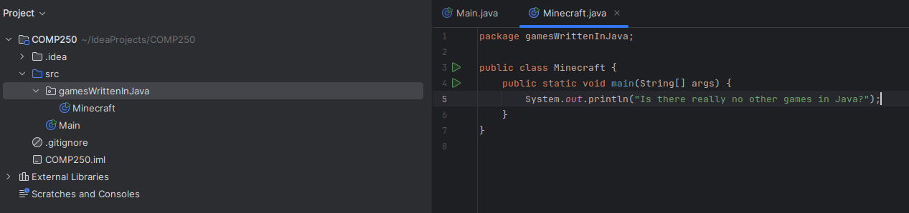
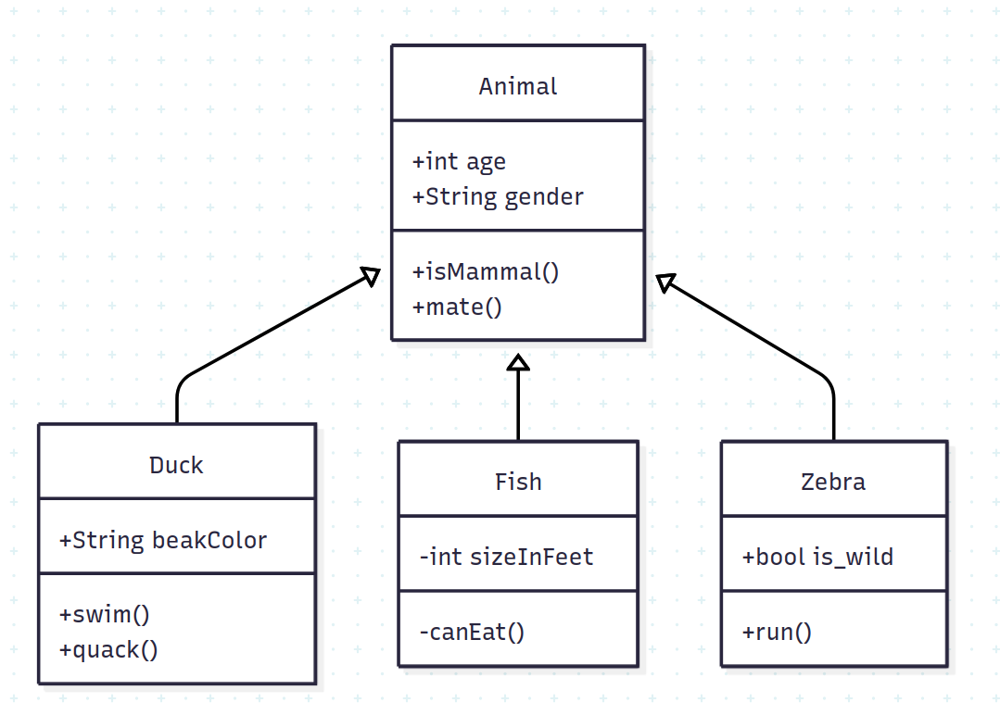
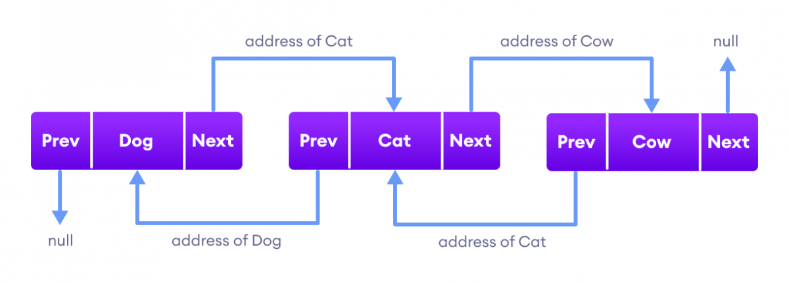
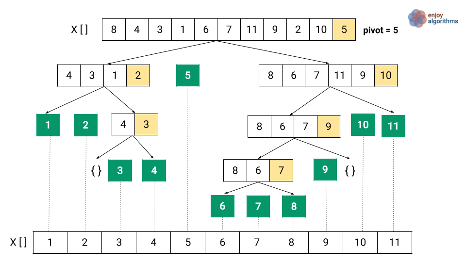
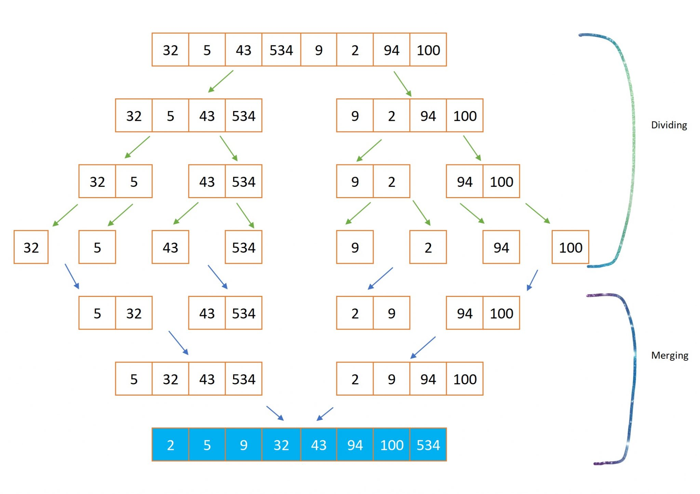
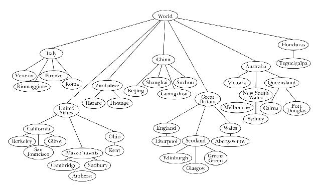

```java
public class COMP250 {
	public static void main(String[] args){
		System.out.println("COMP 250 - Introduction to Computer Science");
	}
}
```

This course is an introductory course to concepts seen and used in the field of computer science. It starts diving into more advanced concepts and lays down the ground work needed to enter many of the more advanced topics in the field.

The course uses the Java programming language for its course work. However, familiarity with Java will be taught during the first few weeks.

This course has [COMP 202 - Foundations of Programming](obsidian://open?vault=Obsidian%20Vault&file=COMP%2FCOMP%20202%2FCOMP%20202%20Course%20Overview) (or equivalent) and [MATH 140 - Calculus 1](#insert-link-here) (or equivalent) as a prerequisites. It also has [MATH 133 - Linear Algebra and Geometry](#insert-link-here) as corequisite. Note that COMP 202 can be skipped with sufficient programming experience. 

---

### Table of Contents

- [**Unit 1**: Introduction to Java and Object Oriented Programming](#unit-1-introduction-to-java-and-object-oriented-programming)
  * [Java](#java)
    * [Java Syntax](#java-syntax)
    * [Variables and Types](#variables--types)
    * [Operators and Control Flow](#operators-and-control-flow)
    * [Static Arrays](#arrays)
    * [Final Elements](#final-elements)
  * [Object Oriented Programming](#object-oriented-programming)
    * [File Organization](#file-organization)
    * [Classes](#classes)
    * [Inheritance](#inheritance)
    * [Interfaces](#interfaces)
    * [The `null` value](#the-null-value)

- [**Unit 2**: Basic Data Structures and algorithms](#unit-2-basic-data-structures-and-algorithms)
  * [Big O Notation](#big-o-notation)
  * [Basic Data Structures](#arraylists)
    * [ArrayLists](#arraylists)
    * [Generic Classes](#generic-classes)
    * [Linked Lists](#linked-lists)
    * [ArrayList vs LinkedList](#arraylist-vs-linkedlist)
  * [Model Data Structures](#model-data-structures)
    * [Stacks](#stacks)
    * [Queues](#queues)
  * [Quadratic Sorting Algorithms](#quadratic-sorting-algorithms)
    * [Bubble Sort](#bubble-sort)
    * [Selection Sort](#selection-sort)
    * [Insertion Sort](#insertion-sort)

- [**Unit 3**: Recursion](#unit-3-recursion)
  * [Mathematical Induction](#mathematical-induction)
  * [Recursive Algorithms](#recursive-algorithms)
    * [Factorials](#factorials)
    * [Fibonacci number calculator](#fibonacci-number-calculators)
    * [Binary Search](#binary-search)
    * [Quick Sort](#quick-sort)
    * [Merge Sort](#merge-sort)
  * [Recurrences](#recurrences)
    * [Solving binary search](#solving-binary-search)
    * [Solving merge sort](#solving-merge-sort)

- [**Unit 4**: Advanced Data Structures](#unit-4-advanced-data-structures)
  * [Trees](#trees)
  * Graphs 
  * Hashmaps

# Unit 1: Introduction to Java and Object Oriented Programming


## Java

[^ Back to top](#table-of-contents)

> Ok, let's put this out of the way first: you are probably not going to learn how to make Minecraft 2 after taking this course. Got it? Nice

By this point in your computer science journey, you are assumed to have become familiar with at least one programming language. If you have taken [COMP 202 - Foundations of Programming](https://www.mcgill.ca/study/2024-2025/courses/comp-202) , then that should be Python. This course will be using the Java programming language.

Java is a High Level Programming language, and is one of the most popular programming languages in the world. It is renowned for its portability and its ability to write to any system with ease, and is still very popular today, being used in many of the back-end systems, and the Android System as a whole (although Kotlin has been on the rise in that department).

To write in Java, you will need two essential components. First is the [**Java Development Kit**](https://www.oracle.com/java/technologies/downloads/) (JDK). This contains all the tools that you will need to write and run a Java program. Second is a Java IDE. Although it is possible to write in Java on a typical text editor app like any other programming language, a proper IDE will make your life significantly easier. There are many options but the most popular option is [Jetbrains' IntelliJ Idea](https://www.jetbrains.com/idea/). This is a paid IDE, but it has a discount for students where you can use the IDE for free. You may also use "IntelliJ Idea Community Edition" (same link), which is the free version for everyone but doesn't have as many features. Alternatively, another popular option is the [Eclipse IDE](https://eclipseide.org/). This option is completely free and still has all the essentials for Java development. 

> Java is both a compiled and interpreted programming language. The compiler will compile your Java source code into byte code, which the Java Virtual Machine (JVM) can then interpret to run. This is how Java achieved the portability it's famed for. You don't need to worry about that, as the IDE you chose to use will do that part for you, making it feel no different than an interpreted language like Python.

--- 
### Java Syntax

[^ Back to top](#table-of-contents)

This section will speedrun through the details of how to write a Java program, and will mostly use Python as a source of reference. Ready? This will go by quickly. 

Java is an Object Oriented Programming language by nature (will go over in more detail later). Everything you write in Java has to be part of a class for an object. Every Java program will have a class name that matches the file name. For example, if you have a file called `HelloWorld.java`, your code will have to start at some point with

```java
public class HelloWorld {

}
```

> This is no longer necessary in the newer versions of Java, but for the sake of this course, it is designed to be adaptable to any version of Java. I promise you we will manage to make you hate Java boilerplate by the end of this course.

You may notice the curly brackets `{}` used in the code. If you come from the C family, Javascript, or basically any language that isn't Python, you are already familiar with how they work. In Java (and basically every other popular programming language), we use curly braces`{}` to define code blocks. Think of how you use indentations in Python, and you have how to use curly brackets in Java. This means that all forms of indentation is completely optional in Java and you could hypothetically write your entire Java program in a single line. Practically though, we still use indentation to make the code readable

#### Methods (Functions)

If we want to run a Java file, it will search for the `main()` method, and run the code in there. The header for the `main()` method will always be the same.

```java
public class HelloWorld {

	public static void main(String[] args){
		System.out.println("Hello World!");
	}
	
}
```

Ok, a lot of things to note from this.

- `System.out.println()` is the `print()` statement in Java. The "ln" means it will print a new line at the end. If you don't wish to do that, you can also use `System.out.print()`, which functions identically but doesn't print a newline character
- Every statement in Java ends with a semicolon (`;`). If you're from basically any language other than Python, you're already very familiar with this. Just remember to terminate all statements with semicolons, otherwise your code won't compile.
- The method header has a lot more keywords than how it was in Python. 
  * `public` and `static` are modifier keywords. We will see them later. 
  * `void` refers to the return type of the method. Unlike Python, you must specify what your function returns in Java
  * `main()` is the name of the method
  * `String[] args` describes one parameter of the method. `String[]` defines the parameter's type (in this case, an array of String), and `args` is the name of the parameter.

We will be exploring methods more when we begin Object Oriented Programming

#### Comments

To write comments in Java, you have two choices. For one-line comments, you use `//` to define where a comment starts. For block comments (multi-line comments), you use `/*` to define where the comment starts, and `*/` to define where the comment ends

```java
public class HelloWorld {

	public static void main(String[] args){
		//prints "Hello world!"
		System.out.println("Hello World!");
		
		/*
		Are you enjoying Java so far?
		
		People online love to hate on Java for a variety of reasons, but 
		it's still widely used to to its robust nature
		*/
	}
	
}
```

### Variables & Types

[^ Back to top](#table-of-contents)

To declare a variable inside Java, you must define the type of the variable beforehand. Java is a static-typed programming language, meaning if you declare an `int` variable, that variable will remain an `int` for the remainder of how long you use it. You cannot assign a `boolean` value to an `int` variable for example. Here are some variable declarations and initialization

```java
public class VariablesShowcase {

	public static void main(String[] args){
	
		String name = "John Doe";
		int apples = 215;
		float altitude = 120384.23;
		double pi = 3.1415926535897932384626433832795028841;
		char bestLetter = 'E';
		boolean something = true;
		byte theGreatestNumber = 42;
		short iRanOutOfVariableNameIdeas = 25565
		long aVeryLongNumber = 4567876543567898765412321;
		// Note that all of these are declarations followed by initializations
		// You can declare a variable without initializing it like so
		int nonInitializedInteger;
		// You can also declare array types. 
	}
	
}
```

You are probably familiar with most of these variable types. Here's the new ones
- `double` functions identically to a `float`. The difference is that whereas a `float` is stored with 32 bits of data, a `double` is stored with 64 bits. Therefore, a `double` variable has more precision at the cost of using more memory. `double` is the default floating point type in Java.
- `char` is a single character. They are written between single quotation marks `' '`. In Java, single quotation marks `' '` are used for `char` type values, while double quotation marks `" "` are used for `String` type values.
- `byte` ,`char` and `long` function identically to `int`. The difference is that `byte` stores an 8 bit value (possible values between -128 to 127), `short` stores a 16 bit value (possible values between -32768 to 32767), and `long` stores a 64 bit value (possible values between -9,223,372,036,854,775,808 to 9,223,372,036,854,775,807). `int` is the more commonly used, but the others are also used when there are memory constraints or dealing with very large numbers

> You'll notice that `String` is capitalized at the start. This is because `String` is an pre-defined object, not a primitive type.

#### Type Casting

To change a value's type, we may use type casting, which is a new concept if you come from Python.

Type casting allows you to change a value's type from one primitive type to another. There are two types of type casting: *implicit* casting and *explicit* casting.

**Implicit casting** occurs when you try to convert a smaller data type to a larger one. Java does this automatically for you when needed. Here's the order in which it works

`byte` -> `short` -> `char` -> `int` -> `long` -> `float` -> `double`

And here's an example in code

```java
public class ImplicitCasting{
	public static void main(String[] args){
		int a = 42;
		double b = a;
		System.out.println(a);
		System.out.println(b);
	}
}
```

Running this will output 

```
42
42.0
```

**Explicit casting** is when you try to convert from a larger data type to a smaller one. The order is the exact reverse of the above one, which is: 

`double` -> `float` -> `long` -> `int` -> `char` -> `short` -> `byte`

If you try to type cast the same way as before

```java
public class WrongExplicitCasting{
	public static void main(String[] args){
		double a = 42.65;
		int b = a;
		System.out.println(a);
		System.out.println(b);
	}
}
```

Java will return a compile time error

```
WrongExplicitCasting.java:4: error: incompatible types: possible lossy conversion from double to int
                int b = a;
                        ^
1 error
```

This is because going from a larger data type to a smaller data type carries the risk of losing data, which is why Java won't do it automatically. You have to manually do it in your code by placing the type in parentheses `()`.

```java
public class ExplicitCasting{
	public static void main(String[] args){
		double a = 42.65;
		int b = (int) a;
		System.out.println(a);
		System.out.println(b);
	}
}
```

And now, we can run our code, and it returns the result

```
42.65
42
```

#### Naming Conventions

This is just a very quick aside for naming conventions in Java. If you loved using underscores in python, I'm sorry

- **Classes**: The start of every word should be capitalized in the place of spaces. Examples: `Student`, `ListNode`, `Mock­Manager­Worker­Repository­Concrete­Proxy­Factory`
- **Methods & Variables**:  Should start with a lower case letter, but capitalize where there should be spaces. Examples: `days`, `maxHealth`, `bogoSort`, `anUnecessarilyAndAnnoyinglyLongVariableName`
- **Constants**: Should be all capitalized with underscores for spaces. Examples: `COLORS`, `MAX_HEALTH`, `I_RAN_OUT_OF_FUNNY_EXAMPLES_TO_WRITE_LONG_NAMES_WITH`

### Operators and Control Flow

[^ Back to top](#table-of-contents)

Here's a list of operators and notes about how they differ from Python

**Math and assignment operators**
- `+` performs addition
- `-` performs subtraction
- `*` performs multiplication
- `/` performs division. If you do a division `/` between two integers, it will perform an integer division by default. (`5/2` returns 2). To get the decimals, you need to type cast into either a `float` or a `double`
- `%` performs modulous
- `++` increments the variable by 1. Identical to `x = x + 1`
- `--` decrements the variable by 1. Identical to `x = x - 1`
- `=` assigns a value to a variable. `+=`, `-=`, `*=`, `/=`, and `%=` all function the same way they did in Python

**Comparison & Logical operators**
- `a == b` returns `true` if `a` equals `b`
- `a != b` returns `true` if `a` is not equals to `b`
- `a > b` returns `true` if `a` is greater than `b`
- `a < b` returns `true` if `a` is less than `b`
- `a >= b` returns `true` if `a` is greater or equal to `b`
- `a <= b` returns `true` if `a` is less or equal to `b`
- `a && b` returns `true` if `a` AND `b` are `true`
- `a || b` returns `true` if `a` OR `b` are `true`
- `!(a)` returns `true` if `a` is `false` and vice versa

You can still perform string concatenation with arithmetic operators. However, you can no longer multiply strings to an integer. In code

```java
public class RipStringMultiplicationFans{
	public static void main(String[] args){
		// You can still do this
		String a  = "String concatenation " + "still works";
		
		// You can't do this anymore
		String b = "You can't do this anymore. N" + ("o" * 10);
	}
}
```

#### Conditionals and Loops

This is how you write an if/else chain in Java

```java
public class ConditionalDemo{
	public static void main(String[] args){
		int yourAge; 
		if (yourAge < 18){
			System.out.println("You cannot enter a bar anywhere in Canada");
		}
		else if (yourAge == 18){
			System.out.println("You can enter a bar in Alberta, Manitoba, and Quebec");
		} else {
			System.out.println("You can enter a bar anywhere in Canada");
		}
	}
}
```

> You'll notice I placed the `else if` statement on a new line, while I placed the `else` statement on the same line. Both are acceptable by conventions. It's a matter of preference

This is how you write a while loop in Java

```java
public class WhileLoopDemo{
	public static void main(String[] args){
		int i = 0;
		int result = 0;
		while (i < 50){
			result += i;
			i++;
		}
		System.out.println(result);
	}
}
```

And for the most interesting one, here's how you would write a for loop in Java

```java
public class ForLoopDemo{
	public static void main(String[] args){
		int result = 0;
		for (int i = 0; i  < 50; i++){
			result += 1;
		}
		System.out.println(result);
	}
}
```

Ok, that's not at all how it works in Python. Let's go over what's happening here

A for loop will need three code statements inside its brackets, separated by semicolons `;` `for (statement 1; statement 2; statement 3)`

- `statement 1` is executed once before the code block executes
- `statement 2` is the condition that is checked for terminating the loop
- `statement 3` is executed every time after the code block executes

If you want to enumerate elements of an iterable type, you can use a for each loop. A for each loop is written `for (type element : iterable){}`, where `type` is the type of the elements, `element` is the variable name that will be used for iteration, and `iterable` is an iterable object such as an array. Speaking of which.

### Static arrays

[^ Back to top](#table-of-contents)

To declare an array type variable, we use square brackets at the type declaration. Array indexing is also done by using square brackets on the variable name. Here's an example, as well as other array operations

```java
public class ArrayDemo{
	public static void main(String[] args){
		
		int[] arrayOfInts = {1,2,3,4,5};
		System.out.println(arrayOfInts[2]); //prints out 3
		
		arrayOfInts[2] = 10;
		System.out.println(arrayOfInts[2]); //prints out 10
		
		System.out.println(arrayOfInts.length); // prints out 5
		
		for (int element : arrayOfInts){
			System.out.print(element); // prints out 1 2 10 4 5
		}
		
		//Declares and initializes an empty array of size 100
		int[] bigEmptyArray = new int[100]; 
	}
}
```

One very notable difference compared to Python is that arrays in Java have a **static size**. Once you initialize an array, you cannot change the array's size without creating a new array. This means that arrays in Java can get "full", and you will need to write a resizing function. Alternatively, you can use an ArrayList, which is a pre built object. More on those later

You can also declare multi dimensional arrays like so `int[][] squareMatrix = new int[5][5]`. To access an element in the inner array, you simply do `squareMatrix[i][j]`

### Final elements

[^ Back to top](#table-of-contents)

The `break` and `continue` statements work identically to how they were in Python.

There exists what's called a `switch` statement. These can be used to replace multiple if/else statements. Here's a usage example

```java
public class SwitchCaseDemo{
	public static void main(String[] args){
		int day = 1;
		switch (day) {
			case 1:
				System.out.println("Monday");
			    break;
			case 2:
			    System.out.println("Tuesday");
			    break;
			case 3:
			    System.out.println("Wednesday");
			    break;
			case 4:
			    System.out.println("Thursday");
			    break;
			case 5:
			    System.out.println("Friday");
			    break;
			case 6:
				System.out.println("Saturday");
			    break;
			case 7:
			    System.out.println("Sunday");
			    break;
			default:
				System.out.println("Something wrong occured");
		}
	}
}
```

When ran, the switch statement will compare its value to every case provided. If there's a match, it will execute the code inside. The `default` code block will be executed if no code matches are found. Note that the switch statement does not automatically break out of the testing when a match is found, which is why every case code has a `break` statement.

A variable **only exists within the scope it is declared in**. You're already familiar with this concept with local variables in Python, but in Java it extends further. If you declare a variable inside a code block, it will no longer exist outside of the code block. This means if we try to run this

```java
public class VariableScopeDemo{
	public static void main(String[] args){
		int age = 17;
		if (age < 18){
			boolean canEnterBars = false;
		}
		else{
			boolean canEnterBars = true;
		}
		System.out.println(canEnterBars);
	}
}
```

We get a compile time error

```
VariableScopeDemo.java:10: error: cannot find symbol
                System.out.println(canEnterBars);
                                   ^
  symbol:   variable canEnterBars
  location: class VariableScopeDemo
1 error
```

To solve a problem like this, we can declare the variable outside the if/else block and assign a value to it inside the code block.

```java
public class VariableScopeDemo{
	public static void main(String[] args){
		int age = 17;
		boolean canEnterBars;
		if (age < 18){
			canEnterBars = false;
		}
		else{
			canEnterBars = true;
		}
		System.out.println(canEnterBars); //Returns false
	}
}
```

This applies to anything that uses code blocks: if/else blocks, while loops, for loops, switch cases, methods, etc.

You can raise exceptions in Java with the `raise` keyword. The syntax is `raise new Exception()`.

Annnnd we're done with Java syntax. Remember that the best way to learn the syntax is through actual coding. We're not done with learning Java though, as to use Java to its fullest potential, we need to fully understand Object Oriented Programming. Buckle up boys and girls, we still got a lot to go

## Object Oriented Programming

[^ Back to top](#table-of-contents)

In Java, there are 8 primitive types: `byte`, `short`, `char`, `long`, `int` `float`, `double` and `boolean`. Everything else is an Object. This part will assume you know nothing about Object Oriented Programming.

### File organization

There are 3 main levels of organization for a Java project

- A **package** is a group of classes
- A **class** is a group of methods and attributes
- A **method** is a group of commands

In the computer level organization, the packages are the folders in which the `.java` and `.class` files are found, the classes are individual `.java` and `.class` files, and the methods are the functions inside a class.

> Note that `.java` files are source code files, while `.class` files are the compiled byte code files.



> Naming conventions for packages is similar to methods and variables

You may use any class inside the same package freely. If file `Runescape.java` was also in package `gamesWrittenInJava`, I can call the `Minecraft` easily from within

```java
package gamesWrittenInJava;

public class Runescape{
	public static void main(String[] args){
		System.out.println("Didn't know this game was written in Java");
		Minecraft sisterGame = new Minecraft();
	}
}
```

> After writing this example, I learned that modern day Runescape is written in C++. Runescape was originally a browser game written in Java. Due to a lack of other examples, we're assuming Runescape is a Java game in this context.

This works from within the package, but sometimes, you want to use classes that are outside of your original package. For that, we have several options. Assume we now have a different package called `players`, and inside the file `Parrot.java`, because everyone knows parrots are the biggest players of Minecraft and Runescape.  If we want to reference an object in the `gamesWrittenInJava` package from within the same project, we could write the entire path towards the class name

```java
package players;

public class Parrot{
	public static void main(String[] args){
		gamesWrittenInJava.Minecraft mainGame = new gamesWrittenInJava.Minecraft();
	}
}
```

This works, if you use the package once or twice. However, it can get very tedious very quickly. To avoid having to rewrite the entire path, we can instead use import statements, which work identically to how they did in Python.

By convention, import statements are placed at the top of the file, before the class declaration, but after the package declaration. Here's what `Parrot.java` would now look like

```java
package players;

import gamesWrittenInJava.Minecraft;

public class Parrot{
	public static void main(String[] args){
		Minecraft mainGame = new Minecraft();
	}
}
```

With the import statement, we now imported the class `Minecraft` from the `gamesWrittenInJava` package. If we want to import the entire package instead (to get the 3 other games written in Java), we can instead do `import gamesWrittenInJava.*;`.

### Classes

[^ Back to top](#table-of-contents)

Now let's talk about the classes themselves. A **class** serves as a blueprint of an object that can be recreated with ease. Imagine you were coding a game and wanted to add monsters in there. The best approach would be to create a class called `Monster`, code the expected behavior of your monsters inside the `Monster` class, and reuse the class `Monster` whenever you want to make an new monster.

Up until now, all our examples could've been rewritten in functional programming, where we don't use classes and objects. Let's look at an example that is specifically designed to demonstrate the advantages of Object Oriented Programming

```java
package entities;

public class Monster {
	
	//Constant
	private static int MAX_HEALTH = 40;
	
	//Attributes
	private int health;
	private int attackDamage;
	private double speed;
	private boolean isBeserk;
	
	//Constructor
	public Monster(int currentHealth, int attackDamage, double speed){
		this.health = health;
		this.attackDamage = attackDamage;
		this.speed = speed;
		if ((double) currentHealth / MAX_HEALTH  <= 0.1){
			this.isBeserk = true;
		}
		else{
			this.isBeserk = false;
		}
	}
		
	// Method
	public void growl(){
		if (this.isBeserk){
			System.out.println("GRAWAERAWAHAHHAHHLLLL");
		}
		else{
			System.out.prinlnt("Grrrr...");
		}
	}
}
```

> Notice how we didn't write a main method. Only the file you are running requires a main method. Otherwise, its inclusion is optional.

> Notice the order in which all the elements are introduced. This is by convention. Unfortunately, the next few parts will not explain the elements in order

Ok let's look at each element one by one. 

At the start of the file, we define and initialize the constants and variables the class will use. We could give default values for the variables, or we can set them in the constructor

The constructor is a special method, as it gets called whenever a new class gets initialized.  If you look at earlier examples, you may have spotted the `new Element()` syntax being used. This is when we're creating a new object of type `Element`, and calling upon the constructor. The constructor can take in parameters, and it's used to initialize the values of our new object.

Methods are functions inside the class

You may notice the `this` keyword used in various methods. `this` refers to the object which the method is being called onto. Think of it as if monster 1 was growling, we don't want monster 2 to change.

Annd everything up until now should've been stuff you have seen in some ways in COMP 202. Now let's start with the new content

#### Modifiers

Up until now, I've written the keywords `public`, `private`, `static`, etc. without really explaining them. We still haven't covered all the content needed to understand them, but I'll explain the ones that we can actually explain right now

I'll use them to describe methods, but the same applies for attributes and classes.

First, there is the **access modifier** keyword. There are four of them in Java. 

- `public` means that the method can be accessed from anywhere within the project. Members outside the package, members inside the package,etc.
- `protected` means that the method may only be accessed by classes within its package OR subclasses of the class. More on those later.
- No modifier(if you don't put a keyword) makes it so that the method may only be accessed by classes within its package
- `private` means that the method may only be accessed within the class it's defined in

A general rule of thumb is that you want to make as many elements of your class `private` as possible. This is to keep with one of the core principles of OOP, which is *encapsulation*. 

**Encapsulation** refers to the way to bundle coding pieces together to allow for greater security and to simplify data hiding. In general, it means we only give the user access to the data they need to finish their task. This allows us greater control over the way our code functions and our data flows, which makes it easier to reuse and maintain.

> “Start with everything private. Expose only what’s necessary.” - ChatGPT

There are also the **non-access modifier** keywords. There are multiple, but here are the ones we will be seeing in this course

- `static` means that the method belongs to the whole class, rather than being specific to each object.
- `final` means that the method cannot be modified or overriden. More on that in the inheritance section
- `abstract` is a weird one to explain right now. Just keep in mind that it exists for now and we'll see it again once we get to inheritance.

> Unlike the access modifier, you can have multiple non-access modifier. You could have a `private static final int` for example.

Static fields are often called *class variables*, while non-static variables are often called *instance variables*. To reference a static method/attribute, you would use the class name instead of the variable name. If we have

```java
public class Cow{
	public static void moo(){
		System.out.println("Moo!")
	}
}
```

Then to access it from a different class, we would use `Cow.moo()`

#### Methods

Now let's look at information specific to methods

So far, all the methods we've seen are void methods, meaning they have no return value. You can define a method that returns a value, whether it's a primitive type or an reference type (Object). To do so, you use the `return` keyword, which works nearly identically to how it works in Python

> One exception is that Java doesn't allow "dead code". This means that if you have code in your method that is unreachable no matter the situation (ex: code after a return statement), you will run into a compile time error.

In general, your fields should always be kept `private`. To modify or obtain the field's value outside of your class, you would then user getter/setter methods, which would be public. The rationale is that it give you more control over the fields, allowing you to add checks and logs and more. This fulfills the principle of encapsulation in OOP

Here's a basic example 

```java
public Monster{

	private int health;

	public Monster(health){
		this.health = health;
	}
	
	// Getter method (most have the same syntax)
	public int getHealth(){
		return this.health;
	}
	
	// Setter method (most have the same syntax)
	public void setHealth(int health){
		this.health = health;
	}
}
```

Another concept is called **method overloading**. This allows greater flexibility to use a method in other context. Let's take the `Random` class for example. When declaring a new `Random` object, we can construct it in two ways.

```java
import java.util.Random;

public class RandomDemo{
	public static void main(String[] args){
		Random unseededObject = new Random();
		Random seededObject = new Random(42);
	}
}
```

There are two ways to initialize a `Random()` object, an unseeded, where they choose a random seed, and a seeded, where you pre-define the seed. This is done by method overloading, where two methods in the same class have the same name, but different parameters.

> Note that only the name has to be the same, and parameters must be different. Modifiers and return types can be the same or can be different when overloading methods.

Let's look at another special method: `toString()`. If you remember `__str__` from python, this is the equivalent in Java. It's a method included by default in every class of Java, but returns an address by default. You can manually change what it writes by writing a `toString()` method yourse

```java
public String toString(){
	//Write your string transforming method here
}
```

### Inheritance

[^ Back to top](#table-of-contents)

Let's go back to the video game we were creating. Assume we want to create a arsenal of monsters: zombies, orcs and skeletons. We can create a separate class for each of them, but when we code each of them, we may notice that all of them have a lot of similarities in how they function. Assume, for example, that we write an `attack()` method in each of them. They might play different animations and have different hit ranges, but they all deal a certain percentage of their `attackDamage` to the enemy. Also, they all have that method.

This is where *inheritance* comes in handy. **Inheritance** is the mechanism of building one class upon another class. This way, we get similar implementations of multiple classes. The class that inherits from another class is called a **subclass** or *child class*, while the *parent class* is also called the **super class**. 

Let's look at how we would implement inheritance with our video game example. Here's an example of how we would write our Monster class

```java
package entities;

public class Monster {
	
	private int attackDamage;
	
	public Monster(int attackDamage){
		this.attackDamage = attackDamage;
	}
	
	public void attack(Fighter f) {
		//Assume the Fighter class exists and has a takeDamage() method
		f.takeDamage(this.attackDamage);
	}
}
```

Now, let's create a class `Zombie` that inherits the `Monster` class. Assume zombies are stronger than most monsters, meaning they deal more damage, but they are stupid and miss 50% of their attacks.

```java
package entities;

import java.util.Random;

public final class Zombie extends Monster{
	
	public static int BASE_ATTACK_DAMAGE = 10;
	
	private Random rng;
	
	public Zombie() {
		super(BASE_ATTACK_DAMAGE);
		this.rng = new Random();
	}
	
	public void attack(Fighter f){
	
		if (this.rng.nextDouble() >= 0.5){
			super(f);
		}
		
	}In a subclass, all non-private elements are inherited
}
```

Ok, there are a few things to talk about in this `Zombie` class. Let's explain them one by one.

- The `extends` keyword indicates that the class is a subclass of another class. A subclass inherits all methods, fields and nested classes (more on those later) from its super class.
- In this class, we are **overriding** both the constructor and the `attack()` method. **Method overriding** is when an instance method have the same signature and return type, but one is found in the parent class and one is found in the child class. This allows us to define different, but similar behavior in the child class more easily
   * You may have noticed the `super()`function in both methods. Calling this in a child class will call the method of the same name in the parent class, while doing so in a constructor will call the code found in the parent class' constructor in the child class.
- You might remember the `final` modifier from earlier. A `final` class cannot be extended further. A `final` method or field cannot be modified or overridden. This is useful for safety in your code.

In a subclass, all non-private elements are inherited. In our `Monster` example, this means that both the constructor and the `attack()` method are inherited: you don't need to write them again. The `attackDamage` field, however, cannot be seen from a subclass.

> A subclass can inherit from multiple super classes.
#### UML Diagrams

To display inheritance trees in a project (and class structures as a whole), we use what's called an **UML diagram** to make it easier to visualize. 



> Source: [Mermaid diagraming](https://mermaid.js.org/) default example

A UML diagram box has three sections. The name of the class, the fields of a class, and the methods a class contains. It has arrows that display inheritance relations.

#### The `Object` class

As mentioned earlier, everything in Java except the primitive data types is an Object. Java has a pretty big inheritance tree, and at the root of the tree is the `Object` class. Every class ever created in Java inherits from the `Object` class. To learn more about it, read the [documentation about the class](https://docs.oracle.com/javase/8/docs/api/java/lang/Object.html). Note that this is where many of the methods each class has by default comes from.

> Are you getting tired of learning OOP? Because I'm starting to get tired of writing about OOP. Courage, we're almost at the end.

#### `instanceof`

A quick aside to talk about the `instanceof` keyword. This allows us to test whether or not an object is an instance of a certain class. The syntax resembles

```java
if (element instanceof Class){
	System.out.println("It returns true if 'Class' is a superclass of element or element's class");
}
```

We usually reserve this as a last resort though.

#### Polymorphism

An object can have multiple forms. The `Duck` from our UML example is both a `Duck` and an `Animal`. Our `Zombie` is also a `Monster`. They can both use methods from both their own class and their superclasses.

#### The `abstract` keyword

When `abstract` was first mentioned above, it was stated to be a weird one to explain. Now that we saw inheritance, we can go into `abstract` classes and methods

An `abstract` method is a method whose implementation must be specified in a class' subclasses. Basically, you declare its existence in the parent class, but force the children to develop themselves what to do.

An `abstract` class on the other hand is a class that cannot be instantiated. Therefore, you must create subclasses of it. Otherwise, it behaves like a non-abstract class. We can have abstract classes with no abstract methods. This allow us to create classes that cannot be instantiated, but can only be inherited.We cannot instantiate an abstract class, but we can define constructors. These constructors are called when an instance of a subclass is created.

Let's take for example this abstract class that defines a shape, with an abstract method inside

```java
package shapes;

public abstract class Shape{
	//Abstract method
	public abstract double getArea();
}
```

We cannot instantiate a `Shape` object,  meaning to use this class, we must create a subclass. Let's call it `Rectangle`

```java
package shapes;

public class Rectangle extends Shape{

	private double base;
	private double height;
	
	public double getArea(){
		return base * height;
	}
}
```

In a similar fashion, here's `Circle`

```java
package shapes;

import java.lang.Math;

public class Circle extends Shape{
	
	private double radius;
	
	public double getArea(){
		return 2 * Math.pow(radius,2) * Math.PI;
	}
}
```

### Interfaces

[^ Back to top](#table-of-contents)

Sometimes, instead of declaring a class, you may declare an `interface` instead for your object. An **interface** is similar to an abstract class, where it has methods and fields, and is designed to be extended into subclasses. 

The crucial difference is that in interfaces, all methods are public and abstract by default, and all fields are public, static and final. Essentially, it's just a list of method names and field names that other classes can use as an implementation blueprint.

Let's make a `HouseAnimal` interface

```java
interface HouseAnimal{
	public void makeSound(); // Implied to be abstract
	public void reactionToBeingPet(); //Implied to be abstract
}
```

And now, if we want to create classes `Dog` and `Cat` that use the `HouseAnimal` interface, we need to override the abstract methods. An interface also cannot have a constructor.

```java
import java.util.Random;

public class Dog implements HouseAnimal{
	
	public void makeSound(){
		System.out.println("Woof!");
	}
	
	public void reactionToBeingPet(){
		this.pant();
	}
}

public class Cat implements HouseAnimal{
	
	Random rng = new Random();
		
	public void makeSound(){
		System.out.println("mrrooow");
	}
	
	public void reactionToBeingPet(){
		if (this.rng.nextDouble() >= 0.1){
			this.doNothing();
		}
		else{
			this.crashOut();
		}
	}
}
```

The benefit of interfaces is that Java does not allow inheriting from multiple super classes, but it does allow implementing multiple interfaces. To implement multiple interfaces, you simply write `implements Interface1, Interface2, ...` in the header.

There are two important interfaces that are used to make a lot of classes function

#### The `Comparable` interface

This interface has a single abstract method, which is the `compareTo(Object o)` method. This interface is commonly used by elements that you want to be able to compare to each other. For example, if you want to sort some elements in a certain order, you need to be able to compare them to each other.

The `compareTo(Object o)` method takes a single parameter, which is the object you want to compare to. The method `e1.compareTo(e2)` returns an `int` that is

- negative if  `e1 < e2`
- zero if `e1 == e2`
- positive if `e1 > e2`

#### The `Iterable` and `Iterator` interfaces

Remember the for-each loop. Well if you want your class to be able to use those, you need to implement this interface

The `Iterable` interface has only one method that needs to be implemented, which is `iterator()`. This creates a new iterator object. That's it

The `Iterator` interface, on the other hand, has two methods that need to be implemented, `hasNext()` and `next()`.

- `hasNext()` returns a boolean if the iteration has more elements in it.
-  `next()` returns the next element in the iteration

> Usually, when a class implements `Iterable`, it will also implement `Iterator`. An iterator should be designed such that you may remove elements from whatever you're iterating during the iteration without issues. This is done with the optional `remove()` method from the iterable

### The `null` value

[^ Back to top](#table-of-contents)

When you initialize a variable in an array, it will generally take a default value. For primitive types, the default value is different variants of `0` for all types that represent a number, `false` for `boolean`, and `\0` for `char`.  For any reference types, however, the default value is `null`.

`null` works similarly to the `None` element in Python. Any object can also take the value of `null`, and it is often returned by functions when a searched value doesn't exist, or an invalid input is put in.

Since a `null` value is not an object, it cannot use methods related to any object. If your code ever encounters a situation like this, it will return perhaps the most infamous exception in Java: `NullPointerException`. Make sure to properly handle `null` cases, but you will probably still encounter this exception at some point :)


>And we're done with OOP, which means we're also done focusing on the programming part of the course. The rest of the course is focused on various data structures and algorithms.

# Unit 2: Basic Data Structures and Algorithms

[^ Back to top](#table-of-contents)

This section will be a list of introductions to various data structures and algorithms. Starting from now on, most of the code for algorithms will be written in pseudo code, following more or less closely Java syntax.

## Big O Notation

[^ Back to top](#table-of-contents)

Before we begin our various observation, we will take a look at the way we measure time complexity in Computer Science.

A first intuition to measure the running time of an algorithm is to simply use real life time to make the comparison. This works somewhat, as we can relatively easily time code in milliseconds or seconds inside our computers using various software. There are too many variables that can influence the result though. The speed of the computer itself, how many other programs are running simultaneously. All in all, it's not reliable and doesn't give any useful information

In Computer Science, rather than using time notation, we look at number of operations. Basically "how many steps does it take to complete a certain task".  For example, calculating the area of a circle takes 3 steps. You square the radius, multiply it by $\pi$ , and multiply that by 2. 

But that's still not really useful information. After all, at smaller scales, pretty much every operation can be finished basically instantaneously. Therefore, *to measure an algorithm's time complexity*, we look at *how much the number of operations grows, as the input grows*. 

Let's go back to calculating the area of a circle. If we assume multiplication to be one operation, then this algorithm runs in constant time. This is because it doesn't matter how big the radius is; it will always take 3 steps to calculate the area. 

To denote time complexity, we use what's called the **big O notation**. We write $O(g(n))$, where $g(n)$ is a function that describes the rate at which the number of operation grows as input size $n$ grows. Calculating the area of a circle would run in $O(1)$, or constant time. A description of a function in terms of big O notation usually only provides an upper bound on the growth rate of the function.

Here's a list of the most common time complexities.


> Graph source: [freeCodeCamp.org](https://www.freecodecamp.org/news/big-o-cheat-sheet-time-complexity-chart/)

- $O(1)$ or **constant time** is when the number of operations does not change as input size gets larger. 
- $O(log (n))$ or **logarithmic time** is when the number of operations increases at a logarithmic rate as the input size gets larger. This means the increase rate gets smaller as the input size gets larger.
- $O(n)$ or **linear time** is when the number of operations increases at a linear rate as the input size gets larger. This means the increase rate remains constant as the input size gets larger
- $O(n * log(n))$ commonly referred to as "n log n", but also called *logarithmic time*. This is when the complexity of an algorithm is some linear function multiplied by a logarithmic function. This complexity is commonly found in sorting algorithms
- $O(n^2)$ or **quadratic time** is when the number of operations increases at a rate that can be described by a quadratic function, meaning the increase rate gets larger as input size gets larger.  Despite being slow, a quadratic time algorithm can still be worked with at larger input sizes. This complexity is common in algorithms that use nested for loops.
- $O(2^n)$ or **exponential time** is when the number of operations increases at a rate that can be described by a exponential function. Such an algorithm becomes unusuably slow at large input sizes.
- $O(n!)$ or **factorial time** is when the number of operations increases at a rate that can be described by a factorial. Such an algorithm is usually unusable.

> Note that for all of these, the coefficients don't matter. An algorithm who's rate of increase is described by $250n$ is still considered to run in *linear time*. An algorithm who's rate of increase is described by $12n^4$ is still considered to run in *quadratic time*.

> Why are *exponential time* and *factorial time* so much worse than the others? Let's take an input size of 32 and feed it through an algorithm of each time complexity. The logarithm is of base 2 as logarithmic algorithms typically involve halves. With that in mind
>
> A *constant time* algorithm finishes in **1** operation
> A *logarithmic time* algorithm finishes in **5** operations
> A *linear time* algorithm finishes in **32** operations
> A *n log n* algorithm finishes in **160** operations
> A *quadratic time* algorithm finishes in **1024** operations
>
> An *exponential time* algorithm finishes in **4294967296** operations
> A *factorial time* algorithm finishes **263130836933693530167218012160000000** operations

This notation is used to calculate three time complexities: Best case scenario ($\omega (n)$) , Average case scenario ($\theta (n)$), and Worst case scenario $O(n)$. Worst case analysis is the most used as it's easier to find and gives a clear upper bound of the worst we can expect. In this course, we'll be looking at best case and worst case

## Basic Data Structures

The following will look at various basic data structures
### ArrayLists

[^ Back to top](#table-of-contents)

In Unit 1, we took a brief look at how to declare arrays in Java. This section will look at them in more detail.

Arrays are one of the data structures that can be used to store data. They are an ordered list of elements, indexed at each block. You can think of them as a block of consecutive slots in memory.

Java allows the creation of static arrays by default. These arrays have memory allocated at compile time and have a fixed size. This comes with a whole set of limitations. So instead, why don't we try to create a dynamic array like those that Python has by default?

Let's see how we would implement that in Java. First, we need to outline all the operations we want to allow our array to do.
- `get(i)` obtain the element at index `i`
- `set(i,e)` set the element at index `i` to element `e`
- `add(e)` add element `e` to the end of the array
- `add(i,e)` insert element `e` to index `i`
- `remove(i)` remove element at index `i` and returns it
- `remove(e)` remove the first occurrence of element `e` if it exists and returns a boolean indicating if it's successful. 
- `clear()` empties the list
- `isEmpty()` returns `true` if array is empty
- `size()` Returns the size of the array

So now, we can start implementing our array. Here's the first draft, with all the obvious methods already written. Let's assume we're making an ArrayList of `String` objects for now

```java
public class ArrayList{
	
	private int size;
	private String[] elements;
	
	public ArrayList(){
		this.elements = new String[8];
		this.size = 0;
	}
	
	public String get(int i){
		return this.elements[i];
	}
	
	public void set(int i, String e){
		this.elements[i] = e;
	}
	
	public void clear(){
		this.elements = new String[size];
		this.size = 0;
	}
	
	public boolean isEmpty(){
		return this.size == 0;
	}
	
	public int size(){
		return this.size;
	}
}
```

All of the following functions run in constant time ($O(1)$) since array indexing also runs in constant time.

Now what about `add(e)`. Let's try to implement it the intuitive way

```java
public void add(String e){
	this.elements[this.size] = e;
	size++;
}
```

This works... until the array is full. This means we'll have to resize the array at some point.

To resize the array, we'll need to create a new array of a larger size, copy all existing elements over, and reset our array reference to the new array.  The intuitive approach would be to make the new array one size larger, as that would be the most memory efficient. However, copying all elements from one array to another runs in linear time ($O(n)$), so we'd rather minimize the amount of time we have to resize as much as possible, while being as memory efficient as possible.

The most popular approach then, is to double the size on each resize. Let's write the modified `add(e)` method and the `resize()` method

```java
// We add a field to track the array's capacity. 
// Assume this is also added in the constructor
// In this case, it would be instantiated to 8
private int capacity;

public void add(String e){
	if (this.size == this.capacity){
		this.resize()
	}
	this.elements[this.size] = e;
	this.size++;
}

private void resize(){
	// Create new array
	String[] newArray = new String[this.capacity * 2];
	
	// Copy elements over
	for (int i = 0; i < this.size; i++){
		newArray[i] = this.elements[i];
	}
	// New references
	this.elements = newArray;
	this.capacity *= 2;
}
```

Due to the need to resize. `add(e)` runs in linear time worst case $O(n)$, although it runs constant time $O(1)$ best case. We can also write `add(i,e)` in a similar way, except we need to shift elements to the right more.

```java
public void add(int i, String e){
	//Resizing logic
	if (this.size == this.capacity){
		this.resize()
	}
	//Shift elements
	int j = this.size;
	while (j != i){
		this.elements[j] = this.elements[j-1]; 
		j--;
	}
	
	//Insert element
	this.elements[i] = e;
	this.size++
}
//This method has the same time complexities as the other add() method
```

Finally, there's the `remove(i)` method. The intuitive way would just be to remove the element at element `i` and be done with it. However, that can create gaps in our ArrayList object, which generates wasted space, as our `add()` method doesn't account for that. Therefore, we should also shift all objects to the left after we removed the object. Here's how it would work

```java
public String remove(int i){
	String removedElement = this.elements[i];
	
	int j = i;
	while (j < this.size - 1){
		this.elements[j] = this.elements[j+1];
		j++
	}
	
	this.size--;
	return removedElement;
}

public boolean remove(String e){
	int j = 0;
	boolean elementLocated = false;
	while (j < this.size){
		//Check if it's the element
		if (this.elements[j] == e && !elementLocated){
			this.elements[j] = null;
			elementLocated = true;
			this.size--;
		}
		//Shifting Logic
		if (elementLocated && j != this.size - 1){
			this.elements[j] = this.elements[j+1]
		}
		j++
	}
	return elementLocated;
}
```

`remove(i)` runs with constant time ($O(1)$) best case , and linear time ($O(n)$) worst case. `remove(e)` on the other hand runs in linear time ($O(n)$) both best case and worst case. This is because we have to go through the entire array no matter the outcome.

Now if all of that sounded like a nightmare to code in whenever you want to use dynamic arrays, you'll be happy to hear that Java already did all the hard work for you. You can import the `java.util.ArrayList` object and it will come with all these objects and methods pre-packaged. The goal of this part is to make you understand what happens "under the hood" behind dynamic arrays. Having said that, there is one concept you need to understand to be able to use the object.

### Generic Classes

[^ Back to top](#table-of-contents)

This is a quick aside to explain generic classes. As you saw just now, it gets quite tedious having to code data structure logic even once. Therefore, we want to make that data structure code as reusable as possible. To do so, we can make use of generic classes

Generic classes are classes with created with a placeholder class in its logic. They are denoted by the angled brackets. Let's look at ArrayList for example

```java
import java.util.ArrayList;

public class GenericClassDemo{
	public static void main(String[] args){
		ArrayList<Integer> arrayOfInts = new ArrayList<>(); 
		ArrayList<String> arrayOfStrings = new ArrayList<>();
	}
}
```

> You have to give an object type when declaring the variable type. When creating the object however, Java can infer it for you

> You cannot use primitive types for generic classes. This is why we use the object `Integer` instead of `int`. These are called wrapper classes, and you can also use the `Double`, and `Character` wrapper classes.

This allows a class to be more versatile for the classes in its logic. In the source code, we just add a placeholder name to the angled brackets, typically a single capital letter.

### Linked Lists

[^ Back to top](#table-of-contents)

Arrays are not the only way we have of generating a list. Introducing **linked lists**, our second data structure of this course.

The basic idea of a linked list is that it's a series of nodes connected to each other. Each node would have one field that contains the node's value, and one field that contains a pointer to the next node. Unlike an ArrayList, a linked list does not use any "array" objects.


> A visual of a linked list. [Source: GeeksforGeeks](https://www.geeksforgeeks.org/dsa/linked-list-data-structure/)

Let's outline the operations that we want our LinkedList to perform

- `get(i)` obtain the element at index `i`
- ~~`set(i,e)` set the element at index `i` to element `e`~~
- `addFirst(e)` add element `e` to the start of the list
- `addLast(e)` add element `e` to the end of the list
- `removeFirst()`removes the first element and returns it
- `removeLast()` removes the last element and returns it
- ~~`clear()` empties the list~~
- ~~`isEmpty()` returns `true` if list is empty~~
- ~~`size()` Returns the size of the list~~

>`set(i,e)`, `clear()`, `isEmpty()`, and `size()` are trivial, so we won't rewrite them. 
#### Singly linked list

[^ Back to top](#table-of-contents)

With that in mind, let's start coding our linked list. We'll begin by making a singly linked list. We will assume we're making a linked list of String again for simplicity

```java
public class LinkedList{
	
	private int size;
	private LinkedListNode head;
	private LinkedListNode tail; //This one is optional, but we'll add it
	
	public LinkedList(){
		this.size = 0;
		this.head = null;
		this.tail = null;
	}
	
	private class LinkedListNode{
		
		String data;
		LinkedListNode next;
		
		public LinkedList(String data){
			this.data = data;
		}
	}
}
```

Already very unfamiliar territory, what we have here is a nested class used to store the nodes. You can put other logic into the node class, but for this example, just some data placeholder will be enough.

Now let's start with `get(i)`

```java
public String get(int i){
	LinkedListNode current = this.head;
	int j = 0
	while (current != null && j != i){
		j++;
		current = current.next;
	}
	return current;
}
```

Well that's a lot more code than before, isn't it.

Unlike an ArrayList, indexing in a Linked List does not run in constant time. This is because a linked list only keeps track of a head pointer and each node only keeps track of the node after itself. With this algorithm, the best case is equivalent to `getFirst()` and runs in constant time ($O(1)$), while the worst case is equivalent to `getLast()` and runs in linear time $O(n)$  as you have to go through the entire list.

You can alleviate this somewhat by using a `tail` pointer to your list, which points to the last element of the list. This still doesn't change the worst case of `get()` as a whole, running in linear time, but it does give a constant time ($O(1)$) option for `getLast()`.

Now let's look at `addFirst()` and `addLast()`

```java
public void addFirst(String e){
	LinkedListNode newNode = new LinkedListNode(e);
	newNode.next = this.head;
	if (this.head == null){ //If initial list was empty
		this.tail = newNode;
	}
	this.head = newNode;
	this.size++;
}

public void addLast(String e){
	LinkedListNode newNode = new LinkedListNode(e);
	if (this.head == null){ //If initial list was empty
		this.head = newNode;
		this.tail = newNode;
	}
	else{
		this.tail.next = newNode;
		this.tail = newNode;
	}
	this.size++;
	
}
```

Ok, what are we doing here?

We need to remember to update all the appropriate fields when adding or removing elements to a linked list. Otherwise, we break our list altogether. This is what's happening here.

To go by step by step, in `addFirst()` we first create a new node for our element, with a pointer to the previous first element to our new node. Then we need to update the head pointer and tail pointer as needed, before updating the size of our list. `addLast()` works in a similar way, but we update the previous tail node, not our new node.

Although we have to do more steps ourselves, we are rewarded in efficiency, as both `addFirst()` and `addLast()` run in constant time ($O(1)$). 

Let's look now at implementations of `removeFirst()` and `removeLast()`
```java
public String removeFirst(){
	if (this.size == 0){ //Edge case 1
		return null;
	}
	LinkedListNode returnNode = this.head;
	returnNode.next = null; //Optional but good practice
	
	if (this.size == 1){ //Edge case 2
		this.head = null
		this.tail = null
	}
	else {
		this.head = this.head.next;
	}
	
	this.size--;
	return returnNode.data; //Should use a getter method instead
}

public String removeLast(){
	if (this.size == 0){ //Edge case 1
		return null;
	}
	
	LinkedListNode returnNode = this.tail;
	if (this.size == 1){ //Edge case 2
		this.head = null
		this.tail = null
	}
	else {
		LinkedListNode current = this.head;
		for (int i = 0; i < this.size - 1; i++){
			current = current.next;
		}
		this.tail = current;
		current.next = null;
	}
	
	this.size--;
	return returnNode.data;
}
```

Ok that's even more code

There are two important edge cases when removing elements from a linked list: an empty list, and a list of size 1. We can't remove an element from an empty list for obvious reasons, and we have to make sure to define a list is empty if we removed the last element.

As for the code itself, in `removeFirst()` we first make an empty list check, then we identify the head element. We then reassign the head pointer to the next element and return the head element. Simple algorithm and runs in constant time ($O(1)$)

`removeLast()`, on the other hand isn't as simple. We start with similar steps, identifying the last element. However, we now need to find the second last element to change its next pointer to null and identify it as the new tail element. This extra step requires going through the entire linked list to arrive at the second last element, which is why `removeLast()` runs in linear time ($O(n)$).

There is a way to solve this little issue however

#### Doubly linked list

[^ Back to top](#table-of-contents)

A doubly linked list functions identically to a singly linked list. The only difference is that each node also has a pointer `prev` that points to the previous element



> A visualization of a doubly linked list. [Source](https://www.programiz.com/java-programming/linkedlist)

To write the classes for a doubly linked list, we would now write as follows

```java
public class LinkedList{
	
	private int size;
	private LinkedListNode head;
	private LinkedListNode tail;
	
	public LinkedList(){
		this.size = 0;
		this.head = null;
	}
	
	private class LinkedListNode{
		
		String data;
		LinkedListNode next;
		LinkedListNode prev; 
		
		public LinkedList(String data){
			this.data = data;
		}
	}
}
```

The operations of a doubly linked list are implemented very similarly to how they were implemented for a singly linked list. `get()`, `addFirst()`, `addLast()` and `removeFirst()` are left as exercises to the reader. We'll be looking at `removeLast()` as that's the more interesting one

```java
public String removeLast(){
	if (this.size == 0){ //Edge case 1
		return null;
	}
	LinkedListNode returnNode = this.tail;
	if (this.size == 1){ //Edge case 2
		this.head = null;
		this.tail = null;
	}
	else {
		returnNode.prev.next = null;
		this.tail = returnNode.prev.next;
	}
	
	this.size--;
	return returnNode.data;
}
```

As you can see, we've simplified the method a lot more. This is because we don't have to traverse the entire list to reach the second last element anymore. This makes a doubly linked list run `removeLast()` in constant time ($O(1)$).

Again, having to implement this every single time is very time consuming. This is why we can use the `java.util.LinkedList<>` object instead, which comes with all this code pre-packaged and more. 

> In a doubly linked list, the `head` element has a null pointer for `prev`, and the `tail` element has a null pointer for `next`. If you connect those two together (`head.prev` points towards `tail`, and `tail.next` points towards `head`), you create what's called a **circular linked list**. The implementations are very similar to how you implement a doubly linked list, except the `tail` pointer is redundant.

### ArrayList vs LinkedList

[^ Back to top](#table-of-contents)

We've now looked at the two most basic ways of storing data, which are the basic structures that every data structure afterwards will be built upon. This is a simple analysis of each approach's pros and cons and when you should use each of them

**ArrayLists** are very efficient at accessing stored data thanks to indexing. Manipulating the array itself by adding or deleting existing data, however, is slow, as you potentially have to change the index of many data points (sometimes the whole list). Use ArrayLists if you need to access data fast and rarely insert/delete new elements.

**LinkedLists** are very efficient when it comes to inserting and removing data at the beginning or end. Since a linked list is essentially a collection of pointers, it's very fast to modify those to adapt to new changes. However, list traversal and access is much slower. Accessing any element except the first and last element will take traversing part of, or the entire list to do so. Use Linked lists if you need fast insertion/removals.


---
## Model data structures

The following data structures are models to follow to implement a data structure. They can be made with either an ArrayList or a LinkedList.

### Stacks

[^ Back to top](#table-of-contents)

A stack is a data structure that follows the principle of *"First in, last out"*. The principle is to have each new element "stack on top" of the previous one, and pick out the top element first whenever we want to obtain the next element.

The best analogy is building a stack of plates. Each time you are adding a plate, you are adding it to the top of the stack. This means the first plate added is the furthest down the bottom, while the last plate added is the furthest up the top. Each time you want to take a plate, you naturally take the top plate. This means whichever plate was added onto the stack the most recently is the first one to be taken off.

> A visualization of a stack. [Source](https://www.programiz.com/dsa/stack)

There are two core methods needed to make a stack work. 
- `push(e)` pushes the element `e` onto the stack
- `pop()` removes the element at the top of the stack and returns it.

As mentioned earlier, you can implement a stack with any basic data structure we've seen, you just need one method to represent the two for the stack.

- With an ArrayList, the best approach would be to use `addLast()` to perform the `push()` operation, and `removeLast()` to perform the `pop()` operation
- With a singly linked list however, it's much more efficient to use `addFirst()` and `removeFirst()` to perform `push()` and `pop()` respectively. You'll notice it's the exact opposite of an ArrayList
- A doubly linked list can use either approach effectively

### Queues

[^ Back to top](#table-of-contents)

A queue is a data structure that follows the principle "*First in, first out*". You've no doubt encountered queues already in your line; whether you're waiting in line at a grocery store, you've tried to enroll in a course that has a waitlist, you are rage queueing your 22nd game of ranked for the day. Queues are pretty much everywhere in life.


>A visualization of a queue. [Source](https://www.geeksforgeeks.org/dsa/what-is-queue-data-structure/)

A queue data structure follows pretty much the same logic as all the aforementioned examples. There are two core methods needed to make a queue function

- `enqueue(e)` Adds element `e` "to the end of the line"
- `dequeue()` Removes the element that's "first in line" and returns it

Just like stacks, queues can be implemented with any basic data structure we've seen. 
In this case, both ArrayLists and LinkedLists will use the same methods to implement a queue. You would use `addLast()` as the `enqueue()` method, and `removeFirst()` as the `dequeue()` method

---
## Quadratic Sorting Algorithms

[^ Back to top](#table-of-contents)

**Sorting algorithms** are step by step procedures used to arrange a collection of data in a particular order. They are valuable tools in Computer Science as many tool in manipulating data require the data set to be sorted, and it also makes the data easier to work with.

There are many ways to sort an unordered list. Some are slow, some are fast, some are easy to implement, some take more effort to implement, some are easy to understand, some are difficult to understand, and some are jokes. 

Right now, we will look at three different approaches to sort an unordered array. We will be using arrays of integers, and try to sort them in ascending order

### Bubble Sort

[^ Back to top](#table-of-contents)

Bubble Sort is a sorting algorithm known for being intuitive and easy to implement. The idea is simple. We go through the entire list, traversing every element one by one. If we encounter two elements where the left one is larger, we swap the two elements. Through an entire list, this will make the largest element "bubble" its way towards the end of the array

Here's how the implementation would work in pseudocode

```
public static bubbleSort(array){
	n = array.length
	for i from 0 to n-1{
		for j from 0 to n-2{
			if (list[j] > list[j+1]){
				swap(list[j], list[j+1])
			}
		}
	}
}
```

This iteration runs in quadratic time ($O(n^2)$), both in the best case and the worst case. We can slightly optimize it by making it such that instead going through the entire list, we replace the outer for loop by a while loop that iterates until the list is sorted. We can also slightly optimize it by making it sort a smaller segment of the array as it keeps running. Since the largest element bubbles towards the right on each iteration, there is a "zone" at the right of the list that we don't need to check anymore that grows larger with each iteration. Here's how such an implementation would work

```
public static bubbleSort(array){
	sorted = true
	i = 0
	n = array.length
	while (!sorted){
		sorted = true
		for j from 0 to n-i-2{
			if (list[j] > list[j+1]){
				swap(list[j], list[j+1])
				sorted = false
			}
		}
		i++
	}
}
```

These slight optimizations still don't change the worst case time complexity ($O(n^2)$), but the algorithm takes less steps overall, and it has a better best case time complexity of running in linear time ($O(n)$) if the given list is already sorted.

Bubble sort's ease of implementation and use comes at the cost of being one of the slowest sorting algorithms out there. Even among the other quadratic time sorting algorithms, it's still one of the slowest

### Selection Sort

[^ Back to top](#table-of-contents)

Here's another approach idea. We can go through the entire list and identify the smallest element. Once identified, we can swap that element with the element at the start of the list. That element is now in its sorted position. We repeat this again, finding the smallest element in our list excluding the one we already sorted, and placing it right next to our smallest element. We repeat these steps for the entire list. 

This approach is called **Selection Sort**. Here's how the implementation goes in pseudocode
```
public static selectionSort(array){
	n = array.length
	for i from 0 to n-2{
		min = array[i]
		for j from i to n-1{
			if (array[j] < min){
				min = array[j]
			}
		}
		swap(array[i],min)
	}
}
```

This approach runs in quadratic time ($O(n^2)$) in all cases, which might make you think that it's less efficient than bubble sort. In practice, swapping elements is costly and quite slow, and selection sort does significantly less swapping than bubble sort, which is why selection sort runs faster on average. It's still incredibly slow though and isn't very practical to use on larger datasets, unlike our final quadratic sorting algorithm

### Insertion Sort

[^ Back to top](#table-of-contents)

The idea goes as follows. We start with the second element of our list. We move it left until we encounter an element that is smaller than it. We move onto the third element of our list, and move it left until we encounter an element smaller than it. We repeat this process for every element in our list.

This approach is called **Insertion Sort**. Here's how we implement it in pseudo code

```
public static insertionSort(array){
	n = array.length
	for i from 0 to n-1{
		current = array[i]
		j=i
		while (j >= 0 && current < array[j]){
			array[j+1] = array[j]
			j--
		}
		array[j+1] = current
	}
}
```

Although this algorithm has a quadratic time ($O(n^2)$) worst case, it has a linear time ($O(n)$) best case (if the list is already sorted). This algorithm excels the most when dealing with a list that's mostly sorted. In those scenarios, insertion sort runs *very closely* to its linear time ($O(n)$) best case scenario. This can happen a lot when you're adding new data to an already existing dataset, such as new items to a shopping catalog, new entry in an experiment's results database, etc. In those scenarios, insertion sort beats the logarithmic time sorting algorithms that we will see later, making it more applicable than the other two in more scenarios.

# Unit 3: Recursion

[^ Back to top](#table-of-contents)

> This unit will be a lot more math focused than the other units. Bear with it.

Before we dive into recursion some more, we first have to understand *induction*

## Mathematical Induction

[^ Back to top](#table-of-contents)

In math, **induction** is a method to prove a statement about every natural numbers. The idea behind this method of proving is

1. Show that the statement is true for a first case, typically called the **base case**
2. Show that if the statement holds for an arbitrary number $n$, then it also holds for $n+1$. This is called the **induction step**

> To quote the domino example my discrete math teacher taught me: *"Here's an analogy using dominoes. You want to show that the first domino falls. Then, you want to show that if any domino falls, the domino also falls."*

Let's take a simple example. Our statement is that for every natural number $n$, the expression $3^n+1$ returns a multiple of 2 (even number).

1. We would first prove that it's true for $n=0$ as our *base case*. Here, $3^0 + 1 = 2$.
2. Our induction hypothesis states that this statement holds for $n$. We want to prove that it will hold for $n+1$. Here we just rewrite the formula $3^{(n+1)} + 1 = 3 * 3^n + 1$ . The new coefficient 3 is just 2+1, so we rewrite $3 * 3^n + 1 = (2 * 3^n + 1) + (1 * 3^n + 1)$. The left bracket is guaranteed to be even due to the multiplication with 2, and we assumed that $3^n+1$ is even by our induction hypothesis. The sum of two even terms is even. Hence we've proven that the statement holds for $n+1$. This concludes our proof.

This is the basic way that mathematical induction functions, and is the most common way of proving by induction. 

A more generalized statement of proving by induction to make it applicable to all situations goes as follows. Assuming a statement for all inputs $x$ of a function $f(x)$

1. Prove the statement holds for your base case(s). One base case is called a weak induction, while multiple is called a strong induction
2. Show that the statement holds for all values that can be generated by your base cases using inductive clauses
3. Show that those values are all the possible values $x$ can take.

The reason why induction here is important is that at some point, if you use an algorithm, you need to prove a statement about it for all inputs. This could be related to time complexities, space complexities, or even just the fact that it works as intended. So far, all our proofs have been trivial. This will not remain the case as we start looking at recursive algorithms

## Recursive Algorithms

[^ Back to top](#table-of-contents)

A **recusive algorithm** is an algorithm which uses calls back to itself to loop over and achieve its expected behavior. A recursive algorithm generally has two core components.

- A **base case** that terminates the program once a certain condition is met
- A **recursive/inductive step** that determines when the program is called again, usually on a smaller or simpler case.

Both components are important when writing a recursive algorithm. Without a base case, your algorithm runs infinitely and eventually crashes in a `StackOverflowError` (when the call stack for function exceeds capacity, called different things in other languages). Without a recursive step, your algorithm isn't recursive at all.

> Every recursive function can actually be written without recursion. However, recursion can simplify the code a lot, which is why it is sometimes preferred

The following section will list out a bunch of recursive algorithms. The time complexities will be stated, although they will be proven later.

### Factorials

[^ Back to top](#table-of-contents)

> My personal favorite to demonstrate recursion

I'm sure you know what a factorial is. If I asked you to write a function that calculates the factorial of an integer $n$. You might come up with something like this

```java
public static int factorial(int n){
	int result = 1;
	for (int i = 2; i <=n; i++){
		result *= i;
	}
	return result;
}
```

This works perfectly fine, but takes 5 lines to write (ew), and the logic is a bit convoluted. Instead of this iterative approach, let's try a recursive approach

```java
public static int factorial(int n){
	if (n <= 1){
		return n;
	}
	return n * factorial(n-1);
}
```

This recursive version of the factorial function performs the same as the above factorial function, but the code is simplified a lot, and it saves one precious line of code (phew). 

It also clearly demonstrates both parts a recursive function very clearly. The if block here is our base case, while the return statement is our recursive step.

This algorithm runs in $O(n)$, where $n$ is our integer.

### Fibonacci number calculators

[^ Back to top](#table-of-contents)

For those who don't know, the Fibonacci sequence is a sequence of number where every number is the sum of the two numbers that came before it. The first few numbers in the sequence are 1,1,2,3,5,8,13,21. We can define the Fibonacci sequence as a function $f_n = f_{n-1} + f_{n-2}$  with base cases $f_{n-1} = 1$ and $f_{n-2} = 1$

Here's how we would write this code iteratively

```java
public static int fibonnaci(int n){
	if (n == 0 || n == 1){
		return 1;
	}
	
	int fib0 = 1;
	int fib1 = 1;
	int fib2;
	
	for (int i = 2; i <=n; i++){
		fib2 = fib0 + fib1;
		fib0 = fib1;
		fib1 = fib2;
	}
	return fib2;
}
```

That code is a little convoluted. Let's simplify this code with recursion

```java
public static int fibonnaci(int n){
	if (n == 0 || n == 1){
		return 1;
	}
	return fibonnaci(n-1) + fibonnaci(n-2);
}
```

Wow, that's so much simpler

Although this code is significantly better to look at, this is a prime example where recursion makes our algorithm significantly worse. Our iterative version of the code runs in $O(n)$, where $n$ is the position of the fibonnaci number we're trying to compute. Our recursive version, however, runs in $O(2^n)$, which is awful. This is due to our recursive function recomputing many of the same values over and over again,. This is why even though the iterative version of the code is much more annoying to write, we prefer it over writing it recursively.

### Binary Search

[^ Back to top](#table-of-contents)

Now let's look at our first algorithm that is most commonly used recursively.

Assume you are a librarian. You have a collection of about 5000 books, sorted alphabetically. Someone comes to you and asks you to borrow "*Mathematical Statistics with Applications*". How would you find the book?

You could go over every single book individually and check every single one of them. In the best case, you find it on the first try, but in the worst case, you have to go through all 5000 books (if the book is not there, for example). That's like using a for loop over your collection, running in $O(n)$ worst case. We can do better

Instead, let's use a different approach. 

1. Check the middle book and compare it to our searched book. Is it the book? Great, we're done.
2. Otherwise, compare the middle book to our searched book. If the book is smaller alphabetically, pick the left half. If it's larger alphabetically, pick the right half
3. Repeat steps 1 and 2 with the smaller halves. Keep dividing until you either find the book you're looking for, or you run out of books to check

Let's picture it in action. You pick the book in the middle: "*Number Theory for Dummies*". Not the book we're looking for. Since the middle book is larger alphabetically than the one we're looking for, we shift our focus to the half that is to the left of this book, and never check any book to the right of the middle. This eliminates the need to check every single book in the right half. We check the middle book in the left half: "*Biological structures at a molecular level*". Not the book we're looking for, and the one we found is lower alphabetically, so we look at the half that is to the right of the book. We check the middle book in that's the middle of that half "*Mathematical Statistics with Applications*". Perfect, we found it. We can now terminate our algorithm and hand the book to our borrower

> For those of you who suggested to just look around the middle of the collection since that's where 'M' is most likely to be, we don't know the distribution of books on our shelves. For all we know, we could have a large number of 'M' books, causing them to expand very far to the extremities of our collection. We could also have a large collection of 'T' books, and no 'C', 'D' or 'F' books, causing our 'M' books to be shifted towards the left of our collection. 

This algorithm is called the **binary search** algorithm. It is an efficient algorithm to find an element in a collection, with two major constraints needed to make it work

- The collection must be sorted
- You must be able to access the data in the collection in constant time.

This algorithm, just like every other algorithm we will see after it, uses a concept called *divide and conquer*, where we divide a problem into smaller sub-problems to tackle it more efficiently

Assume we want to binary search through a sorted array of integers. There are two ways to implement binary search. We can implement it iteratively. Here's an iterative approach to find element `x` from an array,

```java
static int binarySearch(array, x){
	left = 0
	right = array.length
	
	
	while (left <= right){
	
		// We do integer division here
		mid = left + (right - left) / 2 
		
		// If we find the element, we return its index
		if (array[mid] == x){
			return mid
		}
		// if x is greater than mid, we ignore left half
		else if (array[mid] < x){
			left = mid + 1
		}
		// if x is smaller than mid, we ignore right half
		else{
			right = mid -1
		}
	}
	//If element was not found
	return -1
}
```

> This code, and all the remaining algorithms after it, are written in pseudo-code. Java syntax highlighting is enabled for readability.

We can also implement it recursively. Here's a recursive approach to find element `x` from an array

```java
static int binarySearch(array, left, right, x){
	
	if (right >= left){ //Base case
	
		// We do integer division here
		mid = left + (right - left) / 2 
			
		if (array[mid] == x){
			return mid
		}
		// if x is greater than mid, we ignore left half
		else if (array[mid] < x){
			return binarySearch(array, mid+1, right, x)
		}
		//Element can only be in left half, we ignore right half
		else{
			return binarySearch(array, left, mid - 1, x)
		}
	}
	else{ //Element not in array
		return -1
	}
}

void main(){
	//How to call the recursive function
	array = {10,20,30,40,50,60,70,80}
	elementToSearch = 70
	binarySearch(array, 0, array.length, elementToSearch)
}
```

This algorithm runs in constant time ($O(1)$) in the best case, and logarithmic time ($O(log(n))$) in the worst case, making it one of the most efficient searching algorithms we have.

To see binary search in action with visuals, and an iterative implementation in Python, please watch [this video](https://www.youtube.com/watch?v=fDKIpRe8GW4)

### Quick Sort

[^ Back to top](#table-of-contents)

Of course, to be able to use binary search, we need a sorted array. However, all the sorting algorithms we've seen so far haven't been particularly efficient, with all of them running in quadratic time ($O(n^2$)) worst case.

**Quick sort** will be the first out of two efficient sorting algorithms we will see. It gets its name for being possibly the fastest sorting algorithm we currently know of. It also uses the *divide and conquer* paradigm to sort a list. 

Let's go back to our library example. Something happened, and suddenly your 5000 books get thrown into a disordered pile. Now you need to sort them all over again. You could go over the unordered list of books and make swaps whenever you see an unordered pair (bubble sort). You could find the book that is first alphabetically repeatedly and put it to the left until you sort the list (selection sort). You could move each book left in its sorted position (insertion sort). All of these are kinda slow. Instead, let's use the quick sort algorithm

1. Pick a book. Any random book works. We'll call this book the pivot.
2. Go through the entire collection of books. Any book that is lower alphabetically, we place it to the left of the pivot. Any book that is higher alphabetically, we place it to the right of the pivot.
3. Place the pivot book in the middle of these two halves. The pivot is now in its sorted position
4. Repeat this process for each half, and repeat this process until the subsctions get small enough. 

By splitting the original collection into halves, we are able to avoid making a lot of unnecessary comparisons. By repeating this process on smaller subsets of our collection, we're able to sort our entire collection in an efficient manner.

Hence, if you ever needed to sort 5000 books, you now know one of the fastest ways to do so

> Some of you may have thought to instead group each book by their first letter, then sort by their second letter, then their third letter, and so on. This approach is called Radix Sort, and is more efficient than quick sort in certain scenarios, including this one. It's less universally applicable though, and harder to implement in code, so we're not seeing this algorithm



> A visualization of the quick sort algorithm. [Source](https://medium.com/enjoy-algorithm/quicksort-one-the-fastest-sorting-algorithms-2685fb0910c5)

Now how do we translate such an algorithm into code? We could write an iterative version of this algorithm, which would require a stack. Basically nobody writes this algorithm iteratively though, so let's write it recursively.

To begin, we first write a helper method called `partition()`. This method will perform the bulk of the sorting by picking a pivot, and splitting the list into two halves. Let's write it

```java
static int partition(array, left, right){
	
	// There are other ways to pick a pivot element
	// For now, picking the right most element of the array is good enough
	pivot = array[right]
	
	// Index to separate "smaller than pivot" from "larger than pivot"
	splitter = left - 1
	
	// The partitionning
	for (i=0; i < end; i++){
		if (array[i] < pivot){
			splitter++
			swap(array[i], array[splitter])
		}
	}
	
	//Bring pivot in the middle of the two sublists
	swap(array[splitter + 1 ], array[right])
	
	//Return the pivot index
	return splitter + 1
}
```

With this `partition()` method, we can now write the `quickSort()` method

```java
static void quickSort(array, left, right){

	if (left >= right){//Base case
		return
	}
	
	//Recursive step
	pivotIndex = partition(array, left, right)
	quickSort(array, left, pivotIndex - 1) //Recursively sort left half
	quickSort(array, pivotIndex + 1, right) // Recursively sort right half
}
```

The time complexity of this algorithm is highly dependent on the pivots we manage to pick. Ideally, we want to be picking the element at the middle of the sorted sublists to divide the array in the most efficient manner. This best case scenario would sort the array in $O(n*log(n))$. However, it is possible that every time we pick a pivot, we end up picking the largest element of the entire array, or the smallest element of the entire array. If that happens, then our quick sort algorithm essentially becomes an over-complicated selection sort algorithm. This means that interestingly enough, one of the fastest sorting algorithm we currently know of has a worst case time complexity of $O(n^2)$. However, this scenario happens rarely enough that quick sort is still one of the most practical sorting algorithm we have. (Average case is $O(n * log (n))$))

To see a visual explanation of quick sort, watch [this video](https://www.youtube.com/watch?v=Hoixgm4-P4M). 

> Some of you may have thought 'Hey, why don't we just find the ideal pivot every time instead?". The problem with that approach is that finding the middle element is a $O(n)$ operation. If we repeat this for the number of recursive calls we make to quick sort, we end up with a time complexity of $O(n^2 * log(n))$, which is even worse than the worst case scenario we had by just picking the pivot randomly.

### Merge Sort

[^ Back to top](#table-of-contents)

Merge sort is the other efficient sorting algorithm that we will be looking at. This also uses *divide and conquer* paradigm to sort an unsorted list.



> A visualization of merge sort. [Source](https://holypython.com/merge-sort-algorithm-python-code/)

The idea is as follows. We divide the list into two halves, then we recursively sort each half, before merging the two sublists back together.

Just like quick sort, this algorithm can be written using iteration. However, basically no one does that. 

Let's write the merge sort algorithm. To do so, we can first write a `merge()` helper function

```java
static int[] merge(array1, array2){
	finalArray = new array()
	
	// We first add elements from both sublists from smallest first, until
	// one of the two sublists is empty
	while (!array1.isEmpty() && !array2.isEmpty()){
		if (array1.get(0) < array2.get(0)){
			finalArray.addLast(array1.removeFirst())
		}
		else{
			finalArray.addLast(array2.removeFirst())
		}
	}
	
	//We then add the remaining elements into the final list, and return it
	while (!array1.isEmpty()){
		finalArray.addLast(array1.removeFirst())
	}
	while (!array2.isEmpty()){
		finalArray.addLast(array2.removeFirst())
	}
	return finalArray
}
```

Here, we can see the merging process, which is when we actually sort the list. The `mergeSort()` method divides the list to make it ready to be sorted

```java
static int[] mergeSort(array){
	
	if (array.size() <= 1){ //Base case
		return array
	}
	
	//Divide the list
	mid = (array.size() - 1) / 2
	array1 = array.getElements(0,mid)
	array2 = array.getElements(mid+1, list.size()-1)
	
	//Recursively divide the list
	array1 = mergeSort(array1)
	array2 = mergeSort(array2)
	
	//Sort and merge the list back together
	return merge(array1, array2)
}
```

The time complexity of merge sort really isn't obvious at first. However it does in fact run in $O(n*log(n))$ both in the best case and worst case scenario. The biggest differences between merge sort and quick sort is that merge sort creates multiple sub lists, which takes up more memory and requires more operations overall. This makes merge sort slower than quick sort on average, despite its consistent $O(n * log(n))$ time complexity.

To see a visual explanation of merge sort, watch [this video](https://www.youtube.com/watch?v=4VqmGXwpLqc)

## Recurrences

[^ Back to top](#table-of-contents)

So far, we've thrown out these recursive algorithms and their time complexities. However, we need to prove that they actually run in that time complexity.

To do so, we use *recurrence relation*. A **recurrence relation** is an equation or inequality where a function depends on its value on smaller inputs. The best known example of a recurrence relation is the Fibonacci sequence, where every term is the sum of the two terms that come before it.

We can use these relations to define a function $T(n)$ that describes the running time of a recursive algorithm. Let's first try this on our recursive factorial algorithm. We can define the function as

$$T(n) = c + T(n-1)$$

where $$T(1) = b$$

where $c$ is some constant value, and $b$ is the time it takes to solve our base case.

There are many methods to solve this recurrence. Forward substitution, back substitution, the recursion-tree method, and Master theorem. For this course, we will only use back substitution.

To do this, we simply substitute the recurring term with its previous terms. If we do this on our factorial formula, we get the following

$$T(n) = c + T(n-1) $$
$$= c + c + T(n-2)$$
$$ = c + c + c + T(n-3)$$
This continues, until we reach $T(1)$ after $n-1$ substitutions
$$ T(n) = (n-1) *c + T(1) = (n-1)c + b = nc + (b-c)$$
Here, we see a constant coefficient multiplying our input size $n$, added to another constant term $b-c$. This is a linear function, meaning that our function will run in linear time $O(n)$

Let's use this to solve the other recursive algorithms we've seen

> We won't be solving the recursive Fibonacci calculator algorithm.

### Solving binary search

[^ Back to top](#table-of-contents)

Let's use this principle to solve the time complexity of the binary search algorithm. Recall that binary search involves repeatedly splitting a sorted list into halves to find an element. Let's find the worst case scenario, when the element isn't there, and we have to traverse the entire list. We have

$$T(1)=b,\space\space T(n) = c+T(\frac{n}{2})$$

We will simplify our analysis by assuming $n$ is a power of two. Using back substitution

$$T(n) = c + T(\frac{n}{2})$$
$$= c+c+ T(\frac{n}{4})$$
$$= c+c+c+T(\frac{n}{8})$$
After $k$ substitutions, we reach
$$ = k * c + T(\frac{n}{2^k})$$
If we assume $2^k=n$, we can rewrite this expression
$$= kc + T(1)  = kc + b$$
Now, since $2^k=n$, this also means $log_2(n)=k$. We can therefore write
$$=c*log_2(n)+ b$$

Since $c$ and $b$ are constants, it means that our algorithm is bounded by $O(log(n))$.

Intuitively, this makes sense, as the amount of time to find an element in a collection of size 70 is the same as finding an element in a collection of size 110.
### Solving merge sort

[^ Back to top](#table-of-contents)

Now let's use recurrences to solve the time complexity of merge sort. Recall that merge sort involves recursively splitting the list into two halves and sorting them by merging them together. We have

$$T(1) = b, \space\space T(n) = b + c * n + 2 * T(\frac{n}{2})$$
For simplicity, we will assume $n$ is a power of two, and ignore the constant term $b$. Using back substitution

$$T(n) = cn + 2T(\frac{n}{2})$$
$$= cn+ 2(c\frac{n}{2}+ 2T(\frac{n}{4})= cn+cn+4T(\frac{n}{4})$$

Let's just skip to after $k$ substitutions
$$= cn*k + 2^kT(\frac{n}{2^k})$$
If we assume $2^k=n$, and therefore $k=log_2(n)$, we can rewrite
$$=cn*log_2(n)+2^{log_2(n)}T(1)$$
Simplifying
$$=cn*log_2(n)+bn$$
This whole function's growth is bounded by $O(n * log(n))$. Hence, this is the algorithm's time complexity

> You can try using back substitution to solve the other recursive algorithms we saw as well.

# Unit 4: Advanced Data Structures

[^ Back to top](#table-of-contents)

We've looked at pretty basic data types so far. These following data structures are commonly used to organize larger data networks

## Trees



> Example of a tree representing the world. [Source](https://people.eecs.berkeley.edu/~bh/ssch18/trees.html)

A **tree** is a widely used abstract data type. It is composed of a collection of *nodes*, called *vertexes*. We call the top node the **root**. Nodes are connected to each other through *edges*. we call them a **directed edge** if it's ordered (from one node to another), and an **undirected edge** if it's not ordered (a simple connection). For trees, it will primarily be directed edges we'll be having

*Child node* and *parent node* are terminology used for nodes in trees. When moving away from the root, you are going from parent to child. When moving towards the root, you are moving from child to parent, and vice versa. Every node except the root is a child, and each child node may only have one parent. Two nodes are said to be *siblings* if they have the same parent. An *internal node* is a node with at least one child. An *external node* (or *leaf*) is a node with no children. 

A *path* is a sequence of nodes with edges between them. The *length* of a path is the number of edges in that path. A node $v$ is an ancestor to a node $w$, if there is a path from $v$ to $w$. Similarly, $w$ is a *descendant* of $v$. The *depth (level)* of a node refers to the length of the path from the root to the node. The *height* of a node is the maximum length from the node to a leaf.

To implement a tree in Java, it's very similar to how linked lists were implemented. You have a pointer to the root, and a nested class for the node, which has an array of pointers to children classes and the data it contains.

```java
class Tree<T> {
	TreeNode<T> root;
	
	class TreeNode<T>{
		T data;
		ArrayList<TreeNode<T>> children;
		// You can also include a field for the parent, but that's not required
	}
}
```

> Examples of situations that use a tree data structure are your file system on your computer, or a person's ancestry tree

>Ok the rest of this course is a bit boring to write as it's very theoretical about frankly uninteresting topics to write about. Therefore, I'll just stop for now and move on to the next course. I might finish writing this, maybe...

[^ Back to top](#table-of-contents)