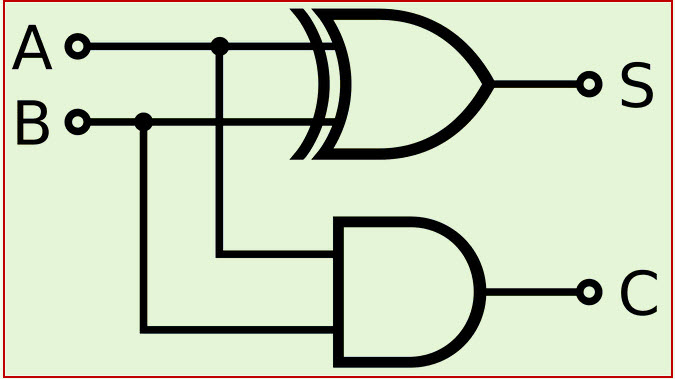

# COMP 273 - Introduction to Computer Systems

```mips
.data
course:   .asciiz "\n COMP 273 - Introduction to Computer Systems\n"

.text
.globl main

main:
	li $v0, 4
	la $a0, course
	syscall
	
	li $v0, 10
	syscall
```
This course is an introductory course to the functionalities within the computer systems.  It looks at a hardware and low level software to understand the basics of how computers funciton, the basic circuits used, the building of a CPU, and various conventions and systems.

This course is not about programming. However, it will require writing assembly code.

This course has [**COMP 206 - Introduction to Software Systems**](./comp206.md) as a corequisite.

### Course Content

- [**Unit 1** - Binary](#unit-1---binary)

Number base operations, twos complement, IEEE 754

- [**Unit 2** - Boolean Circuits](#unit-2---boolean-circuits)

Boolean Algebra, circuits

- [**Unit 3** - Assembly Programming](#unit-3---assembly-programming)

MIPS assembly

- **Unit 4** - IO and Memory

I/O interrupt, Caches, Virtual Memory

- **Unit 5** - CPU

CPU organization, datapath and control, pipelining

# Unit 1 - Binary

So far, while studying computer science, you've looked at a lot of software concepts and how to do them more efficiently. As you're probably aware however, computers can only process binary. How did we make all the operations that modern programs are capable of out of 1s and 0s?

This is what this course is about. We will be looking at a lot of seemingly disjoint and simple ideas, build upon them to create more and more complex features. We will look at how memory works, what instructions are built in. Our end goal is to understand how the CPU, the core of a computer, works. All the concepts we will be seeing throughout the course builds up to that end goal.

## Number bases 

To get started, we first need to understand the language that computers speak. To do that, we need to understand different number bases.

In our day to day life, we use base 10, where have 10 digits from 0-9. This is because we have 10 fingers, so it feels the most natural.

Computers, on the other hand, use **binary**, where there are only two digits which are 1 and 0. Each digit in binary is called a **bit**

Since a long string of binary can take a lot of space, we sometimes simplify it by using **hexadecimal**, or base 16. A hexadecimal number often has prefix `0x` to indicate that it's in hexadecimal base.

> In hexadecimal, a=10 b=11 c=12 d=13 e=14 f=15

A few binary terms that will also be used are 

- a **byte** is a group of 8 bits
- a **nibble/nybble** is a group of 4 bits
- a **word** (MIPS) is a group of 32 bits, or 4 bytes.

To represent a number in base $b$, we write each digits as $a_n*b^n + a_{n-1} * b^{n+1} + ... + a_0*b^0$ where $a$ represent the digits of the number. For example, 13 in binary is 1101, since $8+4+1=13$. 421 in hexadecimal is `0x1A5` as $1*16^2 +10*16^1 +5*16^0=421$

Note that the notation to express different bases is $a_b$ Therefore to indicate that 13 is a decimal number, we write $13_{10}$. To indicate that 10110101 is a binary number, we write $10110101_2$.  

### Integer base conversion

To convert an integer number in base $b$ to decimal, we simply multiply each digit by the base power they represent. This is what we did when we showed how bases work just a little above

To convert a number in decimal to base $b$, we use a little algorithm

1. Divide by $b$ and keep track of the remainder. That remainder is now the least significant bit
2. Repeat until our quotient is zero.

Let's look at an example by converting 13 into binary
$$
\frac{13}{2} = 6 \text{ remainder } 1
$$
$$
\frac{6}{2} = 3 \text{ remainder } 0
$$
$$
\frac{3}{2} = 1 \text{ remainder } 1
$$
$$
\frac{1}{2} = 0 \text{ remainder } 1
$$
The result we get is $1101_2$, which is in fact 13 in binary.

To convert a number from base $a$ into base $b$, we simply convert to decimal then to the desired base.

For special cases, such as when dealing with multiples of 2, it's much easier and much faster to group bits together to convert them. For example, to convert $10110010_2$ to hexadecimal, instead of going through decimal conversion, we can simply do

$$
1011_2 = B_{16}, 0010_2 = 2_{16}
$$
to get our hexadecimal representation of `0xB2`

### Floating points in other bases

The way we write floating point numbers in other bases is actually identical to how we write them in decimal. After the decimal point, we just we going down in number bases. For example, $101.11011_2$ is a floating point number in binary

We can still use the same technique to convert a floating point number from base $b$ to decimal, and the same tricks to convert from base $a$ to base $b$. To convert a floating point from decimal to base $b$, however, we need to modify our algorithm a little

1. Convert the integer part of the number in the same way as before
2. For the fractional part, first multiply by $b$
3. Substract the new integer parts, if any appear.
4. Repeat steps 2-3 until no fraction remain
5. Add removed integer parts together

For example, to convert $6.375_{10}$, we split the number into two parts. First we convert 6 into binary
$$
\frac{6}{2} = 3 \text{ remainder } 0
$$
$$
\frac{3}{2} = 1 \text{ remainder } 1
$$
$$
\frac{1}{2} = 0 \text{ remainder } 1
$$
We get $110_2$. Now we convert 0.375 into binary

$$
0.375 * 2 = 0.75
$$
$$
0.75 * 2 = 1.5
$$
$$
0.5*2=1
$$
Keeping track of the integer part of the multiplication results, we get $0.011_2$. Therefore $6.375_{10} = 110.011_2$ 

## Number Representation

### Integer Representation

So binary works, but now we have a new problem. How are we supposed to represent negative numbers? We have to somehow tell our computer when our number is positive, and when it's negative using only ones and zeros.

An approach we could use is to reserve one bit for the sign. Let's take the most significant bit. This way we can write 6 in a 4 bit number representation as $0110$ and -6 as $1110$. This approach seems to work, but we encounter two problems: there are two ways to write zero ($1000$ and $0000$), and there are no easy ways to add positive numbers to negative ones.

Okay so let's try another approach. We still use the most significant bit for the sign. The difference is that this time, we also take the inverse of each bit to calculate the value. Therefore, in a 4 bit number representation, we get 6 represented as $0110$, but -6 as $1001$. This approach is called **one's complement** and this solves our math issue. However we still have two ways to represent zero ($0000$ and $1111$). Also, all our calculated answers will be off by 1.

Let's try a third approach then. We still use a one's complement approach, but when our number is negative, we add 1 to the inverted bits. Therefore, in a 4 bit number representation, we get 6 represented as $0110$, but -6 as $1010$. This approach is called **two's complement** and it solves every problem we had with the previous approaches. There is only one way to write zero, and we can do math easily again. Two's complement is the most universally used approach to represent integers in binary.

#### Overflow and underflow

Now you may have noticed something important about two's complement. Assume we use 4 bits to represent our number. We can write the number 7, which is written $0111$. However, if we try adding 1 to our number, we get $1000$. Suddenly, our 7 becomes -8, which is not the result of 7+1.

Such a situation is called **arithmetic overflow**, and it happens because of the limited number of bits we have to represent our integer. The same can happen the other way around (if we have -8 and we decrement by 1), which is called an **arithmetic underflow**. 

This is why we have what are called integer limits, which can be found with $2^{n-1} - 1$. The most common number of bits to represent integers are 32 bits and 64 bits. The 32 bit integer limit is 2,147,483,647 which is surprisingly easy to reach in practical situations. The 64 bit integer limit is 9,223,372,036,854,775,807. This is a lot harder to reach in practical situations, which is why 64 bits is still enough for pretty much all use cases.

#### Character representations

This is a quick aside to how character are represented. Since there is no mathematical logic on how to represent the character "A", we have to rely on conventions.

One of the most used conventions is [ASCII](https://www.ascii-code.com/). This convention covers most common characters in English and computer science. with 127 characters represented. However, it's limited to English characters. As such, another character standard called [Unicode](https://home.unicode.org/) was formed. This standard has over 150k symbols, emojis and characters represented, and is used in pretty much all modern applications

### Floating Point representation

Now that we have floating points, we also have a new set of problems. For one, we have a lot more numbers we need to be able to represent. Numbers such as $\pi$ , euler's number, the gravitational constant, etc. We also have to do it in a way that takes a constant amount of memory. Therefore, we can't have pi taking infinite memory for example.

To understand the convention used for floating points, we first have to understand scientific notation. In the scientific world, we use scientific notation to represent numbers. This makes it easier to represent very large numbers like the mass of the Sun in kilograms, or very small numbers like the size of an atom in meters. A number in scientific notation is written like $2.99792458 \times 10^{10}$, where we have a fractional part (2.99792458), multiplied by a base with an exponent ($10^{10}$)

Ok, now we can see how we represent a floating point number in binary

The convention used in pretty much all computers is called IEEE 754. This gives indicators on how to represent a floating point number in 32 bits (single precision, `float`) and 64 bits (double precision, `double`). We will look at the 32 bit representation first


> [Source](https://www.geeksforgeeks.org/computer-organization-architecture/ieee-standard-754-floating-point-numbers/)

IEEE 754 represents the final float number in scientific notation. A number represented in IEEE-754 has the final form
$$
(-1)^{sign} \times (1 + fraction) \times 2^{E - bias}
$$

The 32 bits are divided into 3 fields. There is a field for the sign (1 bit). This is to indicate whether the number is negative (1=negative, 0= positive). This one is rather simple

There is a field for the exponent (8 bits). This represents the value of the exponent for the base to which the final number is multiplied. An intricacy about this field is that since we need a way to represent very small numbers, a bias is subtracted from the exponent. In single precision that bias is 127

The remaining bits (23 bits) are used to represent the fractional field (mantissa). The most significant bit of the fractional part is used to represent the first digit after the decimal dot, and the remaining 22 bits follow suit. Note that the fractional part is added by 1 for practical purposes.

Let's take an example. Let's represent -0.75 in single precision IEEE 754. 

1. We can immediately see it's a negative number, so we can set the sign bit to 1
2. Next, we need to convert 0.75 to binary. Calculating gives us $0.75_{10} = 0.11_2$
3. Next, we normalize the number into scientific notation. $0.11 \times 2^0 = 1.1 \times 2^{-1}$. This also gives us the bits for the fractional field
4. Finally, we find the value of the exponent field with respect to the bias. In this case, we need $E-127 = -1$, where we can find $E=126$. Converted to binary, that gives $01111110$ for our exponent field

Therefore, -0.75 in single precision IEEE 754 is 1 01111110 10000000000000000000000

Double precision IEEE 754 has the exact same fields, and same concepts. However it has 11 bits for the exponent (bias is 1023), and 52 bits for the fractional.

#### Special cases & Denormalized numbers

Here are a list of cases for number representation using IEEE 754.

| Exponent field | Fraction | Object represented    |
| -------------- | -------- | --------------------- |
| 0              | 0        | 0                     |
| 0              | Not 0    | Denormalized number   |
| 1-254          | Anything | Floating point number |
| 255            | 0        | Infinity              |
| 255            | Not 0    | NaN (not a number)    |

**Denormalized numbers** are simply numbers when the exponent field is set to all zeros. This allows us to represent more numbers in a tiny interval ($-2^{-126}, 2^{-126}$), which includes zero. This is tricky to implement.

#### Floating point arithmetic

To add two floating points together
1. Align the radix points (decimal point, make the smaller number match the larger ones)
2. Add the significands
3. Normalize the result
4. Round the number to make it fit IEEE 754

To multiply two floating points together
1. Add exponents together
2. Multiply significands
3. Normalize the result
4. Round the number to make it fit IEEE 754
5. Compute the sign

# Unit 2 - Boolean Circuits
> This section contains stuff that might sound obvious, but they form the backbone of computer circuitry

Although we could have numbers be based off whatever base we want, there are only three that are any useful. Decimal base is useful as it's the most familiar to us, and binary is useful as it's the easiest to implement for computers (either on or off). 

> Hexadecimal is useful to simplify and shorten reading binary values.

With that, the circuitry we design must be able to handle all the on and offs to produce the behavior we want. How did we perform that? This unit overviews some of those circuits

## Boolean Algebra

This section will overview how we handle operations that have booleans as inputs and outputs

### Truth tables and Boolean Operations

As simple as this sounds, this is an effective and widely used way to represent the results of a boolean function. In here, we put all possible values of the inputs, and what values the outputs would have.

As for operations we do on boolean values, we have three main ones:

The **AND** operation is written as a multiplication in mathematical notation ($A*B$). It outputs *TRUE* if both A and B are *TRUE*

| **A** | **B** | **A \* B ** |
| ----- | ----- | ----------- |
| 0     | 0     | 0           |
| 0     | 1     | 0           |
| 1     | 0     | 0           |
| 1     | 1     | 1           |

The **OR** operation is written as an addition in mathematical notation ($A+B$). It outputs *TRUE* if A is *TRUE*, B is *TRUE*, or both A and B are *TRUE*.

| **A** | **B** | **A + B** |
| ----- | ----- | --------- |
| 0     | 0     | 0         |
| 0     | 1     | 1         |
| 1     | 0     | 1         |
| 1     | 1     | 1         |

The **NOT** operation is written as a line over the variable(s)  ($\overline{A}$). It inverts the status of the variable

| $A$ | $\overline{A}$ |
| --- | -------------- |
| 0   | 1              |
| 1   | 0              |

These are the three basic boolean operations. Any boolean circuitry can be written as a combination of these three operations.

### Deriving a boolean expression

If you're given a truth table with inputs and outputs, there are two ways to derive a boolean formula out of it. You can write the expression as a *sum of products* or *product of sums*. Those are exactly what they sound like

For example, take the following truth table, where the output *Z* is *TRUE* only when two inputs are *TRUE*

| **A** | **B** | **C** | **Z** |
| ----- | ----- | ----- | ----- |
| 0     | 0     | 0     | 0     |
| 0     | 0     | 1     | 0     |
| 0     | 1     | 0     | 0     |
| 0     | 1     | 1     | 1     |
| 1     | 0     | 0     | 0     |
| 1     | 0     | 1     | 1     |
| 1     | 1     | 0     | 1     |
| 1     | 1     | 1     | 0     |
We can write the following *sum of products*
$$
Z = (A * B * C') + (A * B' * C) + (A' + B + C)
$$
or the following *product of sums*
$$
Z = ((A' + B' + C) * (A' + B + C') * (A + B' + C'))'
$$

> $A'$ is syntatically equivalent to writing $\overline{A}$ . There are many other ways  to write boolean operators that I'm too lazy to type out

>When doing product of sums, there's a high change you'll have to negate the final expression

### Boolean laws

Once we have a derived boolean formula, we might want to simplify it. To do so, we can use the following boolean laws

1. Identity: $A*1 = A, A+0 = A$
2. Annulment: $0*A=0, 1+A=1$
3. Idempotent: $A+A=A, A*A=A$
4. Inverse: $A*A' =0, A+A'=1$
5. Commutative: $AB = BA, A+B = B+A$
6. Associative: $A(BC)=(AB)C, A+(B+C) = (A+B)+C$
7. Distributive: $A+BC = (A+B)(A+C), A(B+C) = AB+AC$
8. Absorption: $A(A+B)= A, A+AB = A$
9. De Morgan's: $(AB)' = A' + B', (A+B)' = A' * B'$

## Boolean Circuitry

With these in mind, we can start looking at boolean circuits. Circuits are made using various transistors to replicate various boolean functions and operations

### Logic Gates


> [Source](https://www.animalia-life.club/qa/pictures/logic-gates-circuits)

All our circuits will be made using a combination of logic gates. We have AND, OR and NOT, which function identically to their boolean operation counter parts. We also have other gates that can be built with the previous three, but are often represented separately for simplicity

- XOR gates are *TRUE* if either input is *TRUE*, but not both

| **A** | **B** | **A XOR B** |
| ----- | ----- | ----------- |
| 0     | 0     | 0           |
| 0     | 1     | 1           |
| 1     | 0     | 1           |
| 1     | 1     | 0           |
- NAND gates are *TRUE* unless both inputs are *TRUE*

| **A** | **B** | **A NAND B** |
| ----- | ----- | ------------ |
| 0     | 0     | 1            |
| 0     | 1     | 1            |
| 1     | 0     | 1            |
| 1     | 1     | 0            |
- NOR gates are TRUE if both inputs are *FALSE*

| **A** | **B** | **A NOR B** |
| ----- | ----- | ----------- |
| 0     | 0     | 1           |
| 0     | 1     | 0           |
| 1     | 0     | 0           |
| 1     | 1     | 0           |
- XNOR gates are TRUE if both inputs are *TRUE* or both inputs are *FALSE*. This gate is almost never used

| **A** | **B** | **A XNOR B** |
| ----- | ----- | ------------ |
| 0     | 0     | 1            |
| 0     | 1     | 0            |
| 1     | 0     | 0            |
| 1     | 1     | 0            |

All of these gates can be built as a combination of AND, OR and NOT gates, but will be called separately to simplify our circuits, and because of how commonly used most of them are.

> It is worth noting that any circuit can be built using only NAND gates. Any circuit can also be built using only NOR gates.

#### The "Don't care" value

There are certain situations where we don't care about an input's value. Take this truth table for example, where Z is the output value of the following formula
$$
Z = (BC') + A
$$

| **A** | **B** | **C** | **Z** |
| ----- | ----- | ----- | ----- |
| 0     | 0     | 0     | 0     |
| 0     | 0     | 1     | 0     |
| 0     | 1     | 0     | 1     |
| 0     | 1     | 1     | 0     |
| 1     | 0     | 0     | 1     |
| 1     | 0     | 1     | 1     |
| 1     | 1     | 0     | 1     |
| 1     | 1     | 1     | 1     |
Here, you'll notice that if A is active, the values of B and C don't affect the output anymore. Hence, to simplify our truth table, we can write an "x" to indicate a "don't care" value for those inputs.

| **A** | **B** | **C** | **Z** |
| ----- | ----- | ----- | ----- |
| 0     | 0     | 0     | 0     |
| 0     | 0     | 1     | 0     |
| 0     | 1     | 0     | 1     |
| 0     | 1     | 1     | 0     |
| 1     | x     | x     | 1     |
> We could also simplify it further by putting don't cares when A and B are *FALSE*. 

### Combinatorial Circuits

**Combinatorial circuits** are circuits whose output depend only on the value of the inputs. This section will list the most common ones

> For all the following circuits, if the output bit is not specified, assume it's Z

> If the image source is not specified, it's because I made it either in Paint or [Logisim Evolution](https://github.com/logisim-evolution/logisim-evolution), a software to build and simulate circuits.
#### Adder Circuits

Let's go back to elementary school for a moment. Say you were asked to compute the result of 16+25. The way you went about it was probably somewhere along these lines


1. Calculate the sum of the first two digits.
2. If sum is greater than 10, carry over one into the next digit.
3. Repeat until all digits have been calculated

In computer science, this is the logic we implement to perform addition, with the only difference being that it needs to be done in binary. Let's go over the circuits needed to make a circuit capable of addition
##### 1 Bit Half Adder

This circuit takes two bits as input and returns two outputs: a sum and a carry



> [Source](https://www.elprocus.com/half-adder-and-full-adder/)

| **A** | **B** | **Sum** | **Carry** |
| ----- | ----- | ------- | --------- |
| 0     | 0     | 0       | 0         |
| 0     | 1     | 1       | 0         |
| 1     | 0     | 1       | 0         |
| 1     | 1     | 0       | 1         |
This circuit can already add two bits together, but we still need to take into consideration a carry bit that could come from a previous bit sum. Hence, we need to add a bit more circuitry to this

##### 1 bit full adder

This circuit takes in two bits and a carry in bit as input and returns two outputs: a sum and a carry out


> [Source](https://www.elprocus.com/half-adder-and-full-adder/)

| **A** | **B** | **Carry in** | **Sum** | **Carry Out** |
| ----- | ----- | ------------ | ------- | ------------- |
| 0     | 0     | 0            | 0       | 0             |
| 0     | 1     | 0            | 1       | 0             |
| 1     | 0     | 0            | 1       | 0             |
| 1     | 1     | 0            | 0       | 1             |
| 0     | 0     | 1            | 1       | 0             |
| 0     | 1     | 1            | 0       | 1             |
| 1     | 0     | 1            | 0       | 1             |
| 1     | 1     | 1            | 1       | 1             |
Now that's a circuit that can perform addition. We can now chain multiple of these together to form a circuit that is able to add multi-bit inputs together.

> You can also form a subtraction B-A by inverting the bits of A.

#### Decoder/Encoder

A **decoder** is a circuit that takes in an n-bit inputs, and has $2^n$ possible outputs, one for every combination of the input. An **encoder** does the opposite of a decoder.

These circuits are used to convert information to future circuits

Writing/drawing examples of decoders and encoders would take too long and be a bit pointless. See [this](https://www.geeksforgeeks.org/digital-logic/encoders-and-decoders-in-digital-logic/) for more information

#### Multiplexer

Also called a *selector* circuit. A multiplexer has two input bits A and B, and a selection bit S. Depending on the value of S, it will output either the value of A, or the value of B


| **A** | **B** | **S** | **Z** |
| ----- | ----- | ----- | ----- |
| 0     | x     | 0     | 0     |
| 1     | x     | 0     | 1     |
| x     | 0     | 1     | 0     |
| x     | 1     | 1     | 1     |

Of course, this circuit is only for a single bit. For a multi-bit input, you have to copy-paste this circuit multiple times.

#### Read-Only Memory (ROM)

This circuit takes in as input a number of bits as an *adress*. It outputs the data stored "at the address", which is hard-wired in the ROM circuit.

They are built using a decoder, which stores the data, and an array of OR gates, which translates the stored data into a number of bits

#### Programmable Logic Array

A **Programmable Logic Array** has n input bits, and n output bits. All inputs match with each other in an AND gate array, and then an OR gate array. Those arrays can be programmed, meaning it is very flexible

#### 1-bit Arithmetic Logic Unit

An Arithmetic Logic Unit (ALU) is a circuit that performs arithemtic and bitwise operations. This is a bit more complex circuitry, but it's the baseline for all the operations a CPU is able to do


> [Source](https://www.researchgate.net/figure/Figure6-1-bit-Arithmetic-Logic-Unit_fig3_334670014)

This may seem messy (and to be fair it is) but let's break it down slowly.

An ALU needs to be able to perform all the operations a computer is expected to do. We will see those later but for now, just know that every circuit is to allow the computer to perform most operations it needs to be able to perform

- There are two input bits: *A* and *B*. These contain the information that will be processed by the ALU.
- The *B invert* bit is a selector bit to determine whether or not the B input should have its bits inverted.
- The *input carry* bit is the carry bit from the previous bit for an addition operation
- The operation multiplexer indicate which of the three logic unit results to take. There are three possible operations: an AND gate, an OR gate, and an adder for addition

There is no need to memorize the parts of an ALU, but you should at least understand the functions if you see one.

### Sequential Circuits

Combinatorial circuits contain no memory. They perform the operation and output a result. **Sequential circuits**, on the other hand, contain a state. These are circuits used to remember information

#### Clocks

Although not a sequential circuit in itself, it is essential to make any circuit work.

In essence, it's a little piece of circuit that powers on and off repeatedly. This allows us to synchronize circuit inputs and outputs. 

When a clock turns on, it's called the *rising edge*. When it turns back off, it's called the *falling edge*

A clock speed is typically measured in GigaHertz (GHz). 

#### RS Latch

This circuit has two inputs: S and R. When S is on, it **s**ets the output Q to 1. When R gets turned on, it **r**esets the value of Q to 0. If both S and R are 0, it holds the value.


The RS latch causes an invalid input if both S and R are 1, which isn't good. We have to refine this idea further
#### D Latch

D stands for data. It has two input bits, C and D. C is the control bit and D is the data bit. When C is 0, it holds the values of outputs Q and Q'. When C is on though, it sets the value of Q to D, and the value of Q' to D'.


>Notice how the right half of the circuit is just an RS latch

This solves the RS latch's by not allowing R and S to both be 1 at the same time, but it's still not ideal as it allows free editing of the data as long as C is on.

#### D flip-flop

This circuit uses two D latches. One for reading the data, and one for writing the data.


On rising edge (when C is 1), the circuit will read the data from D. During this time, we can freely change the data of D. On falling edge, that data is read and written to Q. This solves the issue of D Latches and gives us control of when data is edited

#### T flip-flop

T stands for toggle. By hooking Q' to D, we can create a circuit that toggles its value whenever it's activated


If D is 1, activating C will toggle it to 0, and vice versa

> The element connected to C is a clock.

## Registers and Memory

### Registers

A **register** is a circuit inside the processor. They are used extensively throughout the datapath

Their general purpose is to store a multi-bit datum. As such, registers are usually built with an array of D flip flops.


> Each sub circuit here is a D flip flop.[Source](https://www.etechnog.com/2019/01/what-is-register-register-types-and.html)

We can also slightly modify this circuit to have one input bit into the first D flip flop. The output of the first bit would then be fed into the second flip flop, and so on and so forth. This creates a **shift register**, which allows us to shift the bits from left to right.


> [Source](https://www.build-electronic-circuits.com/shift-register/)

We can also create a **count register** by turning our D flip flops into T flip flops, and connecting the clock to the first register. This allows a register that counts up or down on rising edge.

> No visualization of this one, you'll just have to draw it on your own :)

### Register File

A register file is a collection of registers. It allows the simultaneous reading of two registers, and the writing of one register. (If you're wondering why, remember how the ALU works).


> [Source](https://www.numerade.com/ask/question/2-draw-a-block-diagram-of-the-register-file-described-in-the-architecture-with-16-registers-in-the-register-file-each-of-which-is-8-bits-3-assume-that-in-the-register-file-described-in-fig-7-01596/)

Let's go over every input/output of this circuit

- "*Data in*" is the data that we want to write to our register file. It will write the data to the register indicated by "*Write Sel*"
- "*A sel*" and "*B sel*" are two bits to indicate to the multiplexer which files to read from. It will then read the data to "*A out*" and "*B out*"
- "*R/W*" is the input for the clock used in these circuits. Usually writing is done on rising edge, while reading is done on falling edge (We'll see why when we look at pipelining)

### Memory

You've probably heard of Random Access Memory (RAM) before. Memory is where more information is stored to be used. There are two types of memory: static random access memory (SRAM) and dynamic random access memory (DRAM). Let's focus on SRAM

Unlike register files, which typically don't have more than 32 registers, memory is huge (typical 16GB of RAM has 16 billion bytes of storage, or 4 billion 32 bit words). As such, we can't use a multiplexer the same way as we did for a register file. Instead, we implement the multiplexer using **tri-state buffer**. This means our output bit has three possible states: 0 and 1 represent the data, while a third state called the *high impedance state* is used to "disconnect" the bit if it's unused. This avoid having to use an array of AND or OR gates, but the circuit needs to be carefully designed to avoid short circuits.

One megabit of RAM would require a decoder that decodes 20 bits into 1048576 output bits.

#### SRAM vs DRAM

This part is to highlight some key differences between SRAM and DRAM

| **SRAM**                        | **DRAM**                     |
| ------------------------------- | ---------------------------- |
| Data is stored in D-Latch       | Data is stored in capacitors |
| 4-6 transistors per bit         | 1 transistor per bit         |
| Fast, less dense, but expensive | Slow, more dense, but cheap  |
| Used for caches                 | Used for large main memories |
## Finite State Machines

Finite State Machines (FSMs) are machines who exist in a finite number of states at any given time. They have inputs (think of them like stimuli), mechanisms to transfer from one state to another,  and a set of output depending on the state

Each FSM can be classified as one of two types. **Moore machines** have an output that is solely dependent on current state. **Mealy machines** have an output that depends on both the inputs and the current state.

### Multiplication

If you recall how we did addition circuit, we'll use the same idea for multiplication. Recall how you did multiplication back in elementary school. Let's take 16x25 as an example


1. Multiply the multiplicand (16) by the first digit of the multiplier (25), and note down the sub-product
2. Multiply the multiplicand by the second digit of the multiplier and shift digits of sub-products to the left once
3. Repeat until all multiplier digits have been done
4. Sum all the obtained sub-products together to obtain the final product.

Can we translate such an algorithm into an FSM? The answer is yes, but I'm too lazy to write down the procedure.

# Unit 3 - Assembly Programming
We've looked a bunch of circuits that do a bunch of operations. While this is useful to be able to know how the computer does it, we still need to define what the computer is even supposed to do.

The list of instructions that the computer can perform is hard-wired into the CPU and can be set to the right bits to perform the desired actions. Since that is a slow and tedious procedure, let's look at *assembly* instead.

**Assembly** is the low level programming language that gets translated directly into machine code, but maintains a level of human readability that binary does not. You might be somewhat familiar with low level control through languages like C. While languages such as C still offer some level of abstraction to help with readability, all assembly instructions get translated directly into machine code by the assembler. This means assembly is the first (and only) true low level language you will see. Get ready, because it's an entirely different world down here.

The family of Assembly instructions we will be looking at is called MIPS assembly.  

> An assembly language code can have file extension `.asm` or `.s`
## Operands and Registers

As assembly is designed to be directly supported by the hardware, everything is kept to a bare minimum. As such, we have a very limited set of operations to our disposal. Any operation that could be decomposed into simpler operations is not included.

This comes down to the variables as well, or the lack thereof. Unlike in high level languages, assembly does not use arbitrary variables, such as `int a = 3`. Instead, it uses registers, which are built directly into the hardware.

Being directly in the hardware means that they are incredibly fast. However, it also means that there is a limited number of them. In MIPS assembly, we have a total of 32 registers we can use. They are numbered from 0 to 31, and you could call them by their number `$0`, `$1`, etc. However, due to conventions surrounding  them, you can call them by their names as well for ease of use.

All register names will be listed here for now. Most of them will be explained later, but two of them will  be explained immediately

| **Register numbers** | **Register Names** | **Description**                        |
| -------------------- | ------------------ | -------------------------------------- |
| `$0`                 | `$zero`, `$r0`     | Zero                                   |
| `$1`                 | `$at`              | Reserved for the assembler             |
| `$2`,`$3`            | `$v0`, `$v1`       | Return values                          |
| `$4`, ... , `$7`     | `$a0`, ... , `$a3` | Arguments                              |
| `$8`, ... , `$15`    | `$t0`, ... , `$t7` | Temporary registers                    |
| `$16`, ... , `$23`   | `$s0`, ... , `$s7` | Saved registers                        |
| `$24`, `$25`         | `$t8`, `$t9`       | More temporary registers.              |
| `$26`, `$27`         | `$k0`, `$k1`       | Reserved for kernel (operating system) |
| `$28`                | `$gp`              | Global pointer                         |
| `$29`                | `$sp`              | Stack pointer                          |
| `$30`                | `$fp`              | Frame pointer                          |
| `$31`                | `$ra`              | Return address                         |

- `$s0` to `$s7` are saved registers. These need to be preserved between function calls.
- `$t0` to `$t9` are temporary registers. These can be used freely to temporarily store values (i.e. take a value, increment it and store it in memory) 
## Comments

Commenting code in assembly is extra important, as assembly code is very hard to read. To indicate a comment, simply place `#` at where your comment begins. Everything after the `#` until the end of the line is ignored by the assembler and is therefore a comment.

```mips
add $s0 $s1 $s2     #This is a comment
```

## Instructions

In assembly, each line corresponds to an instruction, and can only perform a single operation. This is not like a high-level language, such as C or Java, where each line can perform multiple operations `a = b + c + d - e`

Each of these sections will have an example in C/Java, and compare it to how it's written in Assembly.

The syntax of an instruction is rigid. There is 3 general formats, but usually, it will look something like this

```
Operation Destination, Source1, Source2
```

> The commas are optional

### Addition/Subtraction

In C or Java, an addition/subtraction line looks something like this

```C
// C or Java
s0 = s1 + s2
s0 = s1 - s2
```

In assembly, we instead write this for addition

```mips
add $s0 $s1 $s2    
```

and this for subtraction

```mips
sub $s0 $s1 $s2
```

This lines sets the value of the register `$s0` to the sum (or difference) of `$s1` and `$s2`

If you want to add an immediate value instead (an integer), you can use the "add immediate" or "subtract immediate" instructions

```mips
addi $s0 $s1 42
subi $s0 $s1 42
```

#### The zero register

This is a quick aside for something very useful about the add instruction, and a special register

In MIPS assembly, the zero register (`$0`, `$zero`, `$r0`) is always set to 0. You cannot modify its value. This is useful as you can use it to move some values around. For example, say you have a value in `$s0`, and you want to move it to `$s1`. You can write

```mips
add $s1 $s0 $0
```

This will set the value of `$s1` to `s0+0`, which is just `$s0`. 

You can also get the negative of a number of a number in a similar way

```mips
sub $s1 $0 $s1    #s1 = 0 - s1
```

### Data Transfer

MIPS operations are only performed on registers. However, if that's all we can do, computers would be pretty useless. As such, we need a way to load and store data in memory. To do so, we need to specify the register (`$0 - $31`) and the memory address (picture memory as a giant linear array of bytes.)

#### Memory Address

To refer to a memory address, we use the following syntax

```
Offset(AddReg)
```

where **AddReg** is a pointer register with a memory address, and **Offset** is the number of bytes to offset the indicated address.

To put it in C language, let's imagine an array that represents our memory.

```C
int arr[8] = {56, 21, 73, 10, 42, -12, 87, 90}
int *ptr = arr;
```

In our memory, it would be stored a bit like this

| **Address** | 0x1000 | 0x1004 | 0x1008 | 0x100C | 0x1010 | 0x1014 | 0x1018 | 0x101C |
| ----------- | ------ | ------ | ------ | ------ | ------ | ------ | ------ | ------ |
| **Value**   | 56     | 21     | 73     | 10     | 42     | -12    | 87     | 90     |

where the pointer `ptr` has address `0x1000`, and is pointing at `arr[0]`. If we want to access `arr[1]` using `ptr`, we could simply get `ptr + 4`

This is the exact logic that is used in MIPS assembly. If we assume a register `$s0` to have address `0x1000` with our previous array example.

```mips
0($s0)   #0x1000, access arr[0]
4($s1)   #0x1004, access arr[1]
```

> A register can hold **any** 32-bit value. This can be a signed integer, an unsigned integer, a memory address, etc. 

#### Data transfer instructions

Now we can look at the instructions that handle data transfers from memory to registers. All of the following instructions have syntax `operation DstReg, Offset(AddrReg)`, where `operation` is the instruction in question, `DstReg` is the register where the data is read from/written to, and `Offset(AddrReg)` is the memory address format seen above

> Again, the commas are optional

- The `lw` instruction allows us to load a word from memory. Example: `lw $s0, 0($s1)` will load the value of the word at address pointed by register `$s1` onto register `$s0`. 
- The `sw` instruction allows us to store (write) a word into memory. Example: `sw $s0, 0($s1)` will write the value of register `$s0` onto the word at address pointed by register `$s1`.
-  Note that both `lw` and `sw` can **only have offsets of 4** to be word aligned. Attempting other values will result in a crash

### Decisions & Branches

So far, we've seen how to build programs that can make calculations. sequentially. However, if we want to build anything meaningful, we need a way to use conditional flow and repetitive flow.  In high level languages, this is done by the if/else statements, the while and for loops, and inequality operators (e.g. `<=`). How are those translated into assembly?

In assembly, all of those are translated into branch instructions. These are instructions that will jump to a different line of instruction when a condition is met. The way we indicate lines to jump to is through **labels**. To put simply, we can put labels at certain lines of code that the assembler can replace with the instruction address when assembling

```
Label1: #jumping to Label1 will bring the flow of execution back here
		#Some code here
		#Some code here
		#Some code here
		
Label2: #jumping to Label2 will bring the flow of execution back here
		#Some code here
		#Some code here
```

The main branch instructions we can use are **branch equal** (`beq`) and **branch not equal** (`bne`). The two share a syntax, and are similar in functionality

```mips
beq $s0 $s1 label   # go to label if s0 == s1
bne $s0 $s1 label   # go to label if s0 != s1
```

That's for checking a condition. If instead, we just need to jump to a different label, we can use the jump `j` instruction

```mips
j label    # jump to label
```

These are the lines that we can use to implement both conditionals and loops in MIPS assembly. Here's how an "if/else" statement would be implemented (using arbitrary code ideas)

```mips
		#Some code
		beq $s0 $s1 success_label
		###
		# The "else" code block
		###
		j done_label
		
success_label:
		###
		# The "if" code block
		# You could include a jump instruction, but not necessary in this case
		###
		
done_label:
		#Some code
```

And here's how a "while" loop would be implemented (using a counter that increments to 10)

```mips
		add $t0 $0 $0    #Set t0 to 0
		add $t1 $0 10    #Set t0 to 10

loop_start:
		addi $t0 $t0 1   #increment by 1
		bne $t0 $t1 loop_start  #return to first line if t0 != t1
		
		#end of loop code
```

#### Inequalities

`beq` and `bne` only test equality relations. To test for inequalities, we will need to use the **set less than** (`slt`) instruction. The syntax of the instruction is

```mips
slt reg0 reg1 reg2
```

This instruction sets `reg0` to 1 if `reg1 < reg2`and sets `reg0` to 0 otherwise. Afterwards, we often use either `beq` or `bne`. Here are combinations for every inequality operator

```mips
slt $t0 $s0 $s1        # $t0 = 1 if $s0 < $s1
bne $t0 $0 lessThan    # equivalent to ($s0 < $s1) checking

slt $t0 $s0 $s1        # $t0 = 1 if $s0 < $s1
beq $t0 $0 greaterEq   # equivalent to ($s0 >= $s1) checking

slt $t0 $s1 $s0        # $t0 = 1 if $s0 > $s1
bne $t0 $0 greaterThan # equivalent to ($s0 > $s1) checking

slt $t0 $s1 $s0        # $t0 = 1 if $s0 > $s1
beq $t0 $0 lessEq      # equivalent to ($s0 <= $s1) checking
```

Extensions of the `slt` instruction include the following
- `sltu reg0 reg1 reg2`compares the unsigned values of `reg1` and `reg2`. 
- `slti reg0 reg1 immediate` compares `reg1` to an immediate (integer)
- `sltiu reg0 reg1 immediate` compares the unsigned values of `reg1` and an immediate  

## Functions

Now let's take the following function in C

```C
int summation_of_sum(int a, int b){
	int sum = a + b;
	int result = 0;
	for (int i = 0; i <= sum; ++i){
		result += i;
	}
	return result;
}
```

This function takes as input two integers, and return the sum of all integers up to the sum of the two integers. For example, if we input `summation_of_sum(2,3)`, this function would return 15, as `1+2+3+4+5=15`

Before we look at how we would write it in assembly, we first need to define the behavior we want this function to have

-  It needs to be able to take values as arguments, and return values for the rest of the code to use
- It needs to be able to be called from anywhere in the program, and return to the place it was called from after it's done
- It should not change any values it doesn't use.

Now let's look at how we implement functions in assembly

```mips
summation:
		add $t0 $a0 $a1    # obtain sum of two arguments
		add $t1 $0 $0      # Initialize result to zero
		add $t2 $0 $0
summation_loop:
		beq $t2 $t2 end_loop
		add $t1 $t1 $t2    # Add current value
		addi $t2 $t2 1     # Increment value
		j summation_loop
		
end_loop:
		add $v0 $t1 $0     #set return value
		jr $ra

######################################

main:
	addi $a0 $0 2          # Initialize arguments
	addi $a1 $0 3
	jal summation          # Call function
```

Ok there's a few things to go over in this code

- By convention, registers `$a0` to `$a3` are used to set arguments before a function call, and registers `$v0` and `$v1` are used to store a function's return value
- The `$ra` register is used by convention to store return addresses for functions. The parent (caller) needs to save the return address in this register before calling the function, and the child (callee) must return to this address after being done. To facilitate this, we may use two new instructions. `jal` and `jr`
  * `jal label` will store the address of the next instruction before jumping to label
  * `jr reg` will jump to the address of the line indicated by `reg`.

These are some of the basic conventions used to make functions work. However, what happens if our function calls a function? If we do as we're currently doing, we would overwrite `$ra`, and other data we may want to preserve. To prevent that, we should store that information into memory, using a **stack**

> I'm assuming you know what a stack is

The register `$sp` contains an address to the last used space in the stack. To use it, we can allocate memory by decrementing its address by a multiple of 4, and write our data in the newly allocated space

A function should allocate space and store that data when it begins, and restore the data and deallocate space when it ends. Here's how you would do it for `$ra`

```mips
### Allocate and store data
addi $sp $sp -4   # move stack pointer down
sw $ra 0($sp)     # store $ra register

### Deallocate and retrieve data
lw $ra 0($sp)     # retrieve stored ata
addi $sp $sp 4    # move stack pointer back up
```

By convention, the registers that are not preserved between function calls are

- The return address `$ra` (modified by `jal`)
- The arguments `$a0` to `$a3` (volatile between function calls)
- The return values `$v0` and `$v1` (contains return values)
- The temporary registers `$t0` to `$t9` (freely changed)

while the ones that are  preserved are

- The saved registers`$s0` to `$s7` (store on stack and retrieve if needed)
- The stack pointer `$sp` (must point to the same place before and after `jal` to allow caller to restore values from the stack)

> Think of the preserved registers as global variables

### Procedure cheat sheet

**The caller** 
1. Push temporary variables on the stack if needed
2. Assgin arguments, if any
3. `jal`
4. Restore temporary variables, if any

**The callee**
1. Push saved registers on stack if needed
2. Use saved registers
3. Restore the values of saved registers from stack
4. Assign return values, if any
5. `jr $ra`

## Bitwise Operations

Unlike the previous instructions, these instructions modify the bits at the bit level. These  are called bitwise operations, and can be split into two categories, **logical operators** and **shift operators**

### Logical operators

There are three logical operators that we will look at: `and`, `or`, and `nor`. All three operators have the same syntax: `operation destReg, sourceReg1, sourceReg2`

Remember that all registers are 32 bit values. As such, we can very easily see what these three operations do. If we have `$s0` and `$s1` whose values have the following bits as their values.

```
1000 1001 0101 1000 1110 1101 1000 0000   #s0
0010 1011 1010 0000 1110 1001 0001 1111   #s1
```

after `and $s2 $s0 $s1`, the bits in `$s2` will be

```
0000 1001 0000 0000 1110 1001 0000 0000   #s2
```

after  `or $s3 $s0 $s1`, the bits in `$s3` will be

```
1010 1011 1111 1000 1110 1101 1001 1111   #s3
```

after `nor $s4 $s0 $s1`, the bits in `$s4` will be

```
0101 0100 0000 0111 0001 0010 0110 0000   #s4
```

You can also do the operations `andi` and `ori` to perform the operations with an immediate.

> All boolean expressions are made with AND, OR and NOT, so why isn't `not` an operation. Reminder that NOT inverts all the bits in a value. It's very easy to make a not operation with`nor $t1, $t0, $zero`. Since `nor` is more instruction efficient, it is used instead of `not`.

### Shift operators

A shift operations takes the bits a computer have, and shifts all of them to either the left or right. For example, here the bottom value is the top value shifted 3 times to the left

```
0010 1011 1010 0000 1110 1001 0001 1111 
0101 1101 0000 0111 0100 1000 1111 1000  #shifted 3 times to the left
```

The syntax of a shift operation is `operation targetReg, sourceReg, shiftAmount` where `shiftAmount` is a constant smaller than 32.

We have 3 shift operations to look at 
- **Shift left logical** (`sll`) shifts all bits to the left, inserting zeroes on the right side
- **Shift right logical** (`srl`) shifts all bits to the right, inserting zeroes on the left side
- **Shift right arithmetic** (`sra`) shifts all bits to the right and takes a look at the most significant bit. If it's a 1, it inserts 1s on the left. If it's a 0, it inserts 0s on the left.

> Why do we have `sra`? Think of if we're using `sra` to divide by 2, we would like our negative number to stay negative after a shift

## Pseudo instructions

With coding in assembly being as hard as it is already, some assemblers will offer pseudo-instructions that you may use. The assembler will then translate them into true assembly instructions

By definition, **pseudo-instructions** are instructions that are further divided by the assembler when assembling the code together.

Pseudo instructions can be literal new instructions, such as `blt`, `ble`, `bgt` ,and `bge`, which are built in inequality testers used to simplify `slt`. However, not all pseudo instructions are new operations. For example, `addi` is a true assembly instruction. However, `addi $t1, $t0, 10000000` is actually a pseudo-instruction. Why? we'll see it in the next section

You can find lists of pseudo instructions on the web or your IDE's autofill. Here are a few others that you may encounter

- `move reg2 reg1` expands to `add reg2 $zero reg1`
- `li reg, value` expands to `addi reg, $zero, value` if the value fits within 16 bits. If it doesn't it expands to `lui reg, upper_16_bits_of_value` and `ori reg, reg, lower_16_bits`

For all these pseudo-instructions, you may notice the assembler needs to use a register to actually expand the instruction. Whenever it needs an extra register, it uses register `$1` or `$at`, which is reserved for it. As such, using `$at` in your code isn't a good idea as the assembler might modify its value at any point
## Instruction representation

Assembly was first created as an abstraction to machine code, with the goal of making it more readable (even if just by a little). However, in the end, computers can still only understand and process binary. Therefore, we need to convert our assembly instructions to binary.

Although there are dozens of different assembly instructions, all of them use one of three formats, based on how the fields for their 32 bits are divided.

-  **R format**: for instructions with registers
-  **I format**: for instructions with immediates
-  **J format**: for jump instructions

This section will also heavily use a [reference sheet](https://www.comp.nus.edu.sg/~cs2100/lect/MIPS_Reference_Data_page1.pdf) for its examples.

### R format instructions

An **R format** instruction is partitioned as follows

| **Num of bits** | 6      | 5   | 5   | 5   | 5     | 6     |
| --------------- | ------ | --- | --- | --- | ----- | ----- |
| **Field**       | opcode | rs  | rt  | rd  | shamt | funct |

Every field (not in order)

- **opcode** partially specifies what instruction it is. This field is set to all 0s for R format instructions
- **funct** specifies the instruction exactly to which instruction we want to use
- **rs** is the source register, specifying the *first operand*
- **rt** is the target register, specifying the *second operand*
- **rd** is the destination register, specifying the *result of computation*
- **shamt** is used exclusively by shift instructions and contains the amount a shift instruction will shift by. If it's not a shift instruction, this field is set to all 0s

If we want to translate the instruction `add $8 $9 $10` into binary, we just look at every field should be set to

- This is an R format instruction, so **opcode** is `000000`
- This is not a shift instruction, so **shamt** is `00000`
- If we look at the MIPS reference sheet, we can see that the **funct** value for `add` is `0x20`. In binary, that's `0010 0000`, so **funct** is `100000`
- The destination register is `$8`, so **rd** is `01000`
- The first operand is `$9` so **rs** is `01001`
- The second operand is `$10` so **rt** is `01010`

Put it all together, we get

| **Field** | opcode | rs    | rt    | rd    | shamt | funct  |
| --------- | ------ | ----- | ----- | ----- | ----- | ------ |
| **Bits**  | 000000 | 01001 | 01010 | 01000 | 00000 | 100000 |

which we can simplify in hexadecimal to be `0x012A4020`

### I format instructions

I format instructions are for any instruction that does an operation with an immediate. Since 5 bit fields can only represent numbers up to 31, which isn't ideal for immediates, we need a separate format to deal with immediate instructions. 

| **Num of bits** | 6      | 5   | 5   | 16        |
| --------------- | ------ | --- | --- | --------- |
| **Field name**  | opcode | rs  | rt  | immediate |

- **opcode** functions the same as before, but we don't have a **funct** field anymore. Instead, the *opcode* field defines the instruction by itself. This is also why we couldn't group *opcode* and *funct* for R format instructions, as we want to retain consistency between instructions.
- **rs** is the source register, specifying *the operand*
- **rt** is the target register, specifying *the target of computation*
- **immediate** is a 16 bit field representing the immediate we want to add

If we want to translate the instruction `addi $21 $22 -50`, we look at what every field should be set to
- Looking at the reference sheet, we can see the **opcode** value for `addi` is `0x8`. Therefore, the `001000`
- The operand is `$22`, so **rt** is `10110`
- The destination is `$21`, so **rs** is `10101`
- The immediate in 16 bit two's complement binary is `1111111111001110`

Put it all together, we get

| **Field Name** | opcode | rs    | rt    | immediate        |
| -------------- | ------ | ----- | ----- | ---------------- |
| **Bits**       | 001000 | 10101 | 10110 | 1111111111001110 |

which we can simplify in hexadecimal to be `0x22B6FFCE`

#### Large immediates

You may notice a problem with this format. The *immediate* can only hold a 16 bit value. What happens if we want to make an operation with an immediate value of greater than $2^{16}$.  That's a pretty big issue as operations with immediates larger than $2^{16}$ happens quite often.

> This is why `addi $t1, $t0, 10000000` is a pseudo instruction

What do we do then? We will be using another assembly instruction: **load upper immediate** (`lui`), which takes a 16 bit immediate and sets it to the upper half bits of the specified register.

Let's look at an example, say we write `addi $t0 $t0 0xABABCDCD`. The assembler will break it down to 

```mips
lui $at 0xABAB
ori $at $at 0xCDCD
add $t0 $t0 $at
```

#### Branch instructions

Branch instructions (`beq`, `bne`) are actually  I format instructions, but they work a bit differently. This is because immediates are 16 bits, but branch instructions modify an address, which is 32 bits. That may be a problem as it means the immediate cannot specify the entire address

What's the solution? Recall that branch instructions are used for conditional statements and loops. Unlike a jump instruction, which may jump to anywhere in the program, the branch instruction will likely jump by a relatively small amount.

So instead of changing the entire address, we can instead increment the address of the instruction to execute (call it PC) by a set amount. Using a twos complement signed integer, we can now increment/decrement PC by $2^{15}$ bytes. That is good, but we could do better

An instruction is a word (32 bits). This means that the increment we'll do will always be a multiple of 4, meaning the last two bits will always be set to `00`. If we specify the immediate in words instead of bytes, we can now do +/- $2^{15}$ words, which is $2^{17}$ bytes. Much better.

Hence, with branch instructions, if we don't take the branch, we increment PC by 4 bytes (the next instruction). If we do take the branch, we instead increment PC by 4 bytes + (immediate \* 4)

### J format 

J format is reserved exclusively for jump instructions (`j`, `jal`), which may jump anywhere in memory. As such, our previous tactic with branch instruction doesn't work as that goes under the assumption that we won't go too far.

Ideally, we could have a 32 bit address to jump to. However, we can't fit a 6 bit opcode if we do that, so we have to make compromises.

The J instructions have the following format

| **Num of bits** | 6      | 26             |
| --------------- | ------ | -------------- |
| **Field name**  | opcode | target address |
- **opcode** functions the same as in I format instructions.
- all the other fields are combined to make more room to store the address

Just like with branches, jumps are word aligned, so we can optimize it slightly by assuming the last two bits are `00` and use the address in words instead. This lets us specify 28 bits of the address. 

The remaining 4 bits are simply taken by the 4 most significant bits of the PC address. This comes with the limitation of not being actually able to jump anywhere in memory, but it is adequate for 99.99% of situations. 

>If we absolutely need a 32 bit address, we can always use the `jr` instruction, which is actually an R format instruction

### Instruction disassembly

Knowing how instructions are represented allows us to disassemble instructions in binary code. We can use a simple procedure to go about it

1. Look at the *opcode field* of the instruction. If it's `0x0`, it's an R format instruction. If it's `0x2` or `0x3`, it's a J format instruction. Otherwise, it's an I format instruction
2. From there, identify all the other fields,

## Organization of an assembly program

This will quickly overview how an assembly program is structured

An assembly program has two sections: a data section and a text section. The data section is where you declare variables names that are used in the program. Those are then stored in memory. The text section is where your assembly code is written.

```mips
.data
# variable declarations here
# ...

.text
main: # start of code
# remainder of program here
#...
#...
```

A data declaration has the following format `name: .storage_type value(s)`.  Here are example data declarations

```mips
.data

var1: .word 3    # integer variable with initial value 3

array1: .byte 'a','b'  # 2 element character array with elements
					   # initialized to 'a' and 'b'

array2: .space 40      # allocate 40 consecutive uninitalized bytes
					   # could be used as a 40 element character array
					   # or a 10 element integer array. Should comment which

str1: .asciiz "Hello!" # null terminated string

myStructure:           # structure with a float and string pointer
.float 1.5
.word str1
```

### System calls

Sometimes, you can call the operating system to perform a task instead, such as printing a line to the terminal. The exact workings is dependent on CPU architecture and operating system. This table will look at `syscall` values in MIPS assembly.

| **Service**        | **Code** | **Arguments**                                                                       | **Result**             |
| ------------------ | -------- | ----------------------------------------------------------------------------------- | ---------------------- |
| print integer      | 1        | $a0 = value                                                                         | (none)                 |
| print float        | 2        | $f12 = float value                                                                  | (none)                 |
| print double       | 3        | $f12 = double value                                                                 | (none)                 |
| print string       | 4        | $a0 = address of string                                                             | (none)                 |
| read integer       | 5        | (none)                                                                              | $v0 = value read       |
| read float         | 6        | (none)                                                                              | $f0 = value read       |
| read double        | 7        | (none)                                                                              | $f0 = value read       |
| read string        | 8        | $a0 = address of string to be stored, and $a1 = number of characters to be read + 1 | (none)                 |
| memory allocation  | 9        | $a0 = number of bytes of storage desired                                            | $v0 = address of block |
| exit (end program) | 10       | (none)                                                                              | (none)                 |

> The `f` registers are a set of registers used for float operations. They are separate from the 32 we've seen above

When a `syscall` command is executed, the kernel is called and will look at the value stored in `$v0` for the code. Then it will perform the specified operation

With that, we can finally write `print("Hello World!")` in assembly

```mips
.data
str1: .asciiz "Hello World!\n"

.text
main:
	li $v0, 4    #load system call code (4 = print string)
	la $a0, str1 #load address of string to print into $a0
	syscall      # call operating system to print
	li $v0, 10   # load system call code (10 = terminate program)
	syscall      # call operating system to terminate program
```

## Floating Points

To summarize for now
- Floating points have a different instruction set (add a suffix to existing instructions (.s for single precision, .d for double precision) to make them floating point) and different register set (`$f0` to `$f32`) than other values
- Floating points are slower
- Due to rounding, floats do not follow the same mathematical rules as integers.
- `mult` , `div` are instructions to perform multiplication

Will write in more detail later, maybe


## Steps from High Level language to machine code

This section will overview the steps taken to go from a high level language (C) to machine code (binary)


>  [Source](https://www.thesecuritybuddy.com/reverse-engineering/assembly-code-vs-machine-code-vs-object-code-vs-executable-code/)

Your C program first goes through a **compiler**. This software turns your original C source code into Assembly language code. The assembly code generated respects conventions, and may contain pseudo-instructions. (It might even be MIPS) 

The assembly code then passes by an **assembler**. This software reads and uses the directive, replaces pseudo-instructions, and turns them into machine language. The end result is an *object file*. 

Afterwards, the *object file* is used in a **linker**. This software is used to combine several object files together. The end result is an executable file written in binary that can be executed. This step is to allow an executable to be comprised of several source files instead of just one. This is useful for large programs. For example, the Windows operating system, written in C, is 40 million lines of code in several files. The linker merges the data segements of each object, the text segments of each object and resolves references.

Once you have an executable and are ready to execute it, a **loader** loads the executable onto memory, where it is ready to be executed.

And that's how your C code turns into binary code.

> Rest of notes will be written... eventually